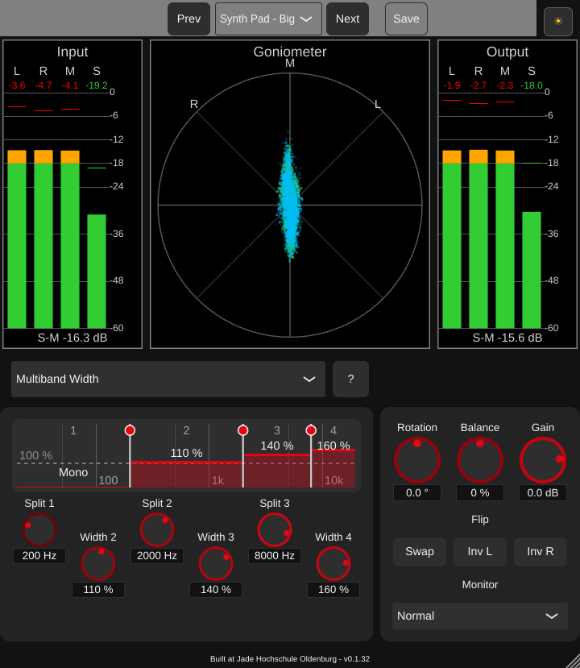
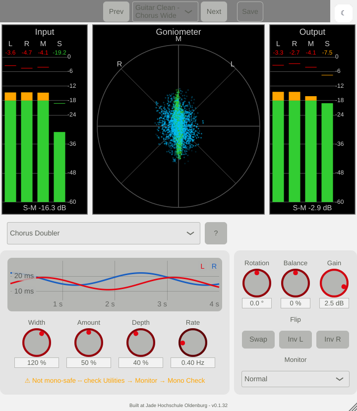

# StereoWidener

A free stereo widening plugin (VST3, AU, Standalone) for Windows, macOS and Linux:
seven widening algorithms, from mono-safe M/S width for mastering to pseudo-stereo for
mono synths and guitars, each with its own interactive display, plus goniometer,
correlation and L/R/M/S meters to see what happens to the stereo image.

Developed at the [Jade Hochschule](https://www.kvraudio.com/developer/jade-hochschule)
(Jörg Bitzer) as a teaching example for students and young engineers -- and as a tool
for mixing and mastering. Free, open source, no commercial interest. **Vibe-coded with
an AI** -- see [How it was made](#how-it-was-made).

| Night theme: Multiband Width ("Synth Pad - Big") | Day theme: Chorus Doubler ("Guitar Clean - Chorus Wide") |
|---|---|
|  |  |

## Download

Binaries for Windows, macOS and Linux: on the
[Jade Hochschule developer page at KVR Audio](https://www.kvraudio.com/developer/jade-hochschule),
together with the other free Jade Hochschule plugins.

Install by copying the plugin into your plugin folder and rescanning in your DAW:

| | VST3 | AU |
|---|---|---|
| Windows | `C:\Program Files\Common Files\VST3\` | -- |
| macOS | `~/Library/Audio/Plug-Ins/VST3/` | `~/Library/Audio/Plug-Ins/Components/` |
| Linux | `~/.vst3/` | -- |

The Standalone version runs without a DAW (audio in -> widener -> audio out).

## Features

### Seven algorithms

| Algorithm | Best for | Mono-safe | Display |
|---|---|---|---|
| **M/S Width (Broadband)** | stereo material, the classic width knob | yes | M/S width |
| **M/S Width (Filtered / Bass Mono)** | mastering: wider top, mono bass, optional "air" shelf on the side signal | yes | side-signal filter curve |
| **Complementary Comb (Pseudo-Stereo)** | mono synths, e-pianos, bass "grit": stereo from mono, mono sum stays exact | yes | L/R comb responses |
| **Allpass Decorrelation** | mono pads, strings, percussion: stereo without audible delay | no | L/R/mono-sum response |
| **Multiband Width** | pads, pianos, drum buses: separate width for 3 bands, lowest band always mono | yes | band-split display, drag bands and crossovers |
| **Early Reflections (Room Widening)** | mono acoustic instruments and vocals: width from a small virtual room | no | echogram |
| **Chorus Doubler** | guitars, organs, backing vocals: slowly modulated delays, double-tracking feel | no | delay modulation over time |

"Mono-safe" means the mono sum (L+R) is unchanged; for the other algorithms a hint
points to the Mono Check monitor. Every algorithm has its own **Width** (0 % = mono,
100 % = unchanged, 200 % = double the side signal) and a **?** button with a short
explanation of the algorithm and all its controls.

### Utilities, applied after every algorithm

Rotation, Balance, output Gain, Swap L/R, Invert L / Invert R, and a Monitor switch
(Normal, Mono Check (L+R), Solo Side (S)).

### Meters

Input and output L/R/M/S level meters with side-to-mid ratio, and a goniometer that
overlays input (green) and output (blue).

### Factory presets

20 starting points, mostly per instrument, each using the algorithm that suits it
(e.g. "Synth Lead - Pseudo Stereo", "Organ - Rotary Feel", "Drums - Overheads",
"Master - Gentle Widen"), plus a neutral "Init". Loudness changes are compensated with
the output Gain, so presets can be compared fairly. Presets are plain XML files in
your user preset folder; factory presets are copied there when missing and never
overwrite a preset you saved yourself:

| | Presets | Settings (GUI size, theme) |
|---|---|---|
| Windows | `%APPDATA%\Jade_Hochschule\StereoWidener\` | `%APPDATA%\StereoWidener\settings.json` |
| macOS | `~/Library/Audio/Presets/Jade_Hochschule/StereoWidener/` | `~/Library/StereoWidener/settings.json` |
| Linux | `~/.config/Jade_Hochschule/StereoWidener/` | `~/.config/StereoWidener/settings.json` |

### Other

Day and night theme (button top right), scalable GUI (drag the corner), zero latency,
low CPU load (at most about 1 % of one core, Multiband Width), all parameters
automatable.

## How it was made

To be honest: StereoWidener is **vibe-coded**. The code was written by an AI,
Anthropic's Claude (in Claude Code; models Claude Sonnet 5 and Claude Opus 5.5), in
conversation with Jörg Bitzer. But not in the "type one prompt, ship the result" way:

- **An intense planning phase first.** Before any plugin code: a catalogue of stereo
  widening algorithms with their theory, pros and cons ([planing.md](planing.md)), then
  a plan with decisions, release scope and roadmap ([plan2.md](plan2.md)), and later a
  separate plan for the GUI redesign ([plan_changeGUI.md](plan_changeGUI.md)).
- **Interactive, step-by-step development.** One feature or fix at a time, each on its
  own git branch, explained, reviewed and only merged on the human's go -- about 75
  commits, each step documented in [docs/algorithms/](docs/algorithms/).
- **Human review, listening and usage tests.** The steps were reviewed, listened to
  and used by humans; their review comments changed algorithms, parameters and the GUI (for
  example a consistent Width for all algorithms, the multiband knob layout, readable
  displays).
- **Meticulous testing by the AI, with these tools:**
  - [pluginval](https://github.com/Tracktion/pluginval) at strictness level 10, usually
    several runs per change (and `gdb` when it found a crash);
  - `WidenerRender` (`tools/widener_render`): renders audio through the plugin's own
    C++ algorithm classes, used for byte-identical before/after checks of every
    refactor;
  - Python reference implementations of every algorithm and cross-checks against the
    C++ code (`python/crosscheck_*.py`, `tools/meter_crosscheck`);
  - `stereo_eval`, a Python evaluation package (correlation per band and over time,
    L/R/M/S levels, loudness BS.1770, mono-sum colouration, IACC), used by
    `python/evaluate_*.py` on test signals and music samples, plus `pytest` unit tests;
  - every algorithm display checked against the transfer function measured from the
    rendered audio;
  - offline GUI renders in both themes and synthetic mouse-drag tests;
  - `python/evaluate_factory_presets.py` (loudness and mono compatibility of every
    preset) and `python/compare_builds.py` (six optimisation levels against the Debug
    build).

What this does not replace: there was no formal listening test or user study, and the
presets for guitar, organ and strings were tuned on stand-in material (no such
recordings were at hand) -- worth your own ears. Feedback is welcome.

## Build from source

The plugin uses [JUCE 8](https://juce.com) and CMake, in the AudioDev environment of
the [AdvancedAudioTemplate](https://github.com/JoergBitzer/AdvancedAudioTemplate)
(top-level `CMakeLists.txt`, `JUCE/`, `Libs/`):

```
AudioDev/
├── CMakeLists.txt     # add_subdirectory(stereo_widening/StereoWidener) ...
├── JUCE/
├── Libs/
└── stereo_widening/   # this repository
```

Release build (from `AudioDev/`):

```console
cmake -S . -B build-release -DCMAKE_BUILD_TYPE=Release
cmake --build build-release --target StereoWidener_VST3 StereoWidener_Standalone -j8
# macOS additionally: --target StereoWidener_AU
```

The results are in
`build-release/stereo_widening/StereoWidener/StereoWidener_artefacts/Release/`.
Release (`-O3` with link-time optimisation) is the tested configuration: it produces
bit-identical output to the Debug build and passes pluginval at strictness level 10
(see [docs/algorithms/phase6_release_builds.md](docs/algorithms/phase6_release_builds.md)).

## For students and developers

The repository documents the whole development, from the algorithm catalogue to the
verification of each algorithm:

| Folder / file | Content |
|--------|---------|
| [StereoWidener/](StereoWidener/) | the plugin, one class per algorithm in `algorithms/`, one playground (display) per algorithm in `playgrounds/`; [StereoWidener/README.md](StereoWidener/README.md) describes every algorithm in detail |
| [StereoAnalyzer/](StereoAnalyzer/) | a separate analysis plugin: goniometer, correlation meter, L/R/M/S levels |
| `shared/` | code used by both plugins (metering) |
| `python/` | test-signal generation, the evaluation package `stereo_eval` (correlation, levels, loudness, mono-sum colouration, IACC), Python reference implementations, the factory preset generator |
| [docs/algorithms/](docs/algorithms/) | one page per algorithm and development step, with measurements |
| `tools/` | `widener_render` (renders a wav file through the plugin's algorithm classes, headless) and `meter_crosscheck` |
| [planing.md](planing.md), [plan2.md](plan2.md) | algorithm catalogue and theory; plan and roadmap |

Test audio is not in the repository (see [test_signals.md](test_signals.md)). Python
environment and evaluation (from the project folder):

```console
python3 -m venv .venv && .venv/bin/pip install -r python/requirements.txt
cd python
../.venv/bin/python generate_test_signals.py        # -> test_signals/generated/
../.venv/bin/python -m pytest                       # validates measures and algorithms
../.venv/bin/python evaluate_factory_presets.py     # renders and measures the presets
```

## License

- **Source code of this repository: [MIT License](LICENSE)**, (c) 2026 Jörg Bitzer,
  Jade Hochschule.
- **Plugin binaries:** they contain third-party code:
  - [JUCE 8](https://github.com/juce-framework/JUCE), used under the
    [AGPLv3](https://www.gnu.org/licenses/agpl-3.0.html) (JUCE is dual-licensed
    AGPLv3 / commercial JUCE licence). Therefore the binaries as a whole are
    distributed under the **AGPLv3** (full text: [LICENSE-AGPL-3.0.txt](LICENSE-AGPL-3.0.txt));
    the complete source code is this repository plus JUCE.
  - the VST3 SDK by Steinberg (bundled with JUCE; GPLv3 option in the SDK version
    bundled with JUCE 8.0.x, MIT from VST 3.8 on) -- VST is a registered trademark
    of Steinberg Media Technologies GmbH;
  - the Audio Unit SDK by Apple (Apache License 2.0, macOS AU only).

MIT code may be combined with AGPLv3/GPLv3 code; the MIT license of the files in this
repository stays as it is, and anyone can reuse them under MIT (for example in a
project with a commercial JUCE licence).

The plugin comes without any warranty (see the licenses).
