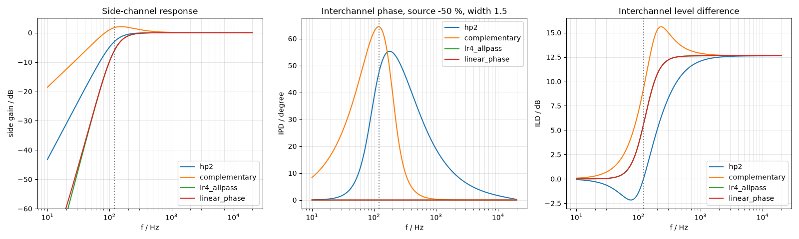
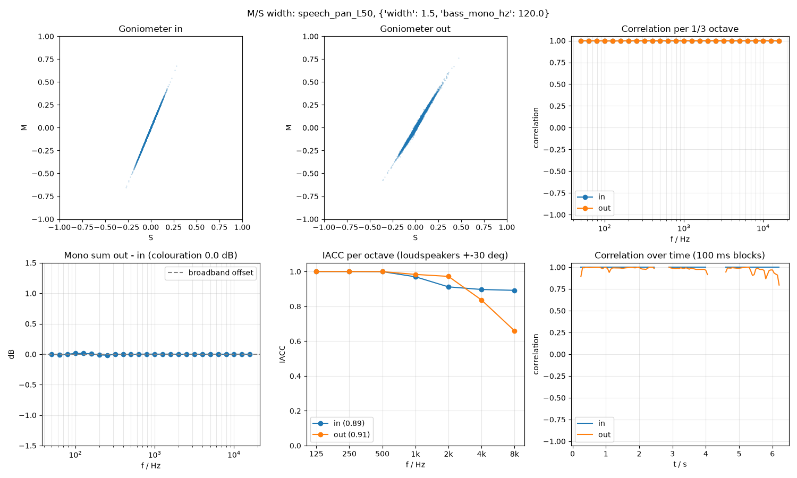

# 2.1 Mid/Side Width with Bass Mono and Side Shelf

Reference: `python/algorithms/ms_width.py`, `python/algorithms/bass_mono.py`
Evaluation: `python/evaluate_ms_width.py`, `python/prototype_bass_mono.py`
(results in `python/results/`, not versioned; the key numbers are copied below)

## Signal flow

```
M = (L+R)/2                      S = (L-R)/2
                                 S = HighShelf(S, f_shelf, g_shelf)      optional
M = AP2(M, fc)                   S = HP2(HP2(S, fc), fc)  = HP_LR4       bass mono, optional
                                 S = width * S
L' = M + S                       R' = M - S
```

All filters are RBJ-cookbook biquads (`python/algorithms/filters.py`). AP2 and HP2 use
Q = 1/√2.

## Properties

- **Mono-compatible by construction:** the mono sum L'+R' = 2M' depends on M only.
  M is either unchanged or passes an allpass, so the magnitude spectrum of the mono sum
  never changes. The measured colouration is 0.00–0.05 dB, which is estimation error.
- width = 0 gives mono, width = 1 (without bass mono or shelf) gives an exact identity.
- **Mono input stays mono:** M/S width cannot create stereo (see the dual-mono samples).
- A correlation meter does not show the width of *panned* sources: a panned mono source
  stays at ρ = 1 for any width, and only the goniometer angle changes. ρ only drops for
  material that is already partly decorrelated (reverb, stereo recordings).

## Finding 1: bass mono must be phase-aligned

A plain 2nd-order high-pass on S (`hp2`) also shifts the phase of S well above fc, while
M stays unfiltered. For a panned source, L' and R' are then no longer scaled copies of
each other:

- The interchannel phase difference reaches 55°, and is still 52° at 2·fc.
- The correlation of a source panned 50 % drops to about 0.6 between 100 Hz and 1 kHz.
  The image smears.
- The level difference changes sign below fc, so the image is pulled to the wrong side.

**Solution (`lr4_allpass`):** a Linkwitz-Riley LR4 high-pass on S, and the matching
2nd-order allpass on M. Because LP4 + HP4 = AP2 (verified numerically to 1e-12):

```
L' = AP2(M) + w·HP4(S) = LP4(M) + HP4(M + w·S)
```

This is exactly an LR4 crossover on L/R with a mono low band. Above fc, M and S have the
same phase, so the stereo image is unchanged (only a common allpass on both channels).



Comparison at fc = 120 Hz, width 1.5, source panned 50 % left (the analytic values are
the same for fc = 40 … 300 Hz):

| variant | S at fc/2 | S at fc/4 | S boost | max IPD | latency | cost |
|---------|-----------|-----------|---------|---------|---------|------|
| hp2 | −12.3 dB | −24.1 dB | 0 dB | 55° | 0 | 1 biquad |
| complementary (S − LP2(S)) | −2.8 dB | −8.9 dB | +2.1 dB | 64° | 0 | 1 biquad |
| **lr4_allpass** | **−24.6 dB** | **−48.2 dB** | **0 dB** | **0°** | **0** | **3 biquads** |
| linear_phase (FIR, LR4 magnitude) | −24.4 dB | −46.9 dB | 0 dB | 0° | 93 ms | 2 × 8191-tap FIR |

On signals (width 1.5, fc = 120 Hz), the broadband correlation of `speech_pan_L50` is
1.00 without bass mono, 0.68 with `hp2`, 0.90 with `complementary`, and 0.99 with
`lr4_allpass` and with `linear_phase`.

**Decision:** `lr4_allpass` is the default. It gives the same result as linear phase with
zero latency and 3 biquads. The linear-phase variant brings no audible benefit. It is
also less accurate at 40 Hz with 8191 taps (−22.6 dB at fc/2) and adds 93 ms latency, so
it is not needed in the plugin. `hp2` and `complementary` stay in the Python code as
teaching examples.



## Finding 2: fixed level compensation is not suitable

`constant_power` (g = √(2/(1+w²))) is exact only if M and S have equal power. On real
material (mostly correlated), it reduces the loudness too much: at width 1.5 the change
is −1.7 to −2.1 LUFS on speech and mixes. Auto gain (Phase 6) should therefore be based
on a loudness measurement, not on a formula.

## Notes for the C++ implementation

- M: 1 biquad (AP2). S: shelf biquad plus 2 biquads (HP2, HP2). The same RBJ formulas
  are used, so a null test against Python is possible (difference below −100 dBFS).
- Switching bass mono on or off changes the phase of M (allpass in or out), which can
  click. Crossfade, or keep the allpass always active and only fade the HP4 in and out.
- Changing fc changes the coefficients of all three biquads. Smooth fc (per block or per
  sample) to avoid zipper noise, and keep M and S coefficients in sync.
- Level compensation: offer "none" only in v1, and add loudness-based auto gain later.
