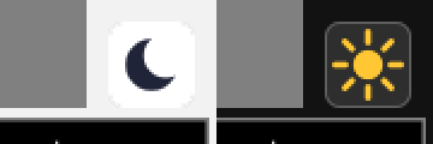

# Windows: drawn theme icons, ASCII badge (v1.0.2)

Report from the first Windows build: the sun on the theme button (Night mode) showed
as three yellow dots.

## Cause

The button showed Unicode text glyphs: sun U+2600, moon U+263E (block "Miscellaneous
Symbols"). Where the system font lacks the glyph, or its fallback glyph is too wide
for the small button, JUCE elides the text to "..." -- drawn in the sun's colour.
The "not mono-safe" hint had the same risk: warning sign U+26A0 (same block) and
arrows U+2192.

## Fix

- The theme button has no text any more. `StereoWidenerLookAndFeel::drawThemeIcon()`
  draws the icon as a vector path, independent of fonts and sharp at every GUI scale:
  the sun as a disc with eight rays, the moon as a crescent (a disc with an offset
  disc clipped out). Which icon to draw is a component property (`themeIcon` = "sun"
  or "moon"); the colours are unchanged (dark navy moon, gold sun). The button got an
  accessibility title ("Switch to day/night theme").
- The hint is plain ASCII: "Not mono-safe -- check Utilities > Monitor > Mono Check".
- The remaining non-ASCII character in the GUI is the degree sign of the Rotation
  knob (U+00B0, Latin-1, in every font).

## Verification

- Offline renders in both themes (Linux); README screenshots regenerated.
- pluginval --strictness-level 10: 2/2 SUCCESS, zero assertions.
- Not verifiable here: the Windows rendering itself -- but the icon no longer depends
  on any font.
