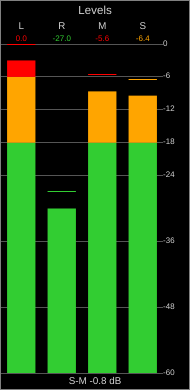
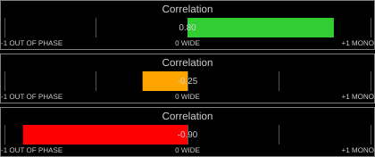
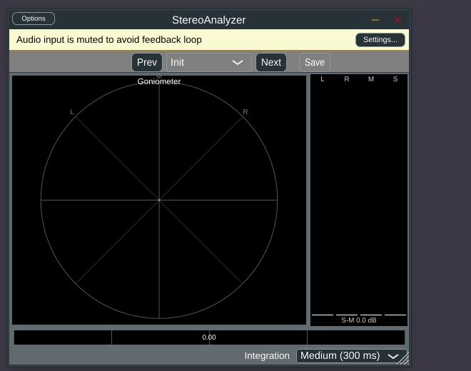
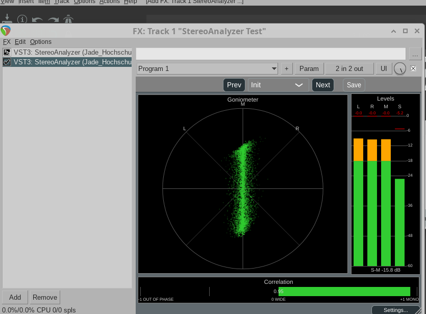

# Phase 2: StereoAnalyzer (metering)

Plugin: `StereoAnalyzer/` (VST3, AU, Standalone; created from AdvancedAudioTemplate)
Shared metering engine: `shared/metering/`
Cross-check tool: `tools/meter_crosscheck/` + `python/crosscheck_meter.py`

## What it does

A pass-through plugin (it never modifies the audio) with:

- **Goniometer** (`GoniometerComponent`): Lissajous plot of S (horizontal) vs. M
  (vertical), same convention as `python/stereo_eval/report.py`'s goniometer plots, so a
  Python plot and the on-screen display can be compared directly. Points fade with age
  ("phosphor" persistence).
- **Correlation meter** (`CorrelationMeterComponent`): −1 … +1 bar, three colour zones
  (green ≥ +0.3, amber −0.3…+0.3, red < −0.3 — a rule of thumb, not a formal standard)
  and endpoint labels ("OUT OF PHASE" / "WIDE" / "MONO").
- **Level meter** (`LevelMeterComponent`): RMS bar (green/amber/red zones at −18/−6 dBFS),
  peak line + numeric readout (coloured by the same zone, and held for a configurable
  time before it decays, see `StereoMeterState::setPeakHoldTime`) for L, R, M, S, a
  shared dB scale to the right (0, −6, −12, −18, −24, −36, −48, −60), and a "S−M"
  width-estimate readout in dB (0 dB = M and S equal power, matches
  `stereo_eval.measures.levels()["S_minus_M_dB"]`).
- **Settings popup** (`SettingsPanel`, opened from the main view's "Settings..." button
  via a `juce::CallOutBox`): three continuous parameters — Integration time (the RMS and
  correlation meters' shared time constant, 50 ms – 2 s), Peak Hold (0 – 5 s), and Peak
  Decay (3 – 60 dB/s once the hold expires). All three are ordinary `AudioParameterFloat`s
  (automatable, saved with the plugin state), not just GUI-local settings.
- All three meter components share a panel chrome (border + title,
  `MeterLookAndFeel::drawPanel`) and a colour/size vocabulary (`MeterLookAndFeel.h`), so
  they read as one instrument panel rather than three independently-styled widgets.




(Offline-rendered with synthetic test signals via a throwaway console tool, not part of
the repo — no display needed: `juce::Image` + `Component::paintEntireComponent`. Level
meter: L driven to a −3 dBFS-RMS sine (peak hits 0 dBFS, red), R to −30 dBFS (green); M
and S land wherever that mix puts them (−5.6 dBFS red, −6.4 dBFS amber here) — the peak
line and its numeric readout are coloured by the same zone as the RMS bar. Correlation:
three separate signals built from a common plus an orthogonal component, at
ρ = 0.8/+0.15/−0.9 — the middle one is inside the new −0.3…+0.3 amber band, which used
to read as green before the fix below.)

Not yet implemented (deferred, see plan2.md Phase 2 step 2, marked optional there):
spectrum display of the mono sum L+R and the side signal L−R. Candidate for a later pass
once `TGMStaticLib/FFT.h` is wired in; not needed to make the analyzer useful.

## Architecture

`StereoMeterState` (`shared/metering/StereoMeterState.h/.cpp`) is the real-time-safe
engine, shared between StereoAnalyzer now and StereoWidener later (Phase 3 needs two
instances, "in" and "out"):

- `processBlock()` runs on the audio thread: no allocation, no locks other than the
  lock-free `MeterFifo` push. Per sample it updates four one-pole ("leaky integrator")
  power sums (L², R², M², S²) and one cross sum (L·R), all with the same time constant,
  so the correlation meter and the level meters always agree on how fast they react.
  Peaks decay linearly in dB/s, like a hardware peak meter.
- GUI components read the meter values with plain atomic loads (`getRmsDb`,
  `getPeakDb`, `getCorrelation`, `getWidthEstimateDb`) and redraw on a 30 Hz
  `juce::Timer`. The goniometer additionally drains one (S, M) point per sample from a
  lock-free `MeterFifo` (`juce::AbstractFifo`-based); if the GUI falls behind, new points
  are dropped rather than the audio thread blocking.
- A mono input (1 channel) is treated as L = R, matching
  `stereo_eval.audio_io.read_stereo`.

## Finding: zero-latency metering needs SynchronBlockProcessor's direct-through mode

The AdvancedAudioTemplate's `SynchronBlockProcessor` normally rebuffers the host's
blocks to a fixed size (`g_desired_blocksize_ms`, 2 ms by default) and reports that as
plugin latency -- useful for FFT processing or synchronous parameter updates, but wrong
for an analyzer, which must never add latency and does not need a fixed block size
(the per-sample leaky integrator in `StereoMeterState` does not care how the host slices
its blocks). `prepareSynchronProcessing(channels, desiredSize)` with `desiredSize <= 0`
switches it to direct-through: `processSynchronBlock()` is called immediately with the
host's own buffer. `StereoAnalyzerAudio::getLatency()` therefore always returns 0.

## Cross-check against Python (Phase 2, step 3)

`tools/meter_crosscheck` is a headless JUCE console app (`juce_add_console_app`, no
GUI/display dependency) that loads a wav file, feeds it through `StereoMeterState` in
512-sample blocks (like a host would), and prints the final correlation and RMS levels.
`python/crosscheck_meter.py` runs it on the Phase-1 test signals and compares the output
to `stereo_eval.measures`.

`StereoMeterState` is a continuous leaky integrator (tau = 300 ms by default, like a
hardware meter); `stereo_eval.measures.correlation()` is the true broadband correlation
over the whole file. They only need to agree closely for signals that stay stationary
over several tau (the noise test signals, 10 s vs. 0.3 s tau); for non-stationary
material (speech, mixes) the leaky value mostly reflects the last ~300 ms, which is the
intended behaviour of a real-time meter, not a bug. `crosscheck_meter.py` asserts a
tolerance (correlation ±0.08, levels ±0.5 dB) only on the four stationary noise signals,
and prints the others for information:

```
signal                    rho py  rho cpp   diff     M py   M cpp     S py   S cpp  stationary
noise_pink_mono.wav        1.000    1.000  0.000   -20.00  -20.20  -200.00 -120.00  yes
noise_pink_rho050.wav      0.491    0.507  0.016   -21.28  -21.23   -25.93  -26.08  yes
noise_pink_uncorrelated    -0.031  -0.032 -0.002   -23.15  -23.27   -22.88  -23.00  yes
noise_pink_antiphase.wav  -1.000   -1.000  0.000  -200.00 -120.00   -20.00  -19.71  yes
speech_pan_L50.wav         1.000    1.000  0.000   -27.25  -40.90   -34.91  -48.55  no
mix_small.wav               0.969    0.984  0.015   -15.40  -16.07   -32.09  -37.05  no
mix_loop_let_it_be.wav      0.961    0.935 -0.026    -9.28  -10.11   -26.25  -24.80  no

OK
```

(The -200 vs -120 dB rows are both "effectively silent": Python floors at 10·log10(1e-20)
= -200 dB, the C++ engine at 10·log10(1e-12) = -120 dB; both are skipped by the level
assertion once below -60 dB.) All four mono-compatibility extremes come out exact:
correlation +1 for mono, -1 for anti-phase, ~0 for independent noise.

## Bug found and fixed: direct-through mode corrupted the heap

The Standalone build initially **segfaulted on launch** (`jassert` failure then crash in
`juce_Displays.cpp`, JUCE's monitor enumeration). `pluginval` (see below) reproduced a
crash too, with a clean backtrace: `malloc(): unaligned tcache chunk detected` inside
JUCE's own VST3 channel-remapping code, called from pluginval's "Open editor whilst
processing" test, then again from plain "Audio processing" when switching block sizes.

**Isolating the cause:** the crash backtrace pointed entirely into generic JUCE
framework code, with no frame in our own code, which first suggested an
environment/JUCE-version quirk unrelated to us. To check, `StereoDelayer` (an existing,
unmodified AdvancedAudioTemplate-based plugin already in daily use, built from the exact
same JUCE checkout) was run through the identical pluginval command as a control: it
passed every test cleanly, `SUCCESS`, no crash, no NaN findings. That ruled out a generic
environment problem and pointed back at something specific to StereoAnalyzer.

**Root cause:** `SynchronBlockProcessor::processBlock()` (`tools/SynchronBlockProcessor.cpp`,
the per-plugin copy from AdvancedAudioTemplate) has a direct-through mode
(`desiredSize <= 0`, used by StereoAnalyzer for zero-latency metering, see above) that
calls `processSynchronBlock()` directly -- but then **falls through** into the normal
fixed-block buffering code below it. That code writes into `m_block`/`m_memory`, which
`prepareSynchronProcessing()` sizes to **0 samples** in direct-through mode: an
out-of-bounds heap write on every single sample. It also overwrites the caller's audio
buffer with reads from the empty `m_memory`, silently breaking the pass-through this
mode is supposed to guarantee. `StereoDelayer` never exercises this branch (it uses
normal fixed-block buffering), which is why the control plugin never hit it -- this
looks like a latent bug in the shared template that nothing in this codebase had
exercised before.

**Fix** (one line, in `StereoAnalyzer/tools/SynchronBlockProcessor.cpp`): `return;`
right after the direct-through call, matching the mode's documented contract ("the
processing will be done directly without buffering"). After the fix:
- pluginval passes cleanly at strictness level 10, including fuzzing (see below).
- The Standalone launches and runs without crashing (previously it crashed within
  seconds every time).
- Both crashes most likely shared this one root cause -- heap corruption surfacing at
  different, essentially random, later allocation sites is a textbook symptom, and
  fixing this one bug independently resolved both observed symptoms.

**Suggested follow-up for the user:** backport this fix to the canonical
`AdvancedAudioTemplate` repository and to any other AudioDev plugin that might use
direct-through mode in the future (this session found no other current user of it in
the AudioDev workspace).

## pluginval

```console
./pluginval --strictness-level 10 --validate StereoAnalyzer.vst3
```

Result after the fix: `SUCCESS`, no failures, at strictness level 10 (includes parameter
fuzzing), across all tested sample rates (44.1/48/96 kHz) and block sizes
(64-1024 samples): open/close, audio processing (no NaN/Inf/denormal found), state
save/load, automation, editor-whilst-processing, bus enable/disable. `pluginval` itself
is not part of this repository; it was downloaded to `AudioDev/tools/pluginval/` for
this session (not versioned).

## User feedback after first look: colour zones, peak hold, settings page

Three changes made after looking at the running plugin:

1. **Correlation amber zone made symmetric** (−0.3…+0.3, was 0…−0.5 -- amber only showed
   for negative values, so e.g. ρ = +0.15 read as green even though it is just as
   "moderate" as −0.15).
2. **Peak now genuinely holds.** `StereoMeterState` previously decayed the peak from
   every sample; it now freezes the peak for `peakHoldTime_s` (default 1.5 s) after the
   last new peak, then decays at `peakDecay_dBPerSecond` -- verified with a synthetic
   burst-then-silence test: the peak dB value was bit-identical 0.5 s into the hold, and
   had dropped by exactly decay-rate × elapsed-time once past it. The peak line and its
   numeric readout are also now coloured by the same green/amber/red zone as the RMS bar
   (previously always white/grey), via a small `zoneColourForDb()` helper.
3. **Settings popup** for the ballistics that do not need to live on the main view.
   `StereoAnalyzerGUI`'s old inline "Integration" combo box is gone; a "Settings..."
   button opens `SettingsPanel` (three `APVTS` `SliderAttachment`s) in a
   `juce::CallOutBox`. Integration, Peak Hold and Peak Decay are now continuous
   `AudioParameterFloat`s (`g_paramIntegration`/`g_paramPeakHold`/`g_paramPeakDecay` in
   `StereoAnalyzer.h`) instead of Integration being a 3-choice discrete parameter --
   automatable and saved with the plugin state like any other parameter. Their display
   precision (e.g. "0.30 s" rather than "0.300000 s") comes from the parameter's own
   `NormalisableRange` interval (`10^-numDecimalPlaces`), not from the slider, so a
   host's generic parameter view shows the same formatting our own popup does.

Verified with `pluginval --strictness-level 10` (clean, including fuzzing) and two
rounds of offline rendering (see below): one confirming the peak-hold timing/value
numerically and the corrected amber threshold visually, a second regenerating the
documentation screenshots below to match. The Settings popup itself was verified with a
small standalone test that constructs a real `AudioProcessorValueTreeState` with the
three parameters and renders `SettingsPanel` to a PNG the same way -- catching, along
the way, that the slider text box's decimal precision comes from the *parameter's*
`getText()`/interval, not from `Slider::setNumDecimalPlacesToDisplay()`, and that the
unit suffix needs `Slider::setTextValueSuffix()` explicitly (the label passed via
`AudioParameterFloatAttributes::withLabel()` is not appended by the slider on its own).

## Screenshot (Standalone, current layout)



Audio input is muted by default (JUCE Standalone's feedback-loop safety), hence the
empty goniometer and 0.00 correlation in this screenshot; the headless `MeterCrossCheck`
run (above, "Cross-check against Python") confirms the actual metering math against real
audio. `MeterCrossCheck` calls `StereoMeterState::processBlock()` directly and never
goes through `SynchronBlockProcessor`, so that cross-check was unaffected by the bug
above and was trustworthy throughout.

## Verified live in Reaper

The plugin loads and runs correctly in an actual DAW (Reaper v6.68, installed on this
machine), processing real audio through `~/.vst3/StereoAnalyzer.vst3`. No `xdotool`/
`xautomation` was available in this sandbox to drive Reaper's GUI, so this used
`python-xlib` (installed into a throwaway venv, not part of the repo) to send real X11
XTEST key/mouse events -- click, type into the FX browser's filter box, click the
transport's Play button.

Two real snags along the way, both about Reaper's own plugin cache rather than the
plugin itself:
- Reaper's `reaper-vstplugins64.ini` had a stale entry from before the plugin was last
  rebuilt (the class ID it cached still matched -- a fresh rescan reproduced the exact
  same ID -- so this alone was not the actual problem).
- A hand-written `<VST ...>` block in a `.rpp` project file (to script a test project
  without any GUI interaction) reliably failed to load ("The following effect plug-in
  could not be loaded"), even with Reaper's own cached ID copied in verbatim -- some
  field in the block was subtly wrong. Inserting the same plugin live through Reaper's
  own FX browser (Track > FX > Add > filter "StereoAnalyzer" > double-click) worked on
  the first try. The RPP project format is undocumented enough that hand-authoring an
  FX block is not a reliable path; driving the real UI is.

With a track holding `mix_loop_let_it_be.wav` (one of the Phase-1 test samples) playing
through the plugin:



Goniometer, level meters (colour zones, numeric peak readouts) and the correlation meter
(0.95, strongly green -- this particular mix is quite mono-centric) all update live and
match what the offline-rendered verification predicted. Reaper's own track/master meters
(visible at the left edge of the full screenshot) confirm real audio was flowing, not
just the plugin's internal state.

## Screenshot (Standalone, current layout)


Audio input is muted by default (JUCE Standalone's feedback-loop safety), hence the
empty goniometer and 0.00 correlation in this screenshot; the headless `MeterCrossCheck`
run (above, "Cross-check against Python") and the live Reaper run (above) both confirm
the actual metering math against real audio. `MeterCrossCheck` calls
`StereoMeterState::processBlock()` directly and never goes through
`SynchronBlockProcessor`, so that cross-check was unaffected by the bug above and was
trustworthy throughout.

## Build

```console
cd /home/bitzer/AudioDev/build
cmake ..
cmake --build . --target StereoAnalyzer_VST3 -j8
cmake --build . --target StereoAnalyzer_Standalone -j8
cmake --build . --target MeterCrossCheck -j8
```

pluginval (not part of this repository, downloaded fresh for this session):

```console
mkdir -p /home/bitzer/AudioDev/tools/pluginval && cd /home/bitzer/AudioDev/tools/pluginval
curl -sL -o pluginval_Linux.zip \
  https://github.com/Tracktion/pluginval/releases/download/v1.0.4/pluginval_Linux.zip
unzip -o pluginval_Linux.zip && chmod +x pluginval && rm pluginval_Linux.zip
./pluginval --strictness-level 10 --validate \
  /home/bitzer/AudioDev/build/stereo_widening/StereoAnalyzer/StereoAnalyzer_artefacts/Debug/VST3/StereoAnalyzer.vst3
```

`StereoAnalyzer/StereoAnalyzer.cpp` and `.h` hold only the plugin-specific glue
(the Integration parameter, wiring `StereoMeterState` to `SynchronBlockProcessor`, and
laying out the three meter components); the reusable metering code is entirely in
`shared/metering/`, ready for StereoWidener to reuse in Phase 3.
