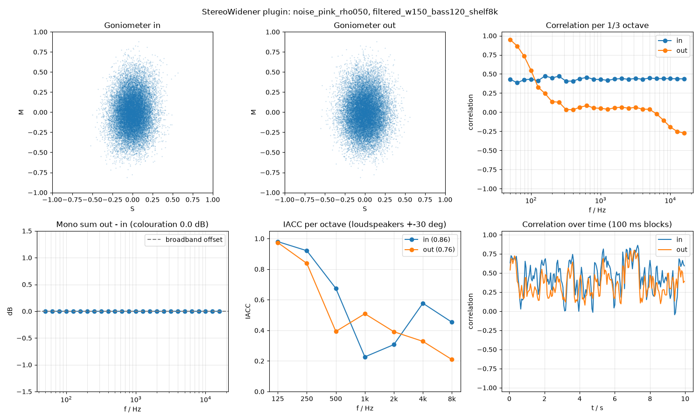

# Phase 3 -- StereoWidener plugin, first algorithms and the algorithm switch

The second plugin in the project, built from a copy of `StereoAnalyzer` (see
[phase2_stereo_analyzer.md](phase2_stereo_analyzer.md)), reusing its metering
components from `shared/metering/` so both plugins share the same goniometer/level-meter
look and any fix helps both. Unlike the analyzer, this plugin actually processes audio:
it widens or narrows the stereo image, switchable between two algorithms.

## GUI layout

User request, in the user's own words: "Level meter left for input, Goniometer in the
middle with two colors green in, blue out, Levelmeter on the right for the output. All a
little smaller (60%) compared to the analyzer. Big Knob in the middle for width. and a
listbox for algorithm selection below that."


- **Input level meter (left) / Output level meter (right)**: two separate
  `LevelMeterComponent` instances, each bound to its own `StereoMeterState`
  (`StereoWidenerAudio::m_meterStateIn` / `m_meterStateOut`) -- the widener measures the
  signal both before and after processing (see "Processing" below).
- **Goniometer (middle), input in green / output in blue overlaid in one circle**:
  `GoniometerComponent` gained a second, optional signal (`setSecondarySeries()`,
  `shared/metering/GoniometerComponent.h`/`.cpp`) drawn on top of the existing primary
  series but sharing the same grid/circle, rather than needing two separate goniometer
  instances stacked or a bespoke widener-only component. `StereoAnalyzer` is unaffected
  (its goniometer just never calls `setSecondarySeries()`, so it keeps drawing a single
  green series exactly as before); this is exactly the "shared, reusable" design
  `shared/metering/` was already following (see phase2 docs). Both series still get the
  existing overload clamp-to-circle-and-turn-red treatment, regardless of which one
  clips.
- **Sizing, "60% of the analyzer"**: `PluginSettings.h`'s `g_levelMeterWidth` (115px) is
  about 60% of the analyzer's `g_levelMeterMaxWidth` (190px), and the whole meter row
  (`g_meterRowHeight` = 260px) is sized similarly relative to the analyzer's equivalent
  goniometer row, leaving room below for the knob and the algorithm selector that the
  analyzer doesn't have.
- **Width knob**: a big rotary `juce::Slider` (`g_widthKnobSize` = 110px diameter),
  bound to the Width parameter via the standard
  `AudioProcessorValueTreeState::SliderAttachment`.
- **Algorithm selector ("listbox")**: a `juce::ComboBox` below the knob, bound to the
  Algorithm parameter via `ComboBoxAttachment`, populated from `g_algorithmNames`.

## Follow-up: help button and per-algorithm aux knobs

User feedback, two more additions to the layout above: "add a small question mark symbol
as a button to the left of the listbox. by clicking an explanation of the algorithm with
scientific source should be provided" and "we need at least 2 other parameter (smaller
knobs) left and right from width. These parameter should change their description for
each algorithm. For this first version the left and right knob are switched off (greyed)
for the broadband MS algorithm and for the filtered one, the left knob is the bass cutoff
frequency and the right is the high-shelf frequency."


**Help button.** A small `juce::TextButton` ("?", `g_helpButtonSize` = 22px) sits to the
left of the algorithm selector (same row). Clicking it opens a `juce::CallOutBox`
(`AlgorithmHelpPanel.h`/`.cpp`, same popup pattern as `StereoAnalyzer`'s Settings button)
showing the *currently selected* algorithm's name and description, captured at click
time so the popup stays consistent even if the selection changes while it's open. The
description text -- including a citation to a written source -- now lives on
`StereoAlgorithm` itself (`getDescription()`), alongside the existing `getName()`: each
algorithm documents itself, matching the project's teaching-example goal (planing.md
section 5) directly in the code the student would read. `AlgorithmHelpPanel` measures
its own height from the wrapped text via `juce::TextLayout` rather than a fixed guess, so
a longer description just makes a taller popup instead of being clipped.

**Aux knobs.** `StereoAlgorithm::process()` now takes a `StereoAlgorithmParams` struct
(`width`, `auxLeft`, `auxRight`) instead of a bare `width` float, and two new interface
methods, `getAuxLeftInfo()`/`getAuxRightInfo()`, return an `AuxKnobInfo { enabled, label
}` describing how (if at all) the active algorithm uses each of `StereoWidenerGUI`'s two
smaller knobs flanking Width (`g_auxKnobSize` = 64px, ~58% of the Width knob's diameter).
`MSWidthBroadband` reports both as disabled (empty `AuxKnobInfo{}`); `StereoWidenerGUI`
greys them out for it via `juce::Slider::setEnabled(false)` (JUCE's default LookAndFeel
dims a disabled slider automatically) and blanks their labels. `MSWidthFiltered` enables
both and labels them "Bass Cutoff" / "High Shelf".

Both knobs are backed by real, always-present APVTS parameters (`g_paramBassCutoff`:
40-500 Hz, default 150 Hz -- the algorithm's previous fixed constant; `g_paramHighShelfFreq`:
1000-16000 Hz, default 8000 Hz) rather than a fully generic, per-algorithm-reconfigurable
control: a single JUCE parameter's numeric range is fixed for the plugin's lifetime, so
letting a future algorithm reinterpret the same knob as, say, a delay time in
milliseconds would need its own parameter underneath anyway. `MSWidthFiltered` reads
`params.auxLeft` as the Bass Cutoff frequency for its existing high-pass filter (now
adjustable, previously a fixed `kCrossoverHz` constant) and gained a second filter stage,
a high shelf on the (already bass-mono'd) side signal at `params.auxRight`, boosting by a
fixed `kHighShelfGainDb` (+3 dB) -- only the frequency is exposed as a parameter for this
first version, as requested; the gain is a named constant in `MSWidthFiltered.h`,
documented as a first-version simplification. Both filters recompute their `juce::dsp::IIR`
coefficients only when their controlling value actually changes (an epsilon comparison,
`hasChanged()`, matching the pattern already used in `StereoAnalyzer.cpp`), not every
sample.

`m_algorithmBox.onChange` calls `StereoWidenerGUI::updateAuxKnobsForActiveAlgorithm()`
to refresh the knobs' enabled state and labels whenever the selection changes -- this
fires both for a user's click and for host-automation-driven changes to the Algorithm
parameter (confirmed by reading JUCE's `ComboBoxParameterAttachment::setValue()`: it
updates the combo box with `sendNotificationSync`, and only suppresses its *own*
re-entrant listener via a `ScopedValueSetter`, not any other listener registered on the
same component), plus one explicit call right after constructing the attachment, since
`onChange` only fires on a later *change*, not the initial state.

**Verification**: rebuilt cleanly with no warnings (an initial `-Wfloat-equal` from the
new filter-coefficient-change check was fixed by switching to the same epsilon-comparison
helper `StereoAnalyzer.cpp` already uses). `pluginval --strictness-level 10` passes,
including its parameter-fuzzing tests now also covering Bass Cutoff and High Shelf.
Verified offline (same render technique as above) in both algorithm states: the
broadband render shows both aux knobs visibly dimmed/disabled; the filtered render shows
them enabled with the correct labels, and the "?" button renders as a clean, legible
glyph (a plain ASCII character in a standard `TextButton`, unlike the earlier
Unicode-gear-glyph problem in `StereoAnalyzer`'s Settings button, see
[phase2_stereo_analyzer.md](phase2_stereo_analyzer.md) -- no such risk here).

### Follow-up: an "Off" position for both aux knobs

User feedback: "It is necessary that the cutoff filter has an off mode. I usually
implement it by allowing a frequency slightly below the 40 Hz, and than set the filter
coefficient to a transparant setting and change the display text to off. The same for
the hp shelv. it should switch off above 16k" -- exactly as described:

- `g_paramBassCutoff`'s range grew from 40-500 Hz to **30-500 Hz**; the 30-40 Hz stretch
  is the "Off" position. `g_paramHighShelfFreq`'s range grew from 1000-16000 Hz to
  **1000-16500 Hz**; 16000-16500 Hz is its "Off" position. Both thresholds
  (`MSWidthFiltered::kBassCutoffOffThreshold` = 40 Hz,
  `kHighShelfOffThreshold` = 16000 Hz) live on the algorithm class itself, not in
  `StereoWidener.h`, so the DSP owns the one true definition of "off"; the parameter
  ranges and the GUI both read those same two constants rather than duplicating the
  numbers.
- **Bug found and fixed: the Off zone first occupied a full third of the knob's
  rotation, not a small sliver.** The first version used `g_paramBassCutoff.minValue`
  = 20 Hz (skew 0.3) and `g_paramHighShelfFreq.maxValue` = 20000 Hz (skew 0.5) --
  reasonable-looking ranges, but user testing found the Off zone spanned from 7 o'clock
  all the way to 10 o'clock on the knob. Cause, confirmed by reading JUCE's
  `NormalisableRange::convertFrom0to1()`: the skew formula is
  `value = start + (end-start) * proportion^(1/skew)`, so a skew *below* 1.0 gives the
  *low* end of the range disproportionately more of the knob's rotation (documented in
  JUCE's own header: "If the factor is < 1.0, the lower end of the range will fill more
  of the slider's length") -- exactly where the Bass Cutoff Off zone sits, and (mirrored
  at the top of the range) where the High Shelf Off zone sits. Fixed by switching both
  knobs to `skew = 1.0` (linear) and narrowing the Off zone's own value-width relative
  to the total range (Bass Cutoff: 10 Hz wide, 30-40; High Shelf: 500 Hz wide,
  16000-16500) -- with a linear mapping, rotation share is directly proportional to
  value-width share, so a narrow zone reliably stays a narrow sliver. Verified
  numerically with `NormalisableRange<float>::convertTo0to1()`: the Bass Cutoff Off
  boundary (40 Hz) now sits at 2.1% of the knob's rotation (i.e. right at the very
  start, 7 o'clock), and the High Shelf Off boundary (16000 Hz) sits at 96.8% (i.e. its
  Off zone is the last 3.2% of rotation, at the opposite end since High Shelf switches
  off *above* its threshold rather than below).
- **Follow-up: linear is wrong for a four-octave knob.** User feedback: linear is
  "OK for the lowpass, but not for the high shelf" -- correct: Bass Cutoff's practical
  range (30-500 Hz) spans under four octaves and linear is a reasonable approximation,
  but High Shelf's 1000-16500 Hz spans *more than* four octaves, so the fix above's
  linear mapping crammed the musically useful low end (1-4 kHz) into a small fraction of
  the knob while wasting most of the rotation on the top octave alone. Fixed with a new
  `makeLogFrequencyParameterWithOff()` (`StereoWidener.cpp`, next to
  `makeFrequencyParameterWithOff()`), which gives High Shelf a *true* logarithmic
  mapping via `NormalisableRange`'s custom-function constructor (not just another
  skew/power-law approximation): `value = start * (end/start)^proportion` and its
  inverse `proportion = log(value/start) / log(end/start)`, so equal frequency *ratios*
  -- octaves -- always get equal rotation, matching how frequency is actually perceived
  and how every real EQ's frequency knob works. Bass Cutoff is unaffected (stays linear,
  `makeFrequencyParameterWithOff()`, per the user's own call that linear is fine there).
  A useful side effect: log compression at the top of a wide range means High Shelf's
  Off zone (16000-16500 Hz, unchanged) stayed a small sliver "for free" -- verified
  numerically (same technique as above): 1000->2000 Hz and 8000->16000 Hz, both exactly
  one octave, land exactly the same 24.7% rotation delta each (confirming the mapping is
  truly logarithmic, not approximately so), the round-trip through
  `convertTo0to1`/`convertFrom0to1` is exact, and the Off zone above 16000 Hz now spans
  just the last 1.1% of rotation (tighter than the earlier linear fix's 3.2%, without
  needing to narrow the zone's absolute Hz width any further).
- **Transparent, not just extreme.** In the off zone, `MSWidthFiltered::process()`
  skips calling `processSample()` on that filter entirely (`bassCutoffBypassed` /
  `highShelfBypassed`, set in `updateFiltersIfNeeded()`) rather than pushing its
  frequency to an edge-case extreme -- a real bypass, with no risk of a near-DC
  high-pass or near-Nyquist shelf doing something subtly audible. Verified with a
  throwaway console tool: with both knobs in their Off zones, `MSWidthFiltered`'s output
  is bit-exact (0.0 max abs diff) with `MSWidthBroadband` given the same input and
  width -- confirming full transparency, not an approximation. A second check with both
  knobs at their normal defaults (150 Hz, 8000 Hz) confirmed they still genuinely differ
  from broadband (max abs diff 0.73), so the bypass path isn't accidentally always-on.
- **"Off" display text**, in three places that all needed to agree: the `AudioParameterFloat`
  itself, via `AudioParameterFloatAttributes::withStringFromValueFunction()` /
  `withValueFromStringFunction()` (a new `makeFrequencyParameterWithOff()` helper next to
  the existing `makeFloatParameter()` in `StereoWidener.cpp`) -- this is what a host's
  generic parameter/automation view shows; and each aux `juce::Slider`'s own
  `textFromValueFunction` / `valueFromTextFunction` in `StereoWidenerGUI`, so typing
  "off" into either knob's text box also works. Both read the same
  `kBassCutoffOffThreshold` / `kHighShelfOffThreshold` constants as the DSP, so the
  displayed "Off" boundary can never drift out of sync with where the bypass actually
  engages.

## Processing: StereoAlgorithm interface and the crossfaded switch

`algorithms/StereoAlgorithm.h` defines the common interface every algorithm implements
(`prepare()`, `reset()`, `process()`, `getName()`, `isMonoSafe()`,
`getLatencySamples()`) -- one small class per algorithm, per plan2.md section 5's
teaching-oriented code rules. `StereoWidenerAudio` (`StereoWidener.h`/`.cpp`) owns a
`std::vector<std::unique_ptr<StereoAlgorithm>>` and an `AudioParameterChoice` selecting
the active one by index.

Switching algorithms mid-playback is crossfaded rather than instant (plan2.md Phase 3:
"Algorithm switching with an equal-power crossfade (20-50 ms)"), so a mode change never
clicks even though the two algorithms shown here sound very different:
`StereoWidenerAudio::processSynchronBlock()` detects the parameter's index changing,
resets the incoming algorithm's filter state, then for `kCrossfadeSeconds` (30 ms) runs
**both** the outgoing and incoming algorithm on (copies of) the same block and mixes
them sample-by-sample with `cos`/`sin` gains (equal power, not a linear ramp, so the
summed power stays constant through the fade instead of dipping). Outside a crossfade,
only the active algorithm runs -- negligible extra CPU.

`m_meterStateIn.processBlock()` runs on the untouched input at the top of
`processSynchronBlock()`; `m_meterStateOut.processBlock()` runs on the final (possibly
crossfaded) output at the end -- so the meters and goniometer always show what actually
came in and what actually went out, including mid-crossfade blends.

## Algorithm 2.1: M/S width, broadband and filtered

Both algorithms implement the same textbook M/S width control (`M = (L+R)/2`,
`S = (L-R)/2`, `L' = M + width*S`, `R' = M - width*S`; `width`: 0 = mono, 1 = unity,
2 = double the side signal) -- deliberately two variants of the *same* control, so
switching between them is an audible, testable difference specifically for exercising
the crossfade above, not two unrelated algorithms.

- **`algorithms/MSWidthBroadband.{h,cpp}`**: the plain version, width applied across the
  whole spectrum equally. Stateless.
- **`algorithms/MSWidthFiltered.{h,cpp}`**: the same control, but S is run through a
  second-order Butterworth high-pass (`juce::dsp::IIR::Filter`, adjustable crossover --
  the Bass Cutoff aux knob, see "Follow-up" below, default 150 Hz) *before* the width
  scaling. Content below the crossover is removed from S entirely -- forced into M, i.e.
  mono -- so bass always stays centred regardless of the width setting, while only the
  highs get widened. This is the standard "bass mono" mastering trick (plan2.md 2.1:
  "M/S width + bass mono"). A second stage, a high shelf at the High Shelf aux knob's
  frequency (default 8000 Hz, fixed +3 dB), then restores some high-frequency "air" --
  the "+ side shelf" part of the same plan2.md entry.

## Verification

**Null test** (plan2.md Phase 3, step 4: "width = 100% gives output = input"), a small
throwaway console tool feeding the same 4096-sample random stereo block through both
algorithms at width = 100%:

```
MSWidthBroadband (width=100%, expected: bit-exact passthrough): max abs diff = 5.96046e-08 (-144.494 dBFS)   PASS
MSWidthFiltered  (width=100%, expected: NOT a passthrough -- bass is always forced mono): max abs diff = 0.217158 (-13.2645 dBFS)
```

`MSWidthBroadband` passes the strict null test (-144 dBFS, far below the -100 dBFS
threshold -- the residual is pure float round-trip error through the M/S transform).
`MSWidthFiltered` is *expected* to fail it: it forces the bass mono at every width
setting by design, so even at width = 100% it genuinely changes the signal. The two
numbers together confirm the algorithms are functionally distinct, which is the whole
point of using them to test the switch.

**pluginval** `--strictness-level 10` passes on the built VST3, including the
"Automation" and "Fuzz parameters" tests, which randomly exercise every parameter
(including the Algorithm choice) at every tested block size/sample-rate combination --
a real stress test of the crossfade logic under rapid, arbitrary switching, with no
crashes or asserts.

**GUI layout**, verified with the same offline-render technique used throughout Phase 2
(no interactive GUI in this sandbox, see `../README.md`): rendered at the plugin's
default size and a larger window, confirming the input/goniometer/output row, the
dual-colour overlaid goniometer (green input filling the circle, blue output visibly
narrower after a test width reduction), the width knob, and the algorithm selector all
lay out and scale correctly. One render-tool-only gotcha along the way:
`GoniometerComponent::refresh()` (which drains the FIFO into the drawn point history)
runs on `MeterComponentBase`'s own `Timer`, which never fires in a synchronous console
app with no message loop running -- worked around in the test tool with
`Thread::sleep()` + `Timer::callPendingTimersSynchronously()`; not a real plugin issue,
since a host always runs a real message loop.

## Follow-up: preset control enabled, and a build/version footer

User feedback, two more small items:

**Preset control.** `StereoWidener/CMakeLists.txt`'s `WITH_PRESETHANDLERGUI` define,
commented out since the plugin was first created, is now enabled (uncommented) -- one
line, matching the exact pattern already used to remove it from `StereoAnalyzer`
earlier in this project. This reserves `g_minPresetHandlerHeight` (30px) at the top of
the window for the preset bar.

**Bug found and fixed: the window didn't grow to make room, so the algorithm selector
ran off the bottom.** Enabling `WITH_PRESETHANDLERGUI` alone doesn't grow the plugin
window; `PluginEditor.cpp`'s `resized()` just gives the preset bar the top
`g_minPresetHandlerHeight + 1` pixels and shrinks `StereoWidenerGUI`'s own area by the
same amount, out of the *same* total `g_minGuiSize_y`. Since the widener's internal
layout (meter row + width-knob row + algorithm row, `PluginSettings.h`) already used
nearly the entire previous window height with almost no slack, losing 31px at the top
pushed the algorithm selector below the visible window entirely. Fixed by growing
`g_minGuiSize_y` from 460 to 491 (the same 456px of actual `StereoWidenerGUI` content,
plus the 31px now reserved for the preset bar) -- verified by computing the algorithm
row's bottom-edge pixel coordinate directly (487px, comfortably inside the new 491px
window) with the same layout math `StereoWidenerGUI::resized()` uses, and confirmed
visually with an offline render including a stand-in preset bar.

**Build/version footer**, the same idea as `StereoAnalyzer`'s (see "Gear-icon Settings
button and build/version footer" in [phase2_stereo_analyzer.md](phase2_stereo_analyzer.md)):
`StereoWidenerGUI`'s goniometer now shows "Built at Jade Hochschule Oldenburg - vX.Y.Z"
in its bottom-left corner via the same `GoniometerComponent::setCornerText()` used
there. Two differences, both because this goniometer is much smaller (~60% of the
analyzer's, per the earlier "GUI layout" request): it is a single combined line rather
than two stacked ones (as requested), and the version is written as "vX.Y.Z" rather
than "Version: X.Y.Z" to save a few characters.

**Bug found and fixed: the combined line didn't fit and was silently truncated to
"...Oldenburg - V..." with the version number cut off entirely** -- defeating the
point of including it. Cause: `GoniometerComponent`'s corner-text box was sized to a
fixed 70% of the panel's width, tuned against the analyzer's much larger goniometer
(where even the longer of its two lines fit comfortably); StereoWidener's smaller panel
left too little room at that same fraction. Fixed in the shared component (not by
shortening the string further, which would keep breaking at other window sizes): the
corner-text box now uses nearly the *full* panel width
(`contentBounds.getWidth() - 2*margin`) instead of a fixed 70%. This is safe because the
text sits right at the bottom margin, well clear of the circle (confirmed visually --
there is a clear black gap between the circle and the text row at every size checked).
Verified both ways: StereoWidener's one-line footer now renders in full with no
truncation, and a re-render of StereoAnalyzer's existing two-line footer confirmed no
regression there (still fits comfortably, still clear of the circle).

## Rendering the test signals through the plugin (Phase 3, step 5)

Every check so far in this phase either used synthetic buffers built inline in a C++
console tool (the null test, the Off-zone bypass check) or the Python *reference*
implementation (`python/algorithms/ms_width.py`, which models a more elaborate,
not-yet-implemented design -- an allpass-aligned bass mono for phase coherence, a
configurable-gain side shelf, optional level compensation -- see that module's
docstring). Neither exercises the actual C++ algorithm classes against the project's
real test-signal corpus.

**`tools/widener_render`** (new, permanent, same pattern as `tools/meter_crosscheck`
from Phase 2) is a headless console tool: `WidenerRender <in.wav> <out.wav>
<broadband|filtered> [width%] [bassCutoffHz] [highShelfHz]`. It loads a wav file
(duplicating mono to L=R, matching `stereo_eval.audio_io.read_stereo`'s convention,
since the algorithm classes require exactly 2 channels), instantiates the real
`MSWidthBroadband`/`MSWidthFiltered` class, processes it in 512-sample blocks (not one
giant call, so `MSWidthFiltered`'s per-sample IIR filter state behaves the same as it
would inside the real plugin's block-based `processSynchronBlock()`), and writes a
32-bit float wav. One gotcha along the way, the same `FileOutputStream`-appends-by-
default bug already hit twice earlier in this project (StereoAnalyzer's screenshot tool,
Phase 2/3 docs): running the tool twice at the same output path silently produced a
corrupt (doubled, unparseable) wav file; fixed with `outputFile.deleteFile()` before
opening the writer, same as the earlier fixes.

**`python/evaluate_widener_plugin.py`** (new) runs this tool across the same 7-signal
corpus `evaluate_ms_width.py` uses (pink noise, panned speech, speech with synthetic
reverb, a small mix, and three sample-based files including dual-mono speech) at five
settings (`broadband` width 0/150/200 %, `filtered` at width 150 % with Bass Cutoff
120 Hz / High Shelf 8000 Hz, and `filtered` at width 150 % with both knobs in their Off
zone), measures each (input, output) pair with `stereo_eval.report.evaluate()` exactly
as `evaluate_ms_width.py` does, and writes a summary table plus one plot per signal to
`python/results/widener_plugin/` (gitignored, like all of `python/results/` --
regenerate with `python python/evaluate_widener_plugin.py`).



Results across the whole corpus matched theory and design intent:
- **Width scaling is exact**: broadband width 150 %/200 % changed S-M by +3.5/+6.0 dB
  on every signal, exactly `20*log10(1.5)` / `20*log10(2.0)` -- confirms the M/S
  recombination introduces no unexpected level error.
- **Mono-sum colouration is exactly 0.0 dB on every signal at every setting**: M/S
  width changes only S, so `L'+R' = 2M` is untouched by construction, and this holds
  in practice, not just in theory -- the plotted "Mono sum out - in" curve (see figure)
  is a flat line at 0 dB across the whole spectrum.
- **`MSWidthFiltered` with both knobs in their Off zone is bit-exact with
  `MSWidthBroadband`** at the same width, re-confirming the Off-zone bypass check from
  earlier in this phase, now on the real test-signal corpus instead of only synthetic
  noise (the script asserts this and fails if it ever stops holding).
- **The bass-mono effect is visible exactly where designed**: the per-octave
  correlation plot for pink noise (figure above) shows "in" and "out" correlation
  nearly identical below the 120 Hz Bass Cutoff, then "out" drops sharply above it --
  a direct visual confirmation that `MSWidthFiltered` keeps the bass centred and only
  widens the highs, not an approximation.
- Dual-mono material (`speech_dry_answers`, S already ~-119 dBFS) showed no meaningful
  change under any setting, as expected: M/S width cannot create stereo width that
  was never there.

## Not yet implemented (deferred to later phases, per plan2.md)

- Mono input / mono->stereo bus layout (currently stereo->stereo only, like the
  analyzer; a mono buffer is passed through unprocessed as a safety guard rather than
  crashing).
- Mix, Output gain, Auto gain, Bypass, and the Mastering/Creative profile switch
  (Phase 4).
- Latency reporting per algorithm is wired up in the `StereoAlgorithm` interface
  (`getLatencySamples()`) but not yet connected to `setLatencySamples()` on a switch,
  since both current algorithms report 0 -- needed once a linear-phase mode exists
  (Phase 4).
- A Settings popup (ballistics for the two meters) like the analyzer's -- both meters
  currently just use `StereoMeterState`'s own defaults.
