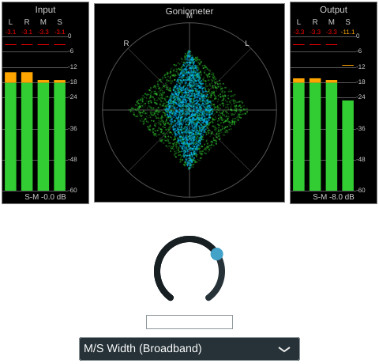

# Phase 3 -- StereoWidener plugin, first algorithms and the algorithm switch

The second plugin in the project, built from a copy of `StereoAnalyzer` (see
[phase2_stereo_analyzer.md](phase2_stereo_analyzer.md)), reusing its metering
components from `shared/metering/` so both plugins share the same goniometer/level-meter
look and any fix helps both. Unlike the analyzer, this plugin actually processes audio:
it widens or narrows the stereo image, switchable between two algorithms.

## GUI layout

User request, in the user's own words: "Level meter left for input, Goniometer in the
middle with two colors green in, blue out, Levelmeter on the right for the output. All a
little smaller (60%) compared to the analyzer. Big Knob in the middle for width. and a
listbox for algorithm selection below that."



- **Input level meter (left) / Output level meter (right)**: two separate
  `LevelMeterComponent` instances, each bound to its own `StereoMeterState`
  (`StereoWidenerAudio::m_meterStateIn` / `m_meterStateOut`) -- the widener measures the
  signal both before and after processing (see "Processing" below).
- **Goniometer (middle), input in green / output in blue overlaid in one circle**:
  `GoniometerComponent` gained a second, optional signal (`setSecondarySeries()`,
  `shared/metering/GoniometerComponent.h`/`.cpp`) drawn on top of the existing primary
  series but sharing the same grid/circle, rather than needing two separate goniometer
  instances stacked or a bespoke widener-only component. `StereoAnalyzer` is unaffected
  (its goniometer just never calls `setSecondarySeries()`, so it keeps drawing a single
  green series exactly as before); this is exactly the "shared, reusable" design
  `shared/metering/` was already following (see phase2 docs). Both series still get the
  existing overload clamp-to-circle-and-turn-red treatment, regardless of which one
  clips.
- **Sizing, "60% of the analyzer"**: `PluginSettings.h`'s `g_levelMeterWidth` (115px) is
  about 60% of the analyzer's `g_levelMeterMaxWidth` (190px), and the whole meter row
  (`g_meterRowHeight` = 260px) is sized similarly relative to the analyzer's equivalent
  goniometer row, leaving room below for the knob and the algorithm selector that the
  analyzer doesn't have.
- **Width knob**: a big rotary `juce::Slider` (`g_widthKnobSize` = 110px diameter),
  bound to the Width parameter via the standard
  `AudioProcessorValueTreeState::SliderAttachment`.
- **Algorithm selector ("listbox")**: a `juce::ComboBox` below the knob, bound to the
  Algorithm parameter via `ComboBoxAttachment`, populated from `g_algorithmNames`.

## Processing: StereoAlgorithm interface and the crossfaded switch

`algorithms/StereoAlgorithm.h` defines the common interface every algorithm implements
(`prepare()`, `reset()`, `process()`, `getName()`, `isMonoSafe()`,
`getLatencySamples()`) -- one small class per algorithm, per plan2.md section 5's
teaching-oriented code rules. `StereoWidenerAudio` (`StereoWidener.h`/`.cpp`) owns a
`std::vector<std::unique_ptr<StereoAlgorithm>>` and an `AudioParameterChoice` selecting
the active one by index.

Switching algorithms mid-playback is crossfaded rather than instant (plan2.md Phase 3:
"Algorithm switching with an equal-power crossfade (20-50 ms)"), so a mode change never
clicks even though the two algorithms shown here sound very different:
`StereoWidenerAudio::processSynchronBlock()` detects the parameter's index changing,
resets the incoming algorithm's filter state, then for `kCrossfadeSeconds` (30 ms) runs
**both** the outgoing and incoming algorithm on (copies of) the same block and mixes
them sample-by-sample with `cos`/`sin` gains (equal power, not a linear ramp, so the
summed power stays constant through the fade instead of dipping). Outside a crossfade,
only the active algorithm runs -- negligible extra CPU.

`m_meterStateIn.processBlock()` runs on the untouched input at the top of
`processSynchronBlock()`; `m_meterStateOut.processBlock()` runs on the final (possibly
crossfaded) output at the end -- so the meters and goniometer always show what actually
came in and what actually went out, including mid-crossfade blends.

## Algorithm 2.1: M/S width, broadband and filtered

Both algorithms implement the same textbook M/S width control (`M = (L+R)/2`,
`S = (L-R)/2`, `L' = M + width*S`, `R' = M - width*S`; `width`: 0 = mono, 1 = unity,
2 = double the side signal) -- deliberately two variants of the *same* control, so
switching between them is an audible, testable difference specifically for exercising
the crossfade above, not two unrelated algorithms.

- **`algorithms/MSWidthBroadband.{h,cpp}`**: the plain version, width applied across the
  whole spectrum equally. Stateless.
- **`algorithms/MSWidthFiltered.{h,cpp}`**: the same control, but S is run through a
  second-order Butterworth high-pass (`juce::dsp::IIR::Filter`, crossover at 150 Hz)
  *before* the width scaling. Content below the crossover is removed from S entirely --
  forced into M, i.e. mono -- so bass always stays centred regardless of the width
  setting, while only the highs get widened. This is the standard "bass mono" mastering
  trick (plan2.md 2.1: "M/S width + bass mono").

## Verification

**Null test** (plan2.md Phase 3, step 4: "width = 100% gives output = input"), a small
throwaway console tool feeding the same 4096-sample random stereo block through both
algorithms at width = 100%:

```
MSWidthBroadband (width=100%, expected: bit-exact passthrough): max abs diff = 5.96046e-08 (-144.494 dBFS)   PASS
MSWidthFiltered  (width=100%, expected: NOT a passthrough -- bass is always forced mono): max abs diff = 0.217158 (-13.2645 dBFS)
```

`MSWidthBroadband` passes the strict null test (-144 dBFS, far below the -100 dBFS
threshold -- the residual is pure float round-trip error through the M/S transform).
`MSWidthFiltered` is *expected* to fail it: it forces the bass mono at every width
setting by design, so even at width = 100% it genuinely changes the signal. The two
numbers together confirm the algorithms are functionally distinct, which is the whole
point of using them to test the switch.

**pluginval** `--strictness-level 10` passes on the built VST3, including the
"Automation" and "Fuzz parameters" tests, which randomly exercise every parameter
(including the Algorithm choice) at every tested block size/sample-rate combination --
a real stress test of the crossfade logic under rapid, arbitrary switching, with no
crashes or asserts.

**GUI layout**, verified with the same offline-render technique used throughout Phase 2
(no interactive GUI in this sandbox, see `../README.md`): rendered at the plugin's
default size and a larger window, confirming the input/goniometer/output row, the
dual-colour overlaid goniometer (green input filling the circle, blue output visibly
narrower after a test width reduction), the width knob, and the algorithm selector all
lay out and scale correctly. One render-tool-only gotcha along the way:
`GoniometerComponent::refresh()` (which drains the FIFO into the drawn point history)
runs on `MeterComponentBase`'s own `Timer`, which never fires in a synchronous console
app with no message loop running -- worked around in the test tool with
`Thread::sleep()` + `Timer::callPendingTimersSynchronously()`; not a real plugin issue,
since a host always runs a real message loop.

## Not yet implemented (deferred to later phases, per plan2.md)

- Mono input / mono->stereo bus layout (currently stereo->stereo only, like the
  analyzer; a mono buffer is passed through unprocessed as a safety guard rather than
  crashing).
- Mix, Output gain, Auto gain, Bypass, and the Mastering/Creative profile switch
  (Phase 4).
- Latency reporting per algorithm is wired up in the `StereoAlgorithm` interface
  (`getLatencySamples()`) but not yet connected to `setLatencySamples()` on a switch,
  since both current algorithms report 0 -- needed once a linear-phase mode exists
  (Phase 4).
- A Settings popup (ballistics for the two meters) like the analyzer's -- both meters
  currently just use `StereoMeterState`'s own defaults.
