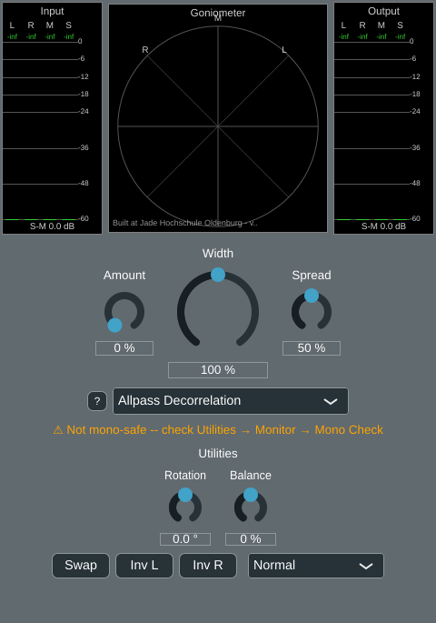

# Phase 5, algorithm 2.5 -- Allpass-cascade decorrelation

Second algorithm in Phase 5 (planing.md 2.5, "Allpass Decorrelation"), implemented
after [algorithm 2.4, complementary comb](phase5_comb.md), following the same
four-step process (plan2.md): Python reference -> C++ class + cross-check -> doc page
-> (new this time) "not mono-safe" badge and mono-check hint in the GUI. Order changed
from the original plan (comb -> multiband -> allpass/velvet -> Haas) to comb ->
**allpass/velvet** -> multiband -> Haas, per explicit request.

## The algorithm

planing.md 2.5 describes two closely related techniques under one entry: filtering L
and R (or a mono source feeding both) through *different* allpass cascades (magnitude
unchanged per channel, only phase differs, so the channels decorrelate), and a "common
approach" formula `S' = S + k*AP(M)`. Taken literally, the second formula alone (with M
left untouched) would be exactly as mono-safe as algorithm 2.4's comb -- but planing.md
explicitly lists "the mono sum is *not* flat" as this algorithm's defining con, which
only follows from the first technique (M *itself* differently phase-shifted per
channel). This implementation therefore uses the first technique, generalised to also
work as an "add on top of existing stereo content" tool (planing.md's group S), not
just mono->stereo (group P):

```
Y1 = AP1(M), Y2 = AP2(M)     -- two different allpass cascades applied to M = (L+R)/2
L' = L + Amount * (Y1 - M)
R' = R + Amount * (Y2 - M)
M' = (L' + R') / 2,  S' = Width * (L' - R') / 2
L'' = M' + S',  R'' = M' - S'
```

Each cascade is `kNumStages = 4` second-order allpass sections (RBJ cookbook formula,
`juce::dsp::IIR::Coefficients::makeAllPass` in C++, `algorithms/filters.py`'s
`allpass()` in Python -- the same formula family used throughout this project). AP1's
section frequencies are fixed (`kBaseFreqsHz = {200, 700, 2400, 8000} Hz`); AP2's are
AP1's shifted up by `Spread` octaves (0-`kMaxSpreadOctaves = 2.0`). At `Amount = 0` this
is an algebraically exact bypass. At `Spread = 0`, AP1 == AP2 so Y1 == Y2, and the *side*
signal is completely unaffected (`L'-R'` reduces exactly to `L-R`) -- but the *mid*
signal still changes, because summing a signal with a phase-shifted copy of itself is
not magnitude-neutral even though each copy alone has an unchanged magnitude spectrum
(see "Verification" below for the numeric confirmation). `Spread > 0` additionally makes
AP1 != AP2, adding genuine inter-channel decorrelation on top of that mid-signal effect.

At `Amount = 1` for dual-mono input (`L = R = M`, so `S = 0`): `L' = Y1`, `R' = Y2`
exactly -- each output channel is *purely* an allpass-filtered copy of M, so each
channel's own magnitude spectrum exactly equals M's (planing.md's stated "pro"). At
intermediate `Amount`, or with existing stereo content mixed in, this is a blend rather
than a pure replacement, so some comb-filter-like ripple is possible in each channel's
own spectrum too -- the same kind of trade-off algorithm 2.4's own doc page describes
for comb, not unique to this algorithm.

## Not mono-safe -- new this phase

Unlike comb, `L''+R''` does **not** generally equal `L+R` once `Amount > 0`:
`L''+R'' = (L+R) + Amount*(Y1+Y2-2M)`, and `Y1+Y2` only equals `2M` in the trivial
`Amount = 0` case. `AllpassDecorrelation::isMonoSafe()` returns `false` -- the first
algorithm in this project to do so (both M/S width algorithms and comb are mono-safe by
construction). This activated plan2.md Phase 5 step 4 for the first time:
`StereoWidenerGUI` now shows an orange **"⚠ Not mono-safe -- check Utilities → Monitor →
Mono Check"** badge directly below the algorithm selector whenever the active
algorithm's `isMonoSafe()` is false (empty, but still laid out, for every mono-safe
algorithm, so switching algorithms never shifts the Utilities section below it -- see
`StereoWidenerGUI::updateAuxKnobsForActiveAlgorithm()`/`resized()`,
`StereoWidener.cpp`). The hint points at the Monitor utility's existing "Mono Check
(L+R)" mode (Phase 4 step 2), rather than adding a new mechanism.



(Screenshot predates the [Phase 5 GUI compaction](phase5_gui_compaction.md), which
moved the aux knobs and Utilities to a different layout -- the rebinding and
mono-safe-badge behaviour shown here is unaffected and still current; see that page
for an up to date screenshot with this algorithm selected.)

## Parameter minimisation: 2 + Width

Two user-facing parameters, same "2 + Width" convention as every algorithm so far:

- **Amount** (`allpassAmount`, 0-100 %, default **0 %**): wet amount of the decorrelated
  component. 0 % is an algebraically exact bypass -- the correct neutral default (see
  [phase5_comb.md's "Removing last-used state"](phase5_comb.md#removing-last-used-state-neutral-defaults-instead)
  section for why every parameter's default must be neutral).
- **Spread** (`allpassSpread`, 0-100 % -> 0-`kMaxSpreadOctaves` octaves internally,
  default 50 %): how far apart AP2's cascade frequencies sit from AP1's. No "neutral"
  value of its own -- inert whenever Amount = 0, same reasoning as comb's Delay default.

**Width** (shared, 0-200 %) scales the resulting `S' = (L''-R'')/2` on top of the above,
same convention as every other algorithm.

A frequency clamp (`0.45 * sampleRate`, both in the C++ class and the Python reference)
prevents a large Spread from pushing a high base frequency (8000 Hz) above Nyquist at
common sample rates -- found via a `NaN`/`Inf` blowup in the very first evaluation run
at `spread_octaves = 2.0` (8000 Hz * 2^2 = 32 kHz, above the 22.05 kHz Nyquist at
44.1 kHz) and fixed before any C++ work started.

## Verification

**Python reference** (`python/algorithms/allpass_decorrelation.py`,
`python/evaluate_allpass.py`): same 7-signal corpus and `stereo_eval.report`
measurements used throughout this project, six settings written to
`python/results/allpass/`. Confirmed:
- **`amount = 0` is an exact bypass on every signal** (`np.max(np.abs(y - x)) < 1e-9`,
  asserted in the evaluation script itself, not just eyeballed).
- **Mono colouration is genuinely non-zero once Amount > 0** (e.g. `mix_small`/
  `a050_s10`: 4.99 dB; `a100_s20`: 12.27 dB) -- confirms the documented "con", in
  contrast to comb's exact 0.00 dB on every row.
- **The `spread = 0` case (AP1 == AP2) still colours the mono sum despite leaving the
  side signal untouched**: verified directly (not just via the summary table) that
  `S_out == S_in` bit-for-bit at `spread_octaves = 0`, while `M_out != M_in` (M's own
  energy actually *drops*, e.g. noise_pink: 0.00745 -> 0.00570) -- this is why the
  `rho`/correlation column still changes at `spread = 0` even though the literal `L-R`
  difference signal is unchanged: correlation depends on the *mid* signal's energy too
  (`rho = (E[M'^2]-E[S^2]) / sqrt((E[M'^2]+E[S^2])^2 - 4*E[M'*S]^2)`), not just on `S`.
  A genuinely surprising result on first look, fully explained by the algebra once
  traced through -- see the module docstring for the derivation.
- **Genuine width from dual-mono input**: `speech_dry_answers` correlation drops from
  1.00 to -0.02/0.91/0.10 across the three amount/spread settings, the same
  "creates real stereo from mono, unlike M/S width" property comb also has.


**C++ cross-check against the real plugin DSP** (`tools/widener_render`, extended with
an `allpass` algorithm option and `allpassAmountPercent`/`allpassSpreadPercent`
arguments; `python/evaluate_widener_plugin.py`, extended with three allpass settings):
running the actual `AllpassDecorrelation` class reproduces the Python reference's
numbers closely -- e.g. `mix_small`/`a050_s10`: rho out 0.23, dS-M 14.7 dB, mono col
4.99 dB, matching the Python reference exactly to the printed precision. The existing
`filtered_w150_off == broadband_w150` bit-exact sanity check (unrelated to this
algorithm) still passes.

**Automated numeric cross-check** (`python/crosscheck_allpass.py`, same pattern as
`crosscheck_comb.py`): diffs `python/results/allpass/summary.txt` against the relevant
rows of `python/results/widener_plugin/summary.txt`. Result: **PASS**, and much tighter
than comb's cross-check -- max diffs across all 21 rows are all effectively 0.00 (the
largest is 0.01 dB mono colouration on one row), since unlike comb's delay line this
algorithm needs no fractional-sample interpolation in the C++ version, so the only
difference between the two implementations is float32 (C++) vs. float64 (Python/scipy)
arithmetic.

**pluginval --strictness-level 10**: SUCCESS on the rebuilt VST3 (`python/results/
allpass/pluginval_final.txt`).

**GUI offline render** (throwaway `WidenerGuiSnapshot` console tool, built and fully
removed afterwards per the project's convention): confirmed the aux knobs correctly
rebind to "Amount"/"Spread" with a `%` suffix (default values 0 %/50 % visible), the
"not mono-safe" badge shows the expected text when Allpass Decorrelation is selected,
and is empty (with no layout shift) for the mono-safe algorithms.

## Files

- `StereoWidener/algorithms/AllpassDecorrelation.h`/`.cpp` (new): the algorithm class.
- `python/algorithms/allpass_decorrelation.py`, `python/evaluate_allpass.py` (new):
  Python reference and evaluation script.
- `python/crosscheck_comb.py` (new, this phase step also added to algorithm 2.4's own
  verification retroactively), `python/crosscheck_allpass.py` (new): automated
  Python-vs-C++ numeric cross-checks.
- `StereoWidener/StereoWidener.h`/`.cpp`: `g_paramAllpassAmount`/`g_paramAllpassSpread`,
  `AllpassDecorrelation` registered as the fourth algorithm, the "not mono-safe" badge
  (`m_monoSafeBadge`) and its wiring in `updateAuxKnobsForActiveAlgorithm()`/
  `resized()`.
- `StereoWidener/PluginSettings.h`: `g_monoSafeBadgeHeight`, `g_minGuiSize_y` grown to
  fit the new badge row (655 -> 685).
- `StereoWidener/CMakeLists.txt`: new source file, version bumped 0.1.4 -> 0.1.5.
- `tools/widener_render/main.cpp`/`CMakeLists.txt`, `python/evaluate_widener_plugin.py`:
  extended with `allpass` algorithm support.
