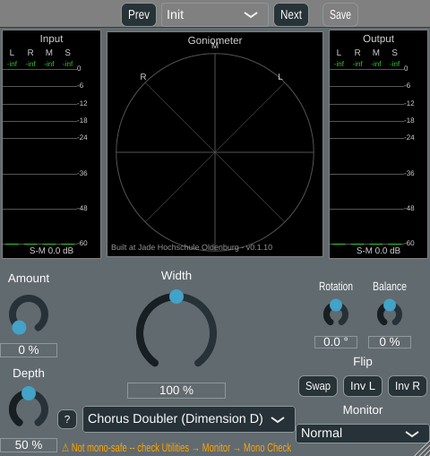

# Phase 5, algorithm 2.11 -- Micro-pitch / chorus doubler ("Dimension D")

Seventh algorithm in Phase 5 (planing.md 2.11, "Micro-Pitch / Chorus Doubler"),
implemented after [algorithm 2.12, early reflections](phase5_early_reflections.md) and
moved up into the v1 plan per explicit request (originally a Phase 7/v2 candidate; see
plan2.md). Before implementation, the user asked whether planing.md 2.11's three
named variants -- chorus, "Dimension D", and true micro-pitch-shift -- are different
enough to need separate classes, or share one engine with different parameters.
Answer, agreed before coding started: chorus and Dimension-D-style widening are the
same technique (an LFO-modulated fractional delay line, sine/triangle LFO) at
different rate/depth/stereo-phase settings, so they share one class; true cent-
accurate pitch-shift needs a structurally different sawtooth/ramp LFO with a two-tap
crossfading delay line to hide the periodic ramp reset -- a real redesign, not a
parameter change. Per explicit decision, **only the chorus/Dimension-D member of the
family is implemented here**; pitch-shift is out of scope.

## The algorithm

planing.md 2.11: "L and R get slightly different short, modulated delays (5-30 ms,
LFO) or fixed detune ... the classic 'Dimension D' or 'micro shift' effect (Eventide
H3000 style)." Group S+P (works on existing stereo content and creates pseudo-stereo
from mono), mono-compatibility "-" -- the worst rating of any Phase 5 algorithm so far
(worse than 2.5/2.12's "o"), matching planing.md's own con: "mono sum shows comb and
flanging artefacts."

The mid signal M is fed through two independently LFO-modulated delay lines, one per
output channel, held a quarter-cycle (90 deg, "quadrature") apart -- the actual source
of L/R decorrelation, same reason 2.5 uses two different allpass cascades and 2.12
uses two different tap patterns:

```
delayL(t) = kBaseDelayMs + Depth*kMaxDepthMs*sin(2*pi*Rate*t)
delayR(t) = kBaseDelayMs + kStereoOffsetMs + Depth*kMaxDepthMs*sin(2*pi*Rate*t + pi/2)
Y_L[n] = M[n - delayL(n)] (fractional read) - M[n]
Y_R[n] = M[n - delayR(n)] (fractional read) - M[n]
L' = L + Width*Amount*Y_L
R' = R + Width*Amount*Y_R
```

Same structural pattern as 2.5/2.12 (add directly to L/R) rather than 2.4's comb: two
different, continuously time-varying delay patterns added to L and R means the mono
sum is not just coloured but *sweeping* -- the interference pattern between L and R
moves with the LFO, "flanging" through a range of comb-filter notch positions over
time, rather than sitting at one fixed set of notches like 2.5/2.12. This is why
planing.md rates this "-" rather than "o".

**`kStereoOffsetMs` is a fixed L/R separation, deliberately NOT scaled by Depth.** An
earlier version scaled the entire LFO excursion -- including the base phase-offset
term -- by Depth, so `Depth = 0` collapsed `delayL` and `delayR` to the exact same
constant: L and R would read the *identical* delayed copy of M, i.e. a single comb
filter baked identically into both channels (no complementary +/- structure like
Complementary Comb, so each channel's own spectrum AND the mono sum both take the full
notch pattern). Found via `evaluate_chorus_doubler.py` showing `Depth = 0` as the
*worst* setting for `dLUFS`/mono coloration in several rows -- backwards from what
"turn depth down" should do. Fixed by keeping L and R always separated by a small
fixed offset, independent of Depth, matching planing.md's own description ("L and R
get slightly different ... delays") as unconditional, not something Depth can turn off
entirely.

## Not mono-safe

Same reasoning as allpass decorrelation/early reflections (a technique that
decorrelates channels by construction cannot also leave the mono sum untouched), but
worse here because the interference pattern itself moves over time.
`ChorusDoubler::isMonoSafe()` returns `false`; the existing "not mono-safe" badge
(built for algorithm 2.5, no new GUI code needed) shows whenever this algorithm is
selected.



## Parameter minimisation: 2 + Width

Two user-facing parameters, per the project's "2 + Width" convention:

- **Amount** (`chorusAmount`, 0-100 %, default **0 %**): wet amount of the chorus
  component. 0 % is an algebraically exact bypass -- the correct neutral default.
- **Depth** (`chorusDepth`, 0-100 %, default 50 %): scales the LFO's modulation
  excursion. No neutral value of its own -- inert whenever Amount = 0, same reasoning
  as comb's Delay/allpass's Spread/early reflections' Room Size defaults.
- **Rate** is NOT user-facing: a `GlobalSettings` default (`chorusRateHz`, default
  0.3 Hz), mirroring comb's `crossoverHz`/early reflections' pre-delay precedent.
  Deliberately kept slow/"Dimension D"-like by design -- a fast rate turns this into
  an obvious vibrato/warble, a different (arguably worse-sounding) effect for a width
  tool, so it is fixed rather than a third knob a user could dial into that regime.
- Base delay, the fixed L/R stereo offset, max depth range, and the L/R LFO phase
  offset are compiled-in constants, mirroring allpass's fixed cascade frequencies /
  early reflections' fixed tap-fraction pattern.

**Width** (shared, 0-200 %) scales the added chorus component on top of the above,
same convention as every other algorithm.

## DelayLine usage: two lines, not a shared multi-tap trick

Uses **two separate** `juce::dsp::DelayLine` instances (one per channel), each read
with plain one-push/one-pop-per-sample usage (default `updateReadPointer=true`) --
deliberately *not* Early Reflections' shared-single-delay-line-with-multiple-taps
trick, even though M is the same signal for both channels. That trick requires getting
`popSample()`'s `updateReadPointer` exactly right for every tap, and took two attempts
to get right for early reflections (see that algorithm's own doc page): an
over-advancing read cursor, then an overcorrection that froze it entirely, both real
bugs found only by direct verification, not by inspection. With only two taps here,
the memory saved by sharing one delay line is negligible, so the simpler,
provably-correct one-line-per-channel design is used instead -- deliberately trading a
few KB of memory for eliminating an entire class of bug before it could recur.

Depth's value is smoothed (`juce::SmoothedValue`, same fix as Complementary Comb's own
"zipper noise on Delay changes"): it directly scales the LFO excursion fed into
`setDelay()` every sample, so an abrupt Depth change would otherwise step the delay
line's target position discontinuously. Amount is a plain output-gain multiplier,
matching Allpass Decorrelation/Early Reflections' precedent of not smoothing that kind
of parameter.

## Verification

**Python reference** (`python/algorithms/chorus_doubler.py`,
`python/evaluate_chorus_doubler.py`): same 7-signal corpus and `stereo_eval.report`
measurements used throughout this project, six settings written to
`python/results/chorus/`. Confirmed:
- **`amount = 0` is an exact bypass on every signal** (`np.max(np.abs(y - x)) < 1e-9`,
  asserted in the evaluation script itself).
- **Mono colouration is genuinely non-zero once Amount > 0**, and larger than either
  allpass decorrelation or early reflections at comparable settings (e.g.
  `mix_small`/`a050_d050`: 2.00 dB, vs. early reflections' 1.96 dB at its own
  `a050_r050` -- similar magnitude here, but this algorithm's own worst case
  (`a100_d100`, most aggressive) reaches 3.44-4.94 dB across signals) -- confirms
  planing.md's "-" mono-compatibility rating.
- **Genuine, strong width from dual-mono input**: `speech_dry_answers` correlation
  drops from 1.00 to 0.11-0.93 depending on setting, even reaching *negative*
  correlation (-0.05 at `a100_d100`) -- a stronger effect than any prior algorithm at
  comparable settings, consistent with planing.md's "strong effect" framing for this
  family.


**C++ cross-check against the real plugin DSP** (`tools/widener_render`, extended with
a `chorus` algorithm option and `chorusAmountPercent`/`chorusDepthPercent`/
`chorusRateHz` arguments; `python/evaluate_widener_plugin.py`, extended with three
chorus settings): running the actual `ChorusDoubler` class reproduces the Python
reference's numbers essentially exactly -- e.g. `mix_small`/`a050_d050`: mono col
2.00 dB in both. The existing `filtered_w150_off == broadband_w150` bit-exact sanity
check (unrelated to this algorithm) still passes.

**Automated numeric cross-check** (`python/crosscheck_chorus_doubler.py`, same pattern
as the other three cross-checks): diffs `python/results/chorus/summary.txt` against
the relevant rows of `python/results/widener_plugin/summary.txt`. Result: **PASS**,
with tolerances as tight as allpass's/multiband's own near-exact cross-checks (max
diffs: rho 0.01, IACC 0.00, dS-M 0.1, dLUFS 0.1, mono col 0.1) -- both sides use the
same fractional/linearly-interpolated delay read and the same LFO formula, and this
algorithm's two-separate-delay-lines design has no shared-cursor subtlety to disagree
on (unlike early reflections' cross-check, which needed much looser tolerances for a
real, understood reason -- see that algorithm's own doc page).

**pluginval --strictness-level 10**: SUCCESS on the rebuilt VST3.

**GUI offline render** (throwaway `WidenerGuiSnapshot` console tool, built and fully
removed afterwards per the project's convention): confirmed the aux knobs correctly
rebind to "Amount"/"Depth" with a `%` suffix (default values 0 %/50 % visible), the
"not mono-safe" badge shows the expected text when Chorus Doubler is selected, and
`M/S Width (Broadband)`'s own layout is unaffected.

## Files

- `StereoWidener/algorithms/ChorusDoubler.h`/`.cpp` (new): the algorithm class.
- `python/algorithms/chorus_doubler.py`, `python/evaluate_chorus_doubler.py` (new):
  Python reference and evaluation script.
- `python/crosscheck_chorus_doubler.py` (new): automated Python-vs-C++ numeric
  cross-check.
- `StereoWidener/GlobalSettings.h`/`.cpp`: `chorusRateHz` default (0.3 Hz).
- `StereoWidener/StereoWidener.h`/`.cpp`: `g_paramChorusAmount`/`g_paramChorusDepth`,
  `ChorusDoubler` registered as the seventh algorithm.
- `StereoWidener/CMakeLists.txt`: new source file, version bumped 0.1.9 -> 0.1.10.
- `tools/widener_render/main.cpp`/`CMakeLists.txt`, `python/evaluate_widener_plugin.py`:
  extended with `chorus` algorithm support.
