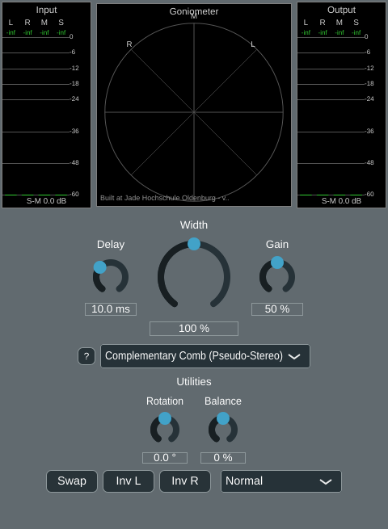

# Phase 5, algorithm 2.4 -- Complementary comb filter pseudo-stereo

Phase 5's plan (plan2.md) adds further widening algorithms beyond the M/S-based ones
from Phase 3. This page covers the first: planing.md's algorithm 2.4, complementary comb
filter pseudo-stereo (Lauridsen/Schroeder). Unlike `MSWidthBroadband`/`MSWidthFiltered`,
which only *reshape* stereo width that already exists in the input, this is a genuine
*pseudo*-stereo technique: it can create audible width from dual-mono material, where
M/S width algorithms have zero effect by construction.

User request for this phase: "start with phase 5 algorithm 2.4 comb. Try to minimize the
parameter to 2 +1 width for the user and all others should go to the settings." -- i.e.
the user-facing control surface for this algorithm must be exactly two algorithm-specific
knobs plus the existing shared Width knob, with anything else (here: the crossover
frequency) as a `GlobalSettings` default (Phase 4), not a GUI control.

## The algorithm

planing.md's base formula, for a mono input `x`: `L' = x + g*x[n-D]`, `R' = x - g*x[n-D]`,
with `D ~= 5-20 ms` and `g ~= 0.3-0.7`. Generalised to a stereo input, as planing.md
itself suggests ("apply to M and add to the existing S"): the mid signal `M` is left
completely untouched, and a delayed, gained copy of `M` is added to the existing side
signal:

```
M' = M
S' = Width * (S + Gain * HighPass(M, crossoverHz)[n - Delay])
L' = M' + S',  R' = M' - S'
```

Because `M` is never touched, `L' + R' = 2M = L + R` always -- perfectly mono-compatible
by construction, independent of Delay/Gain/Width. The high-pass on the delayed
contribution (not on `S` or `M` themselves) is planing.md's own suggested improvement
("Better with ... a crossover (apply only above ~300 Hz)"): low frequencies carry most of
a mix's energy and are the most audible as "phasiness"/comb-filtering colouration, so
they are excluded from the pseudo-stereo treatment -- only the highs get widened.

## Parameter minimisation: 2 + Width

Per the user's explicit request, exactly two algorithm-specific parameters are exposed:

- **Delay** (`combDelay`, 5-20 ms, default 10 ms) -- StereoWidenerGUI's left aux knob.
- **Gain** (`combGain`, 0-100 %, default 50 %) -- the right aux knob. Widened to the
  full 0-100 % range rather than clamped to planing.md's "usable" 30-70 % band, so the
  user isn't limited to a narrower range than the Width knob's own 0-200 %.

**Width** (shared across every algorithm, 0-200 %) scales the whole resulting `S'`,
exactly like `MSWidthBroadband`/`MSWidthFiltered`, so every algorithm shares the same
"how much effect" feel.

The **crossover frequency** (default 300 Hz, matching planing.md's own suggestion) is
*not* a user-facing knob -- it is a `GlobalSettings` default (`combCrossoverHz`,
`GlobalSettings.h`/`.cpp`), the same mechanism Phase 4 already uses for
`MSWidthFiltered`'s high-shelf gain. `ComplementaryComb::setCrossoverHz()` is called
once from `StereoWidenerAudio`'s constructor with `m_globalSettings.getCombCrossoverHz()`.

## GUI: dynamic aux-knob rebinding

Before this phase, StereoWidenerGUI's two aux-knob widgets (`m_auxLeftKnob`/
`m_auxRightKnob`) were permanently wired to `MSWidthFiltered`'s Bass Cutoff/High Shelf
parameters at construction time. Adding a third algorithm with its own Delay/Gain
parameters -- different physical meaning, different range, different unit -- created a
choice: give every algorithm its own dedicated knob pair (rejected: with five
Phase-5 algorithms planned, that means up to ten knobs, defeating the "minimise
controls" request), or make the *existing* two knobs represent different parameters
depending on the active algorithm.

The chosen design: `StereoWidenerGUI::bindAuxKnob()` destroys and recreates the knob's
`SliderAttachment` to point at whichever APVTS parameter ID the active algorithm uses,
reconfiguring that knob's text display (custom "Off"-zone formatting for Bass
Cutoff/High Shelf, a plain unit suffix for Delay/Gain) each time. The mapping from
algorithm index to parameter ID lives in two small anonymous-namespace helpers in
`StereoWidener.cpp`, `auxLeftParamIdFor()`/`auxRightParamIdFor()`, matching the index
order of `g_algorithmNames`. `updateAuxKnobsForActiveAlgorithm()` calls `bindAuxKnob()`
for both knobs every time the algorithm selection changes (and once at construction).

`StereoAlgorithm::AuxKnobInfo` itself was deliberately **not** extended with a
parameter-ID field: keeping that mapping centralized in `StereoWidener.cpp` avoids a
circular include between `algorithms/*.h` (which must stay ignorant of
`StereoWidener.h`'s parameter IDs) and the GUI.

A related bug found and fixed during verification: a disabled knob (e.g. both aux
knobs when `MSWidthBroadband` is active, which has no aux parameters at all) has no
attachment, so its `Slider` falls back to formatting its own raw internal value --
which showed as `"0.0000000"` in the text box instead of something sensible. Fixed by
giving `bindAuxKnob()` an explicit empty-`textFromValueFunction` case for "no parameter"
that returns a blank string, plus an explicit `knob.updateText()` call (the text box
is otherwise only refreshed by a live `SliderAttachment`, which doesn't exist in this
case). Verified with an offline render of all three algorithms (see below).

The audio-thread counterpart of the same problem -- a crossfade between two *different*
algorithms needs each one's own aux parameters, not one shared pair -- is handled by a
new `StereoWidenerAudio::paramsFor(int algorithmIndex, float width)`, called once per
algorithm per block in `processSynchronBlock()` (previously a single shared
`StereoAlgorithmParams` was built once per block and passed to whichever algorithm(s)
ran, which would have fed `MSWidthFiltered`'s Bass Cutoff/High Shelf values into
`ComplementaryComb`'s Delay/Gain during a crossfade into or out of it).



(Screenshot predates the [Phase 5 GUI compaction](phase5_gui_compaction.md), which
moved the aux knobs and Utilities to a different layout -- the rebinding behaviour
shown here is unaffected and still current.)

## Verification

**Python reference** (`python/algorithms/comb.py`, `python/evaluate_comb.py`): mirrors
the structure of `evaluate_ms_width.py` -- the same 7-signal test corpus, six
delay/gain/crossover/width settings, `stereo_eval.report` measurements written to
`python/results/comb/`. Confirmed:
- **Mono-sum colouration is exactly 0.00 dB on every one of the 42 rows** (all signals
  x all settings) -- perfect mono-compatibility by construction, as expected.
- Disabling the crossover (`noxover`) measurably *increases* decorrelation (dS-M) at
  the same delay/gain vs. the crossover-enabled setting, e.g. `mix_small`: dS-M 8.0 dB
  (crossover on) vs. 10.9 dB (off) -- confirms the crossover is doing its job of
  concentrating the effect above ~300 Hz.
- `speech_dry_answers` (dual-mono, S approx -119 dB below M): correlation drops from
  1.00 to 0.73/0.91/0.53 depending on delay/gain -- proof the algorithm creates *real*
  width from mono content, which `MSWidthBroadband`/`MSWidthFiltered` cannot touch at
  all (their own rows for this signal stay at correlation 1.00 regardless of Width).

**C++ cross-check against the real plugin DSP** (`tools/widener_render`, extended this
phase with a `comb` algorithm option and `combDelayMs`/`combGainPercent`/
`combCrossoverHz` arguments; `python/evaluate_widener_plugin.py`, extended with three
comb settings alongside the existing broadband/filtered ones): running the actual
`ComplementaryComb` class (not the Python reference) through the same corpus reproduces
the same findings -- mono colouration 0.00 dB on every row, `speech_dry_answers`
correlation dropping from 1.00 to 0.73/0.91/0.53 across the three delay/gain settings,
matching the Python reference closely. The existing `filtered_w150_off ==
broadband_w150` bit-exact sanity check (unrelated to this phase's changes) still
passes.


**Automated numeric cross-check** (`python/crosscheck_comb.py`, new): rather than
eyeballing the two summary tables above, this parses both
`python/results/comb/summary.txt` (Python reference) and
`python/results/widener_plugin/summary.txt` (C++ plugin) and directly diffs
`stereo_eval.report`'s metrics for the 3 settings x 7 signals both scripts share (21
rows), asserting each is within a tolerance loose enough to absorb the one intentional
implementation difference (the Python reference uses an integer-sample delay with no
interpolation; the C++ class uses `juce::dsp::DelayLine` with linear interpolation, so
automation-time delay changes don't click) but tight enough to catch a real
algorithmic mismatch. Result: **PASS** -- max diffs across all 21 rows: correlation
0.02, IACC 0.01, dS-M 0.6 dB (tolerance 0.7 dB; the one row close to its tolerance,
`speech_dry_answers`/`d05_g030`, is the dual-mono signal at its most delay-sensitive
setting -- S starts near zero there, so dS-M is a highly sensitive ratio), dLUFS
0.1 dB, mono colouration 0.00 dB exactly on every row. Full table in
`python/results/comb/crosscheck_vs_cpp.txt`. Run with `python
python/crosscheck_comb.py` after both `evaluate_comb.py` and
`evaluate_widener_plugin.py`.

**pluginval --strictness-level 10**: SUCCESS on the rebuilt VST3, both before and after
the disabled-aux-knob text-box fix above. (Unrelated, pre-existing: a `JUCE Assertion
failure in juce_NormalisableRange.h:265` fires repeatedly during fuzzing -- confirmed by
isolating it to algorithm index 1 [`MSWidthFiltered`] specifically, i.e. the existing
custom logarithmic-mapped High Shelf `NormalisableRange` from Phase 3, not anything
introduced in this phase; the new Comb parameters use plain linear ranges like
Width/Rotation/Balance, which never trigger it.)

**GUI offline render** (throwaway `WidenerGuiSnapshot` console tool, built and fully
removed afterwards per the project's convention): rendered `StereoWidenerGUI` for all
three algorithms. Confirmed: `MSWidthBroadband` shows both aux knobs disabled with a
blank text box (post-fix; previously showed `"0.0000000"`), `MSWidthFiltered` still
shows "Bass Cutoff"/"High Shelf" with correct Hz formatting (no regression from adding
the rebinding indirection), and `ComplementaryComb` shows "Delay"/"Gain" correctly
rebound with their own units (`10.0 ms`, `50 %`).

## Removing "last used state": neutral defaults instead

Follow-up user report, after using the plugin with this phase's changes: double-
clicking a GUI knob resets it to whatever value that parameter last had when a previous
plugin instance closed (Phase 4's "last used state", `docs/algorithms/phase4_settings.md`),
not to a sensible neutral default -- e.g. Width could double-click-reset to 150 % if
that's what was last dialled in, not 100 %. Root cause: JUCE's
`SliderParameterAttachment` (the internal class behind
`AudioProcessorValueTreeState::SliderAttachment`) automatically wires a slider's
double-click-return-value to *the parameter's own default value*
(`slider.setDoubleClickReturnValue(true, param.convertFrom0to1(param.getDefaultValue()))`,
`juce_ParameterAttachments.cpp`) -- and Phase 4 had made that default itself come from
`GlobalSettings::getLastUsedParam()`, i.e. whatever was last saved, specifically so a
brand new plugin instance would start from where the user left off. That's a reasonable
goal, but conflating "construction-time starting value" with "the neutral value a
double-click should restore" was the mistake: the two are different needs, and the
project already has a mechanism for the first one that doesn't have this side effect --
`PresetHandler`'s `init` preset, an explicit, user-chosen, inspectable action instead of
an invisible side effect of closing the plugin.

**Fix**: removed the mechanism entirely, per the user's explicit request ("let us
delete this part in the settings, especially since the init.xml preset has the same
usage, but is better suited for that"):
- `GlobalSettings::getLastUsedParam()`/`saveLastUsedState()` and the `lastUsedState`
  JSON field are gone; `GlobalSettings` now only persists the GUI scale factor
  (`saveGuiScaleFactor()`, a pure UI convenience, not a processing default) plus the
  settings that were never part of this mechanism (shelf gain, comb crossover, meter
  ballistics).
- `StereoWidenerAudio::addParameter()` now constructs every parameter directly from its
  own compiled-in `g_param*.defaultValue` -- no per-instance seeding at all.
- `StereoWidenerAudioProcessor`'s destructor no longer snapshots every parameter's
  current value; it only calls `saveGuiScaleFactor()`.

**"Default values for all parameters should always be as close to 'neutral' processing
as possible for the given algorithm"** (the user's stated principle, with Width at
100 % on double-click as the example) was then applied to every parameter, not just
Width:

| Parameter | Old default | New default | Why it's neutral |
|---|---|---|---|
| Width | 100 % | 100 % (unchanged) | unity -- side signal untouched |
| Bass Cutoff | 150 Hz | 30 Hz (Off) | filter bypassed -- `MSWidthFiltered` reduces to plain width |
| High Shelf | 8000 Hz | 16500 Hz (Off) | shelf bypassed, same reasoning |
| Comb Gain | 50 % | 0 % | no delayed contribution added to S -- reduces to plain width |
| Comb Delay | 10 ms | 10 ms (unchanged) | inert once Gain = 0; no "neutral" value of its own, left at a representative starting point for when Gain is raised |
| Rotation, Balance, Invert L/R, Swap L/R, Monitor, Algorithm | already 0/false/Normal/Broadband | unchanged | already neutral |

Note the Bass Cutoff/High Shelf/Comb Gain defaults now put `MSWidthFiltered` and
`ComplementaryComb` in a state acoustically identical to `MSWidthBroadband` at the same
Width until the user actively turns a knob -- consistent with "neutral for the given
algorithm" meaning "no *additional* processing beyond the shared Width control" for
every algorithm, not just the first one.

**Verification**: rebuilt and re-ran `pluginval --strictness-level 10` (SUCCESS,
unchanged from before). `docs/algorithms/phase4_settings.md` carries a correction note
pointing back here rather than being rewritten, since its "last used state" section is
now a historical record of a design later found to have this problem.

## Fixing "zipper" noise on Delay changes

Second follow-up, reported after using the plugin: changing the Delay knob produced an
audible "zipper" click. Cause: `ComplementaryComb::process()` called
`juce::dsp::DelayLine::setDelay()` once per block whenever the parameter changed --
this steps the delay line's read position *discontinuously* to a different point in the
circular buffer, and since two nearby points in a delayed periodic/quasi-periodic
signal are generally at different phases, jumping between them produces an audible
click (worse while dragging the knob continuously, hence "zipper").

The user pointed at their own `TimeVariantDelayLine` class (a different project,
`AudioDev/BasicDelay/`) as a possible fix and asked whether to reuse it or write
something simpler. Decided **not** to reuse it, for several concrete reasons found on
inspection, not just a style preference:
- It is designed for N-channel delays with a feedback/crosstalk matrix between
  channels; `ComplementaryComb` needs exactly one mono delay line (for M). Using it
  with 1 channel is actually **unsafe**: `processSamples()` unconditionally reads
  `m_crosstalkGain[1]`/`m_feedbackOld[1]` when `chn == 0`, an out-of-bounds access if
  `m_NrOfChns == 1`.
- It depends on `AudioDev/BasicDelay/`'s own `FirstOrderDesignRoutines.h` -- outside the
  `stereo_widening` git repo entirely, so using it would make this repo not buildable
  from a fresh clone without either vendoring those files in or adding a path
  dependency on a separate, separately-versioned sibling project.
- Its feedback/crosstalk/lowpass/highpass are all irrelevant to this algorithm (the
  crossover filtering already has its own dedicated, already-verified
  `crossoverFilter`) -- dead weight to carry and to have to reason about as "definitely
  inert here".
- Its `processSamples()` takes a whole `AudioBuffer`, while `ComplementaryComb::
  process()` interleaves the delay with per-sample M/S math -- would need restructuring
  either way.

The actual technique that class demonstrates -- ramp the delay *time* smoothly toward
its target instead of stepping it -- doesn't need any of that: `juce::SmoothedValue<float>`
(already used elsewhere in this project, e.g. `StereoWidenerAudio::m_crossfadeProgress`
for the algorithm-switch crossfade) applied to the delay-in-samples value, fed to the
existing, already-verified `juce::dsp::DelayLine` every sample
(`delayLine.setDelay(smoothedDelaySamples.getNextValue())`), achieves the same fix in
about 10 lines, no new class, no external dependency. A `kDelaySmoothingSeconds = 0.02f`
ramp (20 ms, matching the project's other short UI-driven ramps) glides the read
position smoothly across a Delay change instead of jumping.

**Provably no regression for every existing static-setting test**: the smoothing only
engages on a live parameter *change* after the algorithm has already processed at least
one block (`delayInitialized`); the very first block after `prepare()`/`reset()` snaps
directly to that block's target value with `setCurrentAndTargetValue()` (no glide-in
from 0). Since every existing test (`evaluate_comb.py`, `tools/widener_render` /
`evaluate_widener_plugin.py`, `crosscheck_comb.py`) renders one fixed setting per file
with no mid-render automation, none of them ever exercise the "already initialized,
value changes" branch at all -- confirmed by re-running `evaluate_widener_plugin.py`
after the fix and diffing against the pre-fix numbers: bit-for-bit identical on every
comb row.

**Verifying the fix itself**: a throwaway console tool (`tools/comb_zipper_check`,
removed afterwards per the project's convention) drove `ComplementaryComb` with a
sustained 300 Hz tone and an abrupt Delay change mid-stream (5 ms -> 18 ms, close to
the knob's full range, deliberately a worst case), then measured the largest
sample-to-sample jump in the output near the transition. Result: 0.023, essentially the
same as the input tone's own natural sample-to-sample delta (0.021) -- no discontinuity
spike, confirming the glide is smooth. `pluginval --strictness-level 10`: SUCCESS.

StereoWidener 0.1.7 -> 0.1.8.

## Files

- `StereoWidener/algorithms/ComplementaryComb.h`/`.cpp` (new): the algorithm class.
- `python/algorithms/comb.py`, `python/evaluate_comb.py` (new): Python reference and
  evaluation script.
- `StereoWidener/GlobalSettings.h`/`.cpp`: added `combCrossoverHz` (default 300 Hz).
- `StereoWidener/StereoWidener.h`/`.cpp`: `g_paramCombDelay`/`g_paramCombGain`,
  `ComplementaryComb` registered as the third algorithm, `paramsFor()`,
  `bindAuxKnob()`/`auxLeftParamIdFor()`/`auxRightParamIdFor()`.
- `StereoWidener/PluginProcessor.cpp`: destructor now only saves the GUI scale factor
  (see "Removing last-used state" above; no longer snapshots every parameter).
- `StereoWidener/CMakeLists.txt`: new source file, version bumped 0.1.2 -> 0.1.4 (0.1.3
  the comb algorithm itself, 0.1.4 the last-used-state removal/neutral-defaults follow-up).
- `tools/widener_render/main.cpp`/`CMakeLists.txt`, `python/evaluate_widener_plugin.py`:
  extended with `comb` algorithm support.
