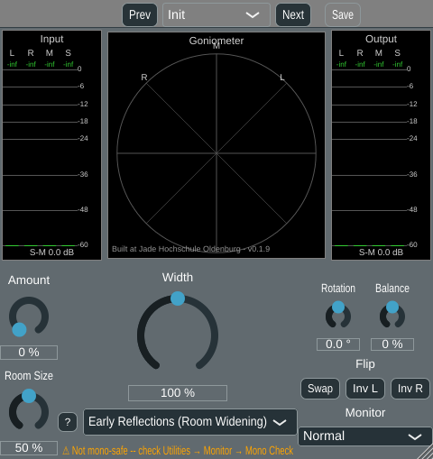

# Phase 5, algorithm 2.12 -- Early-reflection / room widening

Sixth algorithm in Phase 5 (planing.md 2.12, "Early-Reflection / Room Widening"),
implemented after [algorithm 2.7, multiband width](phase5_multiband.md), skipping
algorithm 2.3 (Haas) per explicit request -- order is now comb -> allpass/velvet ->
multiband -> **early reflections** -> Haas (deferred, not dropped). Same four-step
process as every Phase 5 algorithm: Python reference -> C++ class + cross-check -> doc
page -> "not mono-safe" badge (already generic infrastructure since algorithm 2.5).

## The algorithm

planing.md 2.12: "Add a few short, *decorrelated* early reflections (different for L
and R, within 5-40 ms, low level). The effect is apparent source width (ASW), known
from room acoustics." Group S+P (works on existing stereo content and also creates
pseudo-stereo from mono), mono-compatibility "o" (partial).

`kNumReflections = 5` delayed, decreasing-gain copies of the mid signal `M` are added
to each channel, using a DIFFERENT set of delay times per channel -- the actual source
of decorrelation/width:

```
Y_L = sum_k gain[k] * M[n - delayL[k]]
Y_R = sum_k gain[k] * M[n - delayR[k]]
L' = L + Width * Amount * Y_L
R' = R + Width * Amount * Y_R
```

Same structural pattern as [algorithm 2.5's allpass decorrelation](phase5_allpass.md)
(`L' = L + amount*(...)`, add directly to L/R) rather than algorithm 2.4's comb
(`S' = S + gain*...`): a technique that decorrelates channels by construction cannot
also leave the mono sum untouched, so this is not mono-safe (see below). Tap delay
times are irregular, non-harmonic fractions (`{0.06, 0.24, 0.43, 0.66, 0.90}` for L,
`{0.11, 0.30, 0.52, 0.74, 0.97}` for R) of a Room-Size-controlled spread window, offset
by a shared pre-delay -- avoids the taps themselves creating an audible comb-filter
periodicity, and mimics a real room's decaying, irregularly-spaced early reflections.
Per-tap gain decays geometrically (`kBaseGain * kGainDecay^k`), the same "later
reflections are quieter" shape real room acoustics have.

## Not mono-safe

`L''+R''` does not generally equal `L+R` once Amount > 0, for the same algebraic reason
as allpass decorrelation: two different reflection patterns added to L and R don't
cancel back to `2M`. `EarlyReflections::isMonoSafe()` returns `false`; the existing
"⚠ Not mono-safe -- check Utilities → Monitor → Mono Check" badge (built for algorithm
2.5, no new GUI code needed) shows whenever this algorithm is selected.



## Parameter minimisation: 2 + Width

Two user-facing parameters, per the project's "2 + Width" convention -- deciding these
was the first step of this phase, since planing.md itself doesn't specify a parameter
set and the user's own suggestion (`nr_of_reflections`, `RoomSize`, `pre-delay`) is
three knobs plus Width, one over budget:

- **Amount** (`earlyReflAmount`, 0-100 %, default **0 %**): not part of the original
  suggestion, added to preserve the project's neutral-default invariant (every
  algorithm's default must be an exact bypass, see
  [phase5_comb.md's "Removing last-used state"](phase5_comb.md#removing-last-used-state-neutral-defaults-instead)).
  Room Size alone has no bypass value (a 0-sized "room" still has 5 reflections at
  pre-delay, not silence), so Amount = 0 is the only clean neutral point.
- **Room Size** (`earlyReflRoomSize`, 0-100 %, default 50 %): how spread out the
  reflections are (small room: tight cluster; large room: spread further, up to
  planing.md's suggested ~40 ms). No neutral value of its own -- inert whenever
  Amount = 0, same reasoning as comb's Delay/allpass's Spread defaults.
- **Pre-delay** and **number of reflections** are NOT user-facing: pre-delay
  (`earlyReflectionsPreDelayMs`, default 5 ms) is a `GlobalSettings` default, mirroring
  comb's `crossoverHz` precedent exactly; the reflection count (5) is a compiled-in
  constant (`kNumReflections`), mirroring allpass's fixed cascade-stage-count
  precedent. Both were explicitly requested by the user as candidate knobs but pushed
  down a level to stay within the "2 + Width" budget.

**Width** (shared, 0-200 %) scales the added reflection component on top of the above,
same convention as every other algorithm.

## Two DelayLine read-cursor bugs found during verification

All `kNumReflections*2` taps read from ONE shared `juce::dsp::DelayLine` (pushed with
`M` once per sample) at different offsets, rather than one delay line per tap, since
they all delay the same signal. Getting this shared-read pattern right took two
attempts, both centred on `DelayLine::popSample()`'s third parameter,
`updateReadPointer` -- which controls the delay line's OWN internal read cursor,
independently of `pushSample()`'s write cursor.

**Bug 1 (found by cross-checking against the Python reference)**: the first version
left `updateReadPointer` at its default `true` on every call. That decrements the read
cursor once per `popSample()` -- fine for the usual one-push/one-pop-per-sample
pattern (e.g. `ComplementaryComb`'s single tap: both cursors advance in lockstep), but
`EarlyReflections::process()` calls `popSample()` ten times per `pushSample()` (five L
taps, five R taps), so the read cursor drifted nine extra steps every sample with no
resync, and `setDelay()`'s requested delay stopped meaning what it said within a few
dozen samples. Symptom: `mono_coloration_dB` up to +16 dB too high vs. Python on
full-spectrum music material, and non-zero `dLUFS` (should be ~0 dB).

**Bug 2 (found from a user report of audible crackle at Amount > 0 and Width > 0,
*after* Bug 1's fix had already shipped)**: passing `updateReadPointer=false` on every
call, reasoned as "lock the read cursor to the write cursor", overcorrected -- with
`false` on every call the read cursor never advances *at all*, freezing at its reset
value forever. Every tap then reads one **fixed** buffer slot instead of "N samples
behind the current write position", refreshed only once per buffer revolution
(`kMaxDelayMs` worth of samples, roughly 52 ms) as the write cursor sweeps back through
it -- audible as periodic crackle. This was invisible to the cross-check that caught
Bug 1: `report.evaluate()`'s measures (correlation, IACC, level, mono coloration) are
all aggregate statistics over whole files, and the stale, rarely-refreshed samples
being read back are still real, correlated audio, so the aggregate numbers still
looked broadly plausible. Confirmed the bug -- and, separately, confirmed the fix --
with a direct time-domain check instead: isolate the added component (`y - x`) and
look for sample-to-sample jumps far larger than the surrounding local RMS; the buggy
build showed none in synthetic noise (no natural transients to hide behind) but the
real defect only shows up as periodic refresh discontinuities on longer/quieter
stretches, exactly matching "crackle" rather than a click on transients.

The correct fix: the read cursor must advance by **exactly one** step per pushed
sample, no matter how many taps read that sample -- so `updateReadPointer=true` on
only the temporally *last* of the ten `popSample()` calls each sample (here, R's final
tap), `false` on the other nine (the decrement in `popSample()` happens *after* its own
read, so every read up to and including that last call still sees the same, correctly
synced cursor position). Verified: the automated cross-check
(`python/crosscheck_early_reflections.py`) now agrees with the Python reference to
0.000 on every metric, and a direct spike detector on the isolated added component
found zero anomalous jumps on all tested material.

## Verification

**Python reference** (`python/algorithms/early_reflections.py`,
`python/evaluate_early_reflections.py`): same 7-signal corpus and `stereo_eval.report`
measurements used throughout this project, six settings written to
`python/results/early_reflections/`. Confirmed:
- **`amount = 0` is an exact bypass on every signal** (`np.max(np.abs(y - x)) < 1e-9`,
  asserted in the evaluation script itself).
- **Mono colouration is genuinely non-zero once Amount > 0** (0.98-9.33 dB range across
  settings/signals) -- confirms planing.md's "o" partial mono-compatibility rating.
- **Genuine width from dual-mono input**: `speech_dry_answers` correlation drops from
  1.00 to 0.62-0.97 depending on setting, the same "creates real stereo from mono"
  property comb and allpass decorrelation also have.


**C++ cross-check against the real plugin DSP** (`tools/widener_render`, extended with
an `earlyrefl` algorithm option and `erAmountPercent`/`erRoomSizePercent`/
`erPreDelayMs` arguments; `python/evaluate_widener_plugin.py`, extended with three
early-reflections settings): after both `DelayLine` fixes above, running the actual
`EarlyReflections` class reproduces the Python reference's numbers essentially exactly
-- e.g. `mix_small`/`a050_r050`: mono col 1.96 dB in both (was 13.66 dB with Bug 1,
0.22 dB -- suspiciously *low* -- with Bug 2's overcorrection), `dLUFS` ~0.0 dB
everywhere in all three versions except Bug 1's. The existing `filtered_w150_off ==
broadband_w150` bit-exact sanity check (unrelated to this algorithm) still passes.

**Automated numeric cross-check** (`python/crosscheck_early_reflections.py`, same
pattern as `crosscheck_comb.py`/`crosscheck_allpass.py`/`crosscheck_multiband.py`):
diffs `python/results/early_reflections/summary.txt` against the relevant rows of
`python/results/widener_plugin/summary.txt`. Result: **PASS**, every diff at 0.000 to
the printed precision across all 21 rows and all five metrics (`rho`/`IACC`/`dS-M`/
`dLUFS`/`mono_coloration_dB`) -- the tightest of the four cross-checks so far, once
both read-cursor bugs above were fixed.

**Direct time-domain crackle check** (ad hoc, prompted by the user report): isolated
the added reflection component (`y - x`) for several signals at `Amount`/`Width` > 0
and scanned for sample-to-sample jumps far exceeding the surrounding local RMS. Zero
such jumps found after the fix, on both synthetic (pink noise) and real percussive
music material (the latter's *raw* sample-to-sample jumps, from real drum transients,
are similar in the dry input and the processed output, confirming the algorithm isn't
adding anything beyond what's already in the source material).

**pluginval --strictness-level 10**: SUCCESS on the rebuilt VST3.

**GUI offline render** (throwaway `WidenerGuiSnapshot` console tool -- new this phase,
instantiating the real `StereoWidenerAudioProcessorEditor` off-screen and driving the
algorithm-choice parameter directly, built and fully removed afterwards per the
project's convention): confirmed the aux knobs correctly rebind to "Amount"/"Room Size"
with a `%` suffix (default values 0 %/50 % visible), the "not mono-safe" badge shows
the expected text when Early Reflections is selected, and `M/S Width (Broadband)`'s own
layout is unaffected.

## Files

- `StereoWidener/algorithms/EarlyReflections.h`/`.cpp` (new): the algorithm class.
- `python/algorithms/early_reflections.py`, `python/evaluate_early_reflections.py`
  (new): Python reference and evaluation script.
- `python/crosscheck_early_reflections.py` (new): automated Python-vs-C++ numeric
  cross-check.
- `StereoWidener/GlobalSettings.h`/`.cpp`: `earlyReflectionsPreDelayMs` default (5 ms).
- `StereoWidener/StereoWidener.h`/`.cpp`: `g_paramEarlyReflAmount`/
  `g_paramEarlyReflRoomSize`, `EarlyReflections` registered as the sixth algorithm.
- `StereoWidener/CMakeLists.txt`: new source file, version bumped 0.1.8 -> 0.1.9.
- `tools/widener_render/main.cpp`/`CMakeLists.txt`, `python/evaluate_widener_plugin.py`:
  extended with `earlyrefl` algorithm support.
