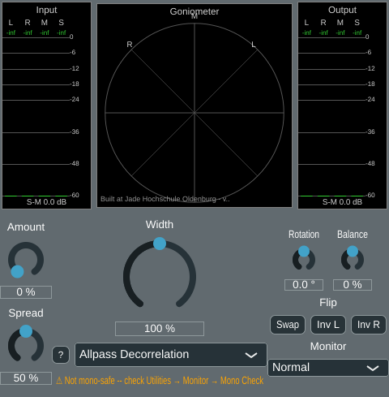
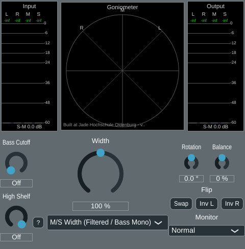

# Phase 5 follow-up -- GUI compaction

User request: "we should compact the design. All Utilities are effectivly working on
the output signal. Therefore, these should be stacked below the output meter. The two
knobs above and the buttons below. I also miss some short text description above or
below the buttons, like monitor. To make space for this change we move the second
auxiliary parameter from the right side of width to the left side and stack the two
parameters vertically. With these changes we can shrink the plugin vertically."

Applies to `StereoWidenerGUI` only (not `StereoAnalyzer`, which has its own, unrelated
GUI). Purely a layout change -- no parameters, algorithms, or audio processing were
touched.

## Before -> after

Before this change, `StereoWidenerGUI::resized()` laid out four separate full-width
rows below the meter row: a knob row (aux-left knob, Width, aux-right knob flanking
it), the algorithm selector row, the mono-safe badge, and a whole separate "Utilities"
section (title, Rotation/Balance knobs, then a row of toggle buttons + the Monitor
selector) -- see [phase3_stereo_widener.md](phase3_stereo_widener.md) and
[phase4_settings.md](phase4_settings.md) for how that layout came about.

After this change, everything below the meter row is reorganised into three columns,
edge-aligned with the meter row's own three sections (left column left-aligned with
the input meter, right column right-aligned with the output meter):

- **Left column**: the two aux knobs, now stacked vertically instead of flanking
  Width -- freed the space needed for the Utilities column on the right.
- **Middle column**: Width, the algorithm selector, and the mono-safe badge --
  unchanged in content and order, just no longer flanked by aux knobs.
- **Right column ("Utilities")**: since every utility (Rotation, Balance, Swap,
  Invert L/R, Monitor) acts on the final output signal after whichever width
  algorithm ran (see [UtilityProcessor.h](../../StereoWidener/UtilityProcessor.h)),
  it now sits directly below the output meter instead of its own full-width rows.
  Per the request, "the two knobs above and the buttons below": Rotation/Balance
  knobs on top, then a "Flip" caption, the three toggle buttons (Swap/Inv L/Inv R),
  a "Monitor" caption, and the Monitor selector.

All three columns are top-anchored and vertically centred within the tallest one's own
height (currently the middle column: Width + algorithm row + badge).

## The missing captions

Before this change, the three toggle buttons (Swap/Inv L/Inv R) had no caption of their
own beyond their individual button text, and the Monitor selector had no caption at
all (just its own currently-selected text, e.g. "Normal") -- unlike every knob, which
already had a label above it (Rotation, Balance, etc). Per the request ("I also miss
some short text description above or below the buttons, like monitor"), two new
`juce::Label`s were added: **"Flip"** above the toggle-button row, and **"Monitor"**
above the Monitor combo box (`StereoWidenerGUI::m_toggleCaption`/`m_monitorLabel`,
`StereoWidener.cpp`). The old full-width "Utilities" section title
(`m_utilitiesTitle`) was removed -- redundant now that the column's position (directly
below the output meter) already conveys the grouping, and keeping it would have cost
vertical space the compaction is specifically trying to save.

## Shrinking the window

`g_minGuiSize_y` (`PluginSettings.h`) dropped from 685 to **520** (a ~24% reduction):
the Utilities section no longer adds its own ~156 px of full-width rows below the
algorithm selector -- it now only needs to fit within whichever of the three columns
is tallest, and the right (Utilities) column at 182 px is actually *shorter* than the
middle column's 210 px (Width label+knob+textbox 146, + algorithm row 30, + mono-safe
badge 18, with the row gaps between). Verified by rendering `StereoWidenerGUI` off-
screen at exactly the height it gets inside the real plugin (`g_minGuiSize_y` minus
the preset bar `PluginEditor.cpp` reserves above it) and confirming every control is
fully visible with a small margin, for all four algorithms (the two screenshots above,
plus Broadband and Comb, all checked the same way).

`g_guiratio` (width:height aspect ratio, derived from `g_minGuiSize_x`/`g_minGuiSize_y`)
changed accordingly from ~1.43 to ~1.08 -- the window is now closer to square than the
previous noticeably-tall shape, matching the more horizontally-distributed three-column
layout.

## Verification

- `pluginval --strictness-level 10`: SUCCESS (`python/results/gui_compaction/
  pluginval_final.txt`).
- Offline GUI renders (throwaway `WidenerGuiSnapshot` console tool, built and fully
  removed afterwards per the project's convention) for all four algorithms, at the
  exact height `StereoWidenerGUI` receives inside the real plugin (window height minus
  the preset bar): confirmed no clipping or overlap for any algorithm, including the
  longest-content case (Allpass Decorrelation, which also shows the mono-safe badge
  below the algorithm selector).
- No parameter, algorithm, or processing changes -- this is a pure layout change, so no
  DSP verification was needed; the existing algorithm-level verification
  ([phase5_comb.md](phase5_comb.md), [phase5_allpass.md](phase5_allpass.md)) still
  applies unchanged.

StereoWidener 0.1.5 -> 0.1.6.
