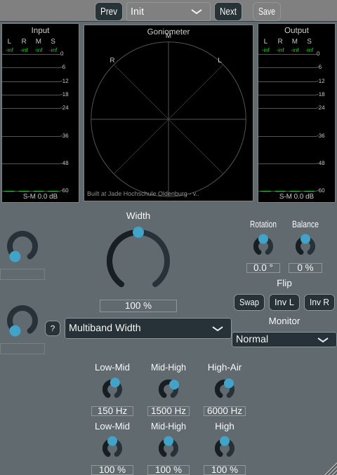

# Phase 5, algorithm 2.7 -- Multiband width

Third algorithm in Phase 5 (planing.md 2.7, "Multiband Width"), implemented after
[algorithm 2.5, allpass decorrelation](phase5_allpass.md), following the same
process -- but discussed in depth before implementation this time, since the user
flagged up front that it "would change the design completely": 6 parameters (3
crossover frequencies, 3 band widths) don't fit the "2 + Width" convention every
earlier algorithm used, so both the parameter-passing interface and the GUI needed to
grow a second, more general mechanism alongside the existing one, not just a bigger
version of it.

## The algorithm

planing.md 2.7: "Crossover (Linkwitz-Riley LR4, 3-4 bands, which sums to allpass or
flat) and an M/S width per band. Bass mono comes built in." Implemented as 4 bands from
3 Linkwitz-Riley 4th-order (LR4) crossovers, applied as a tree (each split feeds the
next), with mid and side split once each (filtering commutes with the linear M/S
transform, so this is cheaper than splitting L and R separately and computing M/S per
band):

```
M = (L+R)/2, S = (L-R)/2
M = M1+M2+M3+M4, S = S1+S2+S3+S4                          (per-band decomposition)
S' = Width * (0*S1 + width2*S2 + width3*S3 + width4*S4)   -- band 1 forced mono
M' = M   (unchanged, same convention as every width algorithm in this project)
L' = M' + S',  R' = M' - S'
```

Band 1 ("bass", below the first crossover) always has width 0 -- "bass mono comes
built in" (planing.md) -- not a parameter, matching this project's established
"minimise to what the user actually needs" philosophy. Mono-safe by construction: M is
never touched, so `L'+R' = 2M` always, independent of any width setting, the same
guarantee algorithm 2.4's comb has.

## Getting the reconstruction flat: allpass phase-compensation

A **naive** tree split -- each band being whatever LP4/HP4 combination its path
through the tree left it with -- does **not** reconstruct flat. Band 1 only passed
through one crossover's phase response on its way out of the tree, band 2 passed
through two, bands 3/4 through all three; summing bands with mismatched accumulated
phase causes real, measurable magnitude ripple where their spectra overlap. This was
found and measured during development, *before* any C++ was written: the naive
Python version showed a consistent **~0.5-0.6 dB of spurious mono-sum colouration at
every setting**, regardless of band widths -- a symptom of the reconstruction itself
(all bands summed with default/neutral widths, which should be a pure pass-through),
confirmed by isolating a single crossover split in isolation (perfectly flat magnitude
via a sine sweep, 0.000 dB at every tested frequency, but a measurable sample-domain
lag -- i.e. a true allpass, not an identity) and by tracing the tree's algebra by hand:
`band3+band4` only equals the second split's own remainder `rest2` if that split's own
allpass distortion is the identity, which it isn't.

This directly matches planing.md's own flagged risk: "Crossover phase must be handled
(LR sums to an allpass, or use linear phase with latency)." Two fixes were on the
table -- proper allpass phase-compensation (more filter-design work, no added latency,
genuinely flat) or a linear-phase FIR crossover (simpler concept, exact by
construction, but adds real latency this project hasn't wired up anywhere yet). Chosen:
**allpass phase-compensation**, since multiband is explicitly framed as *the* mastering
tool (planing.md: "the tool most used in practice"), where mono-sum fidelity matters
more than for a creative/pseudo-stereo mode, and it avoids adding latency.

The fix: every band must pass through the same total number of crossovers before
summing. A band that "skipped" a crossover on its way through the tree (because it was
already separated out earlier) is passed through an **LR4 allpass** (`LP4(x) + HP4(x)`
-- unity magnitude by the same LR4 property, just not used to separate anything, only
to add the matching phase) at that crossover's frequency instead:

```
band1 = LR4_allpass(LR4_allpass(low1, freq2), freq3)   -- skipped both freq2 and freq3
band2 = LR4_allpass(low2, freq3)                        -- skipped freq3
band3 = low3                                             -- already passed all 3
band4 = high3                                             -- already passed all 3
```

Result: mono-sum colouration dropped from ~0.55-0.6 dB to **0.01-0.04 dB** at the
neutral (all-widths-100%) setting -- verified both in the Python reference
(`python/evaluate_multiband.py`'s `IDENTITY_TOLERANCE_DB = 0.15`, using
`mono_coloration_dB`, a per-1/3-octave-band *level* comparison, not a raw sample
difference, since the compensated sum is still a true allpass of the input -- flat
magnitude, real phase distortion, so a naive sample-domain diff would report a large
"error" that isn't audible as colouration at all) and in the real C++ DSP.


## Parameter minimisation, and where it broke down

Six user-facing parameters -- the one algorithm in this project that doesn't fit the
"2 + Width" convention every earlier algorithm used:

- **Low-Mid, Mid-High, High-Air** (crossover frequencies, log-mapped like High Shelf,
  ranges 40-400/200-4000/1000-18000 Hz, defaults 150/1500/6000 Hz).
- **Low-Mid, Mid-High, High** (band 2/3/4 widths, 0-200 %, default 100 % -- neutral,
  same convention as the shared Width knob; band 1 is always 0, not a parameter).

Discussed with the user before implementation (see the user-facing conversation this
page is drawn from): agreed to keep a generic knob grid (reusing the existing
knob-rebinding machinery, laid out as a 2x3 grid) rather than build a dedicated
band-split-editor widget (a frequency axis with draggable crossover markers) for v1,
and to let the plugin window resize when Multiband Width is selected rather than
permanently reserve space for it in every other algorithm.

## Architecture: a second, more general parameter mechanism

`StereoAlgorithmParams`' existing `auxLeft`/`auxRight` pair (and the `AuxKnobInfo`-based
`getAuxLeftInfo()`/`getAuxRightInfo()` interface) is exactly two values, by design --
generalising it to an arbitrary count would have forced every existing algorithm and
all of `StereoWidenerGUI`'s two-knob-rebinding code to change for a case only one
algorithm needs. Instead, `StereoAlgorithm.h` gained a **parallel, additive**
mechanism: `StereoAlgorithmParams::multi` (a fixed `std::array<float, kMaxMultiParams>`,
`kMaxMultiParams = 6`) plus `getNumMultiParams()`/`getMultiParamInfo()`, both with
default implementations returning 0/empty -- every existing algorithm (`MSWidthBroadband`,
`MSWidthFiltered`, `ComplementaryComb`, `AllpassDecorrelation`) needed **zero changes**
to keep working exactly as before.

`StereoWidenerGUI` mirrors this: the existing two-knob column is untouched, and a new
`m_multiKnobs`/`m_multiLabels`/`m_multiAttachments` array of up to `kMaxMultiParams`
knobs (hidden via `addChildComponent`, not `addAndMakeVisible`, so they start invisible)
is shown -- laid out as a `g_multiGridCols`-wide grid, currently 2 rows of 3 -- only
when `getNumMultiParams() > 0`. `bindMultiKnob()` mirrors `bindAuxKnob()`'s rebinding
pattern but simpler (no "Off"-zone formatting, since none of Multiband Width's
parameters have one).



### The window resizes per algorithm

Since 6 knobs don't fit in the space 0-2 did, and per the design discussion the window
should grow only for the algorithm that needs it rather than permanently reserve that
space, `StereoWidenerGUI::getRequiredContentHeight()` reports how tall the component
needs to be for whichever algorithm is currently selected, and a new
`onActiveAlgorithmChanged` callback (fired at the end of
`updateAuxKnobsForActiveAlgorithm()`, i.e. on every algorithm switch, including the
initial one) lets `PluginEditor.cpp`'s `updateWindowSizeForActiveAlgorithm()` resize
the whole plugin window -- and its locked aspect ratio, and its resize limits -- to
match. Measured: 480x509 px for every algorithm except Multiband Width, 480x677 px for
Multiband Width (both at the base/unscaled GUI size).

Fixing this also fixed a latent bug in `PluginEditor.cpp`'s existing preset-bar height
calculation, which computed the preset bar's height as `height * g_minPresetHandlerHeight
/ g_minGuiSize_y` -- correct only as long as the window's aspect ratio always equals
the fixed `g_guiratio` constant, no longer true once that ratio changes per algorithm.
Replaced with a `scaleFactor`-based calculation (`scaleFactor * g_minPresetHandlerHeight`)
that stays correct regardless of the current aspect ratio.

### A crossover-ordering bug found during GUI verification

The three crossover knobs are meant to stay ordered (Low-Mid < Mid-High < High-Air) --
discussed and agreed before implementation: each knob clamps itself against its
current neighbours' live values on drag (`StereoWidenerGUI::clampCrossoverKnob()`),
rather than letting the three float independently and sorting them at processing time
(rejected: "which knob is the low-mid split" would silently swap whenever two crossed,
confusing to operate). `MultibandWidth::updateFrequenciesIfNeeded()` also sorts and
separates the three values defensively on the DSP side regardless, since a DAW can
automate the three parameters directly, bypassing the GUI clamp entirely.

**Bug found and fixed during offline GUI verification**: the very first render showed
Low-Mid and Mid-High collapsed to their range minimum (40 Hz, 200 Hz) instead of their
real defaults (150 Hz, 1500 Hz). Cause: `clampCrossoverKnob()` was wired to fire on
every `onValueChange`, including the ones `bindMultiKnob()` itself triggers while
(re)binding all three knobs' `SliderAttachment`s one at a time -- mid-loop, the *other*
two knobs' values are still whatever they were left at (an unbound Slider's own default,
effectively 0), which got read as a real "neighbour" value and clamped the knob
currently being bound down to near 0. Fixed with a guard flag
(`m_bindingMultiKnobs`) that `clampCrossoverKnob()` checks first, set for the duration
of `updateAuxKnobsForActiveAlgorithm()`'s (re)binding loop.

**A second, smaller display bug found in the same pass**: the crossover knobs' text
boxes showed far too many decimals ("150.0000... Hz", truncated by the narrow knob to
"150.0..."). Root cause, found by elimination: once a `SliderAttachment` is bound, the
displayed text comes from the underlying `AudioParameterFloat`'s own `getText()`, not
from the `Slider`'s own `setNumDecimalPlacesToDisplay()`/`setTextValueSuffix()` (which
have no effect once attached) -- and the custom log-frequency `NormalisableRange` used
for these three parameters (`makeLogFrequencyParameter()`, StereoWidener.cpp) has no
explicit "interval" for the default text formatting to derive a sensible decimal count
from. Fixed by giving that parameter builder an explicit whole-Hz
`withStringFromValueFunction()`, matching the pattern `makeFrequencyParameterWithOff()`/
`makeLogFrequencyParameterWithOff()` already used for Bass Cutoff/High Shelf. (The
three band-width parameters needed the opposite fix: their default text does *not*
include the `%` unit at all, so `bindMultiKnob()` still adds an explicit suffix for
those specifically.)

## Verification

**Python reference** (`python/algorithms/multiband_width.py`, `python/evaluate_multiband.py`):
same 7-signal corpus and `stereo_eval.report` measurements used throughout this
project, five settings written to `python/results/multiband/`. Confirmed:
- **The `default` (all-neutral) setting reconstructs flat**: `mono_coloration_dB`
  0.01-0.04 dB across every signal (asserted, `IDENTITY_TOLERANCE_DB = 0.15`) -- the
  phase-compensation fix described above, verified numerically.
- **Bass mono is genuinely built in**: `noise_pink_rho050`'s per-octave correlation
  plot (above) shows the output forced to ~1.0 below ~150 Hz regardless of the
  (neutral, in this setting) band widths, while tracking the input's own correlation
  closely above that.
- **Per-band control works independently**: `narrow_high` (band 4 width = 0) increases
  decorrelation less than `default`... actually decreases it in the high band only
  (e.g. `noise_pink_rho050`: rho out 0.83 vs 0.76) while `wide_mid` (band 3 width = 2.0)
  widens more overall (rho out 0.61) -- each band's own knob genuinely only affects
  that band.
- **`all_narrow`** (bands 2-4 all at width 0, band 1 already forced) reduces to fully
  mono on every signal (rho out 1.00, dS-M around -120 to -175 dB), same as
  `MSWidthBroadband` at Width = 0 %.

**C++ cross-check against the real plugin DSP** (`tools/widener_render`, extended with
a `multiband` algorithm option and 6 new arguments; `python/evaluate_widener_plugin.py`,
extended with 4 multiband settings): running the actual `MultibandWidth` class
reproduces the Python reference's numbers essentially exactly, e.g. `noise_pink_rho050`/
`default`: rho out 0.76, dS-M -4.1 dB, mono col 0.01 dB in both. The existing
`filtered_w150_off == broadband_w150` bit-exact sanity check (unrelated to this
algorithm) still passes.

**Automated numeric cross-check** (`python/crosscheck_multiband.py`, same pattern as
`crosscheck_comb.py`/`crosscheck_allpass.py`): diffs `python/results/multiband/
summary.txt` against the relevant rows of `python/results/widener_plugin/summary.txt`.
Result: **PASS**, with every diff at 0.000 to the printed precision -- the tightest of
the three cross-checks so far, since (like allpass, unlike comb) no delay-line
interpolation is involved, so the only difference between the two implementations is
float32 (C++) vs. float64 (Python/scipy) arithmetic through the 24-biquad-per-signal
phase-compensated tree.

**pluginval --strictness-level 10**: SUCCESS on the rebuilt VST3 (`python/results/
multiband/pluginval_final.txt`), including with the dynamic window-resize wiring
exercised during automated parameter fuzzing/editor-automation tests.

**GUI offline render** (throwaway `WidenerGuiSnapshot` console tool, extended this
phase to instantiate the *full* `StereoWidenerAudioProcessorEditor` -- not just
`StereoWidenerGUI` -- specifically to exercise and verify the dynamic resize path, and
fully removed afterwards per the project's convention): confirmed the window resizes
correctly on selecting/leaving Multiband Width (480x509 <-> 480x677), the 6-knob grid
lays out and labels correctly, both bugs above are fixed, and no other algorithm's
layout regressed.

## Files

- `StereoWidener/algorithms/MultibandWidth.h`/`.cpp` (new): the algorithm class.
- `StereoWidener/algorithms/StereoAlgorithm.h`: `StereoAlgorithmParams::multi`,
  `getNumMultiParams()`/`getMultiParamInfo()` (default-implemented, no other algorithm
  needed changes).
- `python/algorithms/multiband_width.py`, `python/evaluate_multiband.py` (new): Python
  reference and evaluation script, including the phase-compensation derivation.
- `python/crosscheck_multiband.py` (new): automated Python-vs-C++ numeric cross-check.
- `StereoWidener/StereoWidener.h`/`.cpp`: `g_paramMultibandFreq1/2/3`,
  `g_paramMultibandWidth2/3/4`, `MultibandWidth` registered as the fifth algorithm, the
  multi-param grid (`m_multiKnobs` etc.), `bindMultiKnob()`, `clampCrossoverKnob()`,
  `getRequiredContentHeight()`, `onActiveAlgorithmChanged`, a new
  `makeLogFrequencyParameter()` helper (log-mapped, no "Off" zone).
- `StereoWidener/PluginEditor.h`/`.cpp`: `updateWindowSizeForActiveAlgorithm()`; fixed
  the preset-bar height calculation to use `scaleFactor` instead of a
  `g_minGuiSize_y`-relative ratio that assumed a fixed aspect ratio.
- `StereoWidener/PluginSettings.h`: `g_multiGridCols`/`g_multiKnobSize`/
  `g_multiKnobTextBoxWidth`/etc.
- `StereoWidener/CMakeLists.txt`: new source file, version bumped 0.1.6 -> 0.1.7.
- `tools/widener_render/main.cpp`/`CMakeLists.txt`, `python/evaluate_widener_plugin.py`:
  extended with `multiband` algorithm support.
