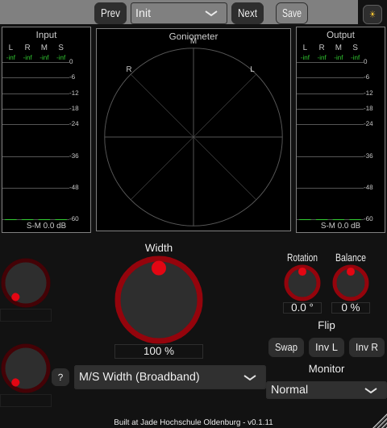
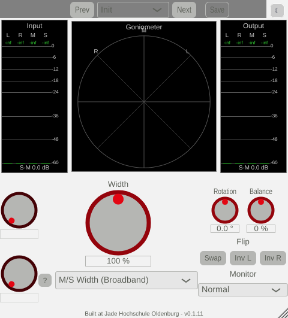

# Phase 6 GUI polish -- Day/night theme

A GUI-only feature (Phase 6, "v1 release"), not a Phase 5 algorithm: a runtime-
switchable colour theme for every widget except the metering/goniometer displays,
per explicit request. Day mode reuses the "Jade" house style already used by other
Jade-branded plugins in this codebase (white background, grey knob disc, red
handle/pointer -- see `Libs/TGMTools/JadeLookAndFeel.h`); Night mode keeps this
plugin's original dark aesthetic (not its exact original colours -- see the
follow-up tweaks below, which darkened it significantly on further feedback), with
knobs recoloured from the old stock-JUCE white/teal to grey discs with the same red
handles as Day.

## Design

`StereoWidener/PluginLookAndFeel.h`/`.cpp`: one `juce::LookAndFeel_V4` subclass,
`StereoWidenerLookAndFeel`, constructed with a `Theme` (`Day`/`Night`) and switchable
at runtime via `setTheme()`. Deliberately does NOT reuse `JadeLookAndFeel` directly:
that class hardcodes its palette straight into `drawRotarySlider()` rather than
exposing it via colour IDs or members, so it cannot itself serve two different
palettes. Instead, `drawRotarySlider()` here is adapted from Jade's own geometry
(disc + brightening outline ring + rotating pointer dot) but reads two members
(`m_knobDiscColour`, `m_knobHandleColour`) set per-theme in `applyTheme()` -- one
drawing routine serves both themes, differing only in which colours are set.

The red handle/pointer colour (`kAccentRed`, matching Jade's own red) is identical in
both themes, per the request ("red for handles should be kept"); only the
background/knob-disc palette differs.

**Deliberately excluded**: the metering/goniometer components (`shared/metering/*`)
draw entirely from their own independent `MeterLookAndFeel` colour constants, never
via `juce::LookAndFeel`/`findColour()` -- confirmed by grep before writing any code,
not assumed -- so a theme switch cannot touch them, exactly the "this will not change
the displays" requirement.

**Persistence**: `GlobalSettings::getUseDayTheme()`/`saveUseDayTheme()`, same
JSON-backed, immediate-persist pattern as `guiScaleFactor`. Default `false` (Night) --
unchanged look for anyone who never touches the toggle.

**Toggle control**: a new `juce::TextButton` in `PluginEditor`'s top-right corner
(independent of the preset bar's own layout, `PluginSettings.h`'s `g_themeButtonSize`/
`g_themeButtonGap`), showing the icon of the mode a click switches TO (a moon in Day
mode, a sun in Night mode -- common toggle-icon convention). `PluginEditor` owns the
`StereoWidenerLookAndFeel` instance and calls `setLookAndFeel()` on itself (not
`LookAndFeel::setDefaultLookAndFeel()`), scoping the theme to this one editor's
component tree rather than mutating global static state.

## Two bugs found during verification (both via the GUI offline-render check, not by inspection)

**Button text became invisible in Day mode.** The first colour scheme aliased a
`TextButton`'s off-state text colour to the same "ambient label text" colour used
everywhere else. In Day mode, that ambient text colour and the button's own fill
colour (`m_knobDiscColour`) happened to be the *same* value (both derived from Jade's
dark olive-grey), so "Prev"/"Next"/"Save"/"Swap"/"Inv L"/"Inv R"/the theme button
itself all rendered as blank boxes -- text drawn in the exact colour of its own
background. Night mode accidentally "worked" because its ambient text colour
(near-white) happened to differ enough from its button fill (mid-grey) to stay
legible, masking the same underlying role confusion. Fixed by giving buttons their
own explicit `m_buttonTextColour`, chosen to contrast with the button's *own* fill in
each theme, not aliased to whichever colour happens to be used for something else
that theme.

**The moon icon rendered as a blank placeholder glyph.** The initial choice, U+1F319
(a supplementary-plane colour-emoji codepoint), had no glyph in the font available
where this was tested/rendered. Switched to U+263E (last-quarter moon), from the same
"Miscellaneous Symbols" block as the sun glyph (U+2600) already in use -- a plain
Unicode symbol far more likely to have a fallback glyph in any standard font, not
dependent on colour-emoji font support.

## Follow-up colour/layout tweaks (after seeing the first version rendered)

Four further changes, all from direct feedback on the first screenshots:

1. **Build/version footer moved to the bottom of the whole plugin window.** It used
   to be drawn inside the goniometer's own corner (`GoniometerComponent::
   setCornerText()`, shared with StereoAnalyzer -- left untouched there). Now a plain
   `juce::Label` (`StereoWidenerGUI::m_footerLabel`), reserved from the bottom of
   `resized()` first (so it stays anchored there regardless of which algorithm --
   and so which content height -- is active) and added to `getRequiredContentHeight()`
   (`g_footerHeight`, `PluginSettings.h`).
2. **Day mode's knob/button fill was too dark, too high contrast against the white
   background.** It reused the same dark olive-grey as Jade's own text colour
   (`kDayText`). Replaced with `kDayKnobDisc`, that same colour blended 60% of the way
   towards the white background -- a soft light grey, still visibly distinct from
   pure white but nowhere near as harsh. Button text had to change too (see below).
3. **Night mode's background is now much darker.** `kNightBackground` went from plain
   `juce::Colours::darkgrey` to a near-black custom shade, per explicit request ("this
   is OK, if we darken the plugin-background significantly"). `StereoWidenerGUI::
   paint()`'s own `.brighter(0.3f)` offset on the content area (left over from the old
   stock-JUCE scheme) was removed for the same reason -- applied to the new near-black
   background it would have undone most of the darkening. (`kNightKnobDisc` initially
   matched this to `shared/metering/MeterLookAndFeel.h`'s pure-black constant exactly;
   corrected in the second follow-up round below once that made knobs/buttons barely
   distinguishable from the also-near-black window.)
4. **The theme-toggle button's own icon styling** no longer follows the general
   button-text convention: the moon glyph is always a fixed dark navy
   (`kMoonColour`), the sun glyph always a fixed bright gold (`kSunColour`),
   independent of which theme is active, while the button's own fill follows the
   *opposite* rule -- white specifically in Day mode (an explicit per-component
   colour override, brighter than the general Day button fill above) and the theme's
   own ambient (now-black) button fill in Night mode (override removed, so it always
   tracks whatever the LookAndFeel currently uses there). Implemented as
   `applyThemeButtonStyle()` in `PluginEditor.cpp`, called from both the constructor
   and `toggleTheme()`.

## Second follow-up round (Night's knobs/buttons still too close to the window background)

Matching the display background exactly (point 3 above) turned out to be a step too
far: with the window background *also* darkened to near-black in the same pass,
knobs/buttons ended up barely distinguishable from the window itself -- reported after
seeing that version rendered, with Day mode's own knob/window relationship given as
the reference for what "distinguishable" should look like.

- **`kNightKnobDisc` changed from pure black to a colour a little LIGHTER than
  `kNightBackground`** (0.18 vs 0.07 brightness) -- the same kind of visible
  separation Day mode already has between its own window and knob/button fill, just
  in the opposite direction (Night's window is already near-black, so going *darker*
  isn't meaningfully visible; going a little *lighter* is what actually reads as a
  distinct control surface). Still clearly darker overall than Day's own
  `kDayKnobDisc`, so the "much darker" request from the first round still holds.
- **The theme-toggle button gained a visible border**, needed only in Night mode (Day
  mode's white-on-near-white button was already reported as "good" without one).
  Investigated JUCE's own `LookAndFeel_V4::drawButtonBackground()` source first (not
  assumed): a standalone (non-segmented) `TextButton` gets no outline stroke at all by
  default, only a plain filled rounded rectangle -- confirming there was no existing
  colour ID to just set. Added a `StereoWidenerLookAndFeel::drawButtonBackground()`
  override that calls the stock implementation first, then, only for the button whose
  `getComponentID()` matches `themeToggleComponentID`, strokes an extra
  `backgroundColour.brighter(0.3f)` rounded-rectangle outline -- visible in Night mode
  (where the fill is dark enough for `.brighter()` to matter) and a no-op in practice
  in Day mode (white can't get meaningfully brighter), matching exactly which mode
  needed the fix.

**A real (if intermittent) crash found and fixed during this round, unrelated to the
colour changes themselves:** the first `pluginval --strictness-level 10` run after
adding `themeToggleComponentID` segfaulted partway through (during "Editor
Automation"); a second run immediately after passed cleanly. Root cause: the ID was
declared as `static const juce::String`, at namespace/class scope -- a known
cross-translation-unit static-initialisation-order hazard for `juce::String`
specifically (its constructor can run before or after JUCE's own internal string
machinery is ready, depending on link order, so behaviour can vary run to run, which
matches the one-crash-then-clean pattern observed). Fixed by changing it to
`static constexpr const char*` instead -- a compile-time literal with no runtime
constructor to order against anything. Confirmed fixed with five consecutive clean
`pluginval` runs after the change (zero clean runs in a row would have been just as
possible before it, given the non-determinism).

## Verification

**GUI offline render** (throwaway `WidenerGuiSnapshot` console tool, extended to find
and `triggerClick()` the real theme button -- exercising the actual production code
path: `setTheme()` + `GlobalSettings::saveUseDayTheme()` + `sendLookAndFeelChange()`
-- rather than just constructing two separately-themed instances; built and fully
removed afterwards per the project's convention): confirmed
- Night (default): near-black background with a visibly lighter (not black-on-black)
  knob/button fill, red handles, all button/label text readable, the theme toggle
  shows a visible border around its dark fill, footer anchored to the bottom of the
  window.
- Day (after clicking the real toggle): white background, soft light-grey knob/button
  fill, red handles (same accent colour as Night), all button/label text readable,
  theme toggle shows a white button with a dark moon (no border needed, as expected),
  footer still at the bottom of the window -- both original bugs and the first
  follow-up round's fixes all stay correct.
- Day mode with a "not mono-safe" algorithm selected (Chorus Doubler, from the first
  verification pass, still valid after the colour tweaks): the orange warning badge
  text stays clearly readable against the light background.
- The real settings file's `useDayTheme` round-trips correctly across the toggle
  click and process exit (verified by inspecting it directly between runs).
- Meters/goniometer are visually identical in both themes, as expected from the
  `MeterLookAndFeel` independence confirmed in the design step.
- Cropped/zoomed views of the theme-toggle button (both themes) confirmed the border
  and icon-colour details directly, not just at the full-window thumbnail scale.

**pluginval --strictness-level 10**: SUCCESS on the rebuilt VST3, five consecutive
clean runs after the static-initialisation-order fix (see above).

## Files

- `StereoWidener/PluginLookAndFeel.h`/`.cpp` (new): the theme class.
- `StereoWidener/GlobalSettings.h`/`.cpp`: `useDayTheme` persistence.
- `StereoWidener/PluginEditor.h`/`.cpp`: owns the LookAndFeel instance, the toggle
  button, `toggleTheme()`, `applyThemeButtonStyle()`.
- `StereoWidener/PluginSettings.h`: `g_themeButtonSize`/`g_themeButtonGap`,
  `g_footerHeight`.
- `StereoWidener/StereoWidener.h`/`.cpp`: `m_footerLabel` (build/version footer, moved
  out of the goniometer's own corner), `getRequiredContentHeight()`/`resized()`
  updated to reserve its row, `paint()`'s `.brighter(0.3f)` offset removed.
- `StereoWidener/CMakeLists.txt`: new source file, version bumped 0.1.10 -> 0.1.11.
