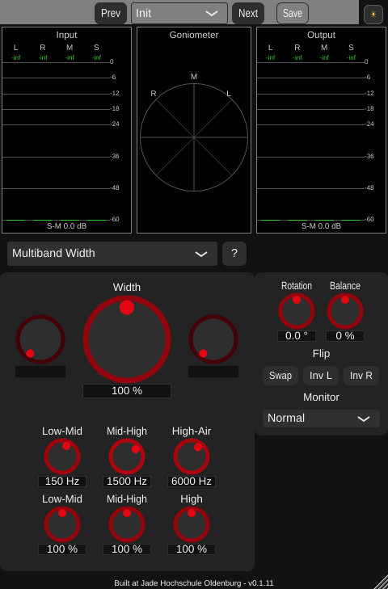
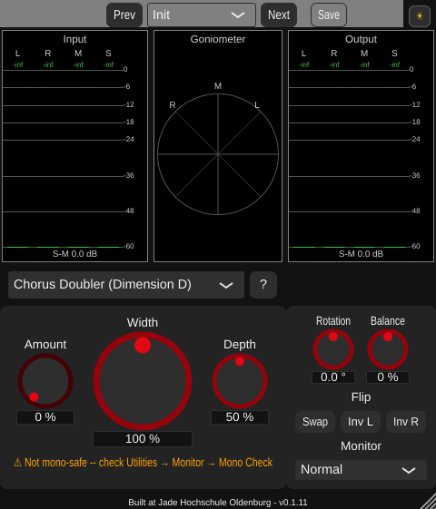

# Phase 6 GUI polish -- three-column redesign ("divide the parameter part into thirds")

A GUI-only redesign (Phase 6, "v1 release"), following on from
[phase5_gui_compaction.md](phase5_gui_compaction.md) and
[phase6_daynight_theme.md](phase6_daynight_theme.md), per four explicit requests:

1. The three meter-row displays (Input, Goniometer, Output) should all be the same
   height -- the goniometer was a little shorter.
2. The area below the meter row should be divided into thirds: the right third is
   Utilities only, emphasised with a small surrounding "card" (slightly brighter
   background).
3. The algorithm selector should move to the middle of the left two-thirds, directly
   below the input meter + goniometer.
4. The "?" help button should move to the right of the algorithm selector, exactly as
   tall as it. All of the active algorithm's own parameters should sit below the
   selector, in their own card matching the Utilities panel's treatment; the two cards
   are separated the same way the three meter-row panels are.

## The goniometer height bug (request 1)

`StereoWidenerGUI::resized()` set the level meters' bounds with
`.reduced(g_levelMeterPadding)` (2 px on all four sides) but the goniometer's with
`.reduced(g_goniometerPadding)` (4 px on all four sides) -- different padding values,
so the goniometer came out 4 px shorter (252 px vs. the level meters' 256 px) purely
by accident, not by design. Fixed with `Rectangle::reduced(deltaX, deltaY)`'s two-axis
overload: the goniometer keeps its own (larger) *horizontal* padding for visual
breathing room from the level meters either side, but now uses the level meters' own
`g_levelMeterPadding` vertically, so all three come out exactly the same height.
Verified by direct pixel measurement (not just eyeballing a screenshot): all three
panels measure 254 px tall, same top and bottom row, at the default window size.

## The shared left-two-thirds/right-third grid (requests 2-4)

The key design decision: rather than dividing the parameter area into thirds
*independently* of the meter row above it, `g_levelMeterWidth` (the input/output level
meters' width) now does double duty as the single shared right-column width for
*every* row in the GUI -- the meter row, the algorithm-selector row, and the two boxed
panels. This is what makes request 3 ("directly below the input and goniometer
display") exact rather than approximate: the algorithm-selector row's left block is
`getWidth() - levelMeterWidth`, which is *by construction* the combined width of the
input meter and goniometer above it, not a separately-computed "roughly two-thirds".

`g_levelMeterWidth` changed from 115 to 165 px (at the default 480 px window width,
`480/3 = 160`; 165 gives the Utilities panel's content a few pixels of headroom
inside its own padding -- see below) -- a deliberate widening of the input/output
level meters themselves, not just a description of the space below them. This makes
the meter row itself closer to three true equal thirds too, not only the area below it.

Below the meter row:
- **Algorithm selector row**, unboxed, centred within the left two-thirds. The "?"
  help button moved to the right of the combo box (previously to its left) and is now
  exactly `g_algorithmRowHeight` square -- both the button and the combo box derive
  their height from the same constant, so there is nothing to keep in sync by hand
  (previously `g_helpButtonSize` was a separate constant that happened to differ from
  `g_algorithmRowHeight`).
- **Two boxed "card" panels**, side by side, drawn with a slightly brighter background
  in `StereoWidenerGUI::paint()` (`background.brighter(0.08f)`, the same relative
  brightening in both day/night themes) at bounds computed in `resized()` and stored
  in `m_paramPanelBounds`/`m_utilPanelBounds`:
  - **Left (parameters)**: aux-left / Width / aux-right in one row (previously the aux
    knobs were their own stacked column to the left of a separate "Width + algorithm
    selector + badge" middle column -- the algorithm selector's move out freed this
    space up for a single combined row), then the "not mono-safe" badge, then (only
    for Multiband Width) its dedicated 6-knob grid, growing this panel specifically.
  - **Right (Utilities)**: unchanged internally (Rotation/Balance, Flip buttons,
    Monitor selector) -- now visibly boxed to match the parameter panel's treatment,
    where it previously had no background of its own.

  Both panels share the *same* height in the common case (like the three meter-row
  panels, a matched pair of cards) -- the parameter panel is the only one that grows
  taller on its own, and only when the multiband grid is active; the Utilities panel
  stays at the shared base height regardless. Separated the same way the meter-row
  panels are: contiguous cells (no explicit gap removed between them), each with its
  own internal `g_panelPadding` inset, so the *visible* gap between the two card
  backgrounds is padding-based, not a differently-styled gap.

## Verification

**GUI offline render** (throwaway `WidenerGuiSnapshot` console tool, rendering the
default algorithm, Multiband Width, and a "not mono-safe" algorithm (Chorus Doubler);
built and fully removed afterwards per the project's convention): confirmed all four
requests above, plus no regression in the day/night theme (both card panels take the
theme's own background-brightening treatment automatically, since they read the
ambient `ResizableWindow::backgroundColourId` at paint time) and in the mono-safe
badge/multiband-grid mechanisms already covered by prior verification passes.

**Direct pixel measurement** (not just a screenshot glance): the three meter-row
panels measure exactly 254 px tall, same top and bottom, at the default window size --
confirms request 1 precisely, not approximately.

**pluginval --strictness-level 10**: SUCCESS, three consecutive clean runs.

## Files

- `StereoWidener/PluginSettings.h`: `g_levelMeterWidth` widened (115 -> 165, now also
  the shared right-column width for every row); `g_panelPadding`/`g_panelCornerSize`
  (new); `g_paramKnobGap` replaces `g_auxKnobVGap` (aux knobs no longer stacked);
  `g_helpButtonSize` removed (the help button's size now derives from
  `g_algorithmRowHeight` directly); `g_utilColumnWidth` removed (the Utilities panel's
  content width now derives from its own card bounds).
- `StereoWidener/StereoWidener.h`: `m_paramPanelBounds`/`m_utilPanelBounds` (new).
- `StereoWidener/StereoWidener.cpp`: `paint()`, `resized()`,
  `getRequiredContentHeight()` all rewritten for the new layout.
- `StereoWidener/CMakeLists.txt`: version bumped 0.1.11 -> 0.1.12.

## Follow-up (v0.1.13): quarters and a more prominent divider

Two more explicit requests:

1. **Level meters "a little too big"**: the meter row now uses *quarters* (input 1/4,
   goniometer 2/4, output 1/4) instead of the thirds it shared with the panel row
   below. Deliberately decoupled into its own constant, `g_levelMeterWidth` (now 120,
   `= g_minGuiSize_x/4`), separate from `g_rightBlockWidth` (165, the panel row's own
   thirds-based width) -- the two rows now use different fractions on purpose.
2. **More prominent divider** between the parameter and Utilities cards: an explicit
   `g_panelDividerWidth` (6px) gap, drawn in the plain (unbrightened) background
   colour, sits between the two panels' rounded-rect backgrounds -- previously they
   were flush against each other with no visible line at all.
   - While verifying this in Day mode, found the card background itself was nearly
     invisible: `background.brighter(0.08f)` on Day's ~0.95-brightness background has
     almost no 8-bit headroom left (242 vs 243). Fixed with a brightness-adaptive
     direction in `paint()`: darken when the background is already light, brighten
     when it's dark (`getPerceivedBrightness() > 0.5f ? darker(0.06f) : brighter(0.08f)`).

### Files (follow-up)

- `StereoWidener/PluginSettings.h`: `g_levelMeterWidth` decoupled from
  `g_rightBlockWidth` (120 vs 165); `g_panelDividerWidth` (new).
- `StereoWidener/StereoWidener.cpp`: `resized()` reserves the divider gap between the
  two panels; `paint()`'s panel colour now picks a brightness-adaptive direction.
- `StereoWidener/CMakeLists.txt`: version bumped 0.1.12 -> 0.1.13.
