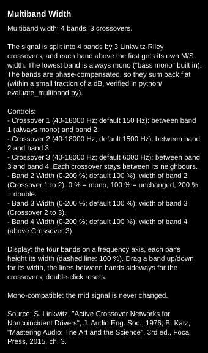

# Help texts with a Controls list (v0.1.28)

Review request: "check if all help texts contain a clear list of the parameters and
what they do."

## Audit (before)

None of the seven "?" help texts had a parameter list. Parameters were mentioned in
the prose, mostly without ranges, and some not at all: M/S Filtered, Complementary
Comb and Allpass didn't explain Width (Allpass didn't mention it at all), Multiband
said "crossovers" while its knobs said "Split", and no text gave the ranges.

## Change

- Every parameter's definition (`AlgorithmParamSpec`) now carries a one-line help
  text (`withHelp()`); every Width has the same standard line (0 % = mono, 100 % =
  unchanged, 200 % = double the side signal).
- `StereoAlgorithm::getControlsText()` generates the "Controls:" list from the
  parameter definitions -- name, range (with any Off zone), default, help -- so the
  list always matches the actual knobs and can't drift from them.
- All seven help texts restructured the same way: what the algorithm does, the
  Controls list, what the display shows and how to drag it, mono compatibility,
  source. Parameter explanations removed from the prose (now in the list).

All seven generated texts:
[python/results/help_texts/help_texts.txt](../../python/results/help_texts/help_texts.txt).

## Verification

- Every parameter of every algorithm appears in its list, with the range and default
  the parameter actually has (checked in the generated texts).
- Popups rendered offline: 290-575 px tall at the fixed 340 px width, readable.
- DSP unchanged (only text and parameter metadata).

## Files

- `StereoWidener/algorithms/StereoAlgorithm.h`: `help` field, `withHelp()`,
  `getControlsText()`.
- `StereoWidener/algorithms/*.h/.cpp`: help lines per parameter, restructured
  `getDescription()`.
- `StereoWidener/CMakeLists.txt`: version 0.1.27 -> 0.1.28.
