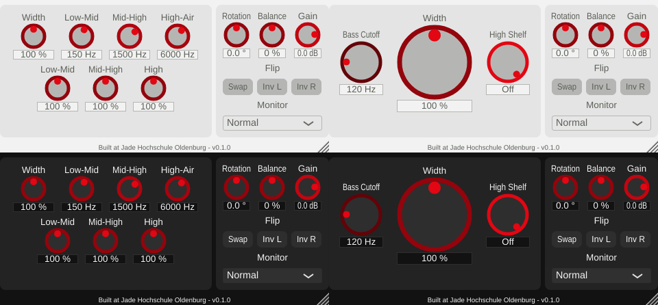

# Utility label truncation and value-box contrast (v0.1.17)

Two display problems found while verifying the playground step 0
([phase6_playground_step0.md](phase6_playground_step0.md)), fixed per request.

## Truncated Utilities labels

Since v0.1.15 shrank the Utilities knobs to 40 px to fit the Gain knob, each label was
only as wide as its knob, so at 100 % zoom "Rotation" and "Balance" were cut to
"Rota..." and "Bala...". (Screenshots at the time were taken at ~1.4x zoom, where the
labels still fit.) Each label now spans its knob plus the gap between knobs (half on
either side), `StereoWidenerGUI::resized()`. Knob positions are unchanged.

## Low-contrast value boxes

Cause: a bug, not the colour choice. `PluginEditor`'s constructor called
`setLookAndFeel()` before adding its child components. JUCE notifies only the current
children of a look-and-feel change, and a `Slider` builds its value box from the
look-and-feel's colours only when notified. So every value box kept JUCE's default
dark-scheme colours: white text on a transparent box. In the Night theme that happens
to look fine; in the Day theme it is white text on the light grey card. Only pressing
the theme toggle (which notifies all components again) fixed it until the next
restart. `setLookAndFeel()` now runs last in the constructor.

Contrast of the value text against its box, computed from the theme colours (WCAG
formula):

| | Before | After |
|---|---|---|
| Day | 1.27 : 1 (white on the card) | 5.83 : 1 (JadeGray on the white box) |
| Night | default colours, readable by chance | 17.2 : 1 (whitesmoke on the near-black box) |

## Verification

- Offline GUI render (throwaway snapshot tool, removed afterwards) of Multiband and
  M/S Filtered in both themes at 100 % zoom.
- `pluginval --strictness-level 10`: 4/4 SUCCESS, zero JUCE assertions. Output:
  [python/results/label_contrast_fix/console.txt](../../python/results/label_contrast_fix/console.txt).

## Files

- `StereoWidener/PluginEditor.cpp`: `setLookAndFeel()` moved to the end of the
  constructor.
- `StereoWidener/StereoWidener.cpp`: wider Utilities labels.
- `StereoWidener/CMakeLists.txt`: version 0.1.16 -> 0.1.17.
