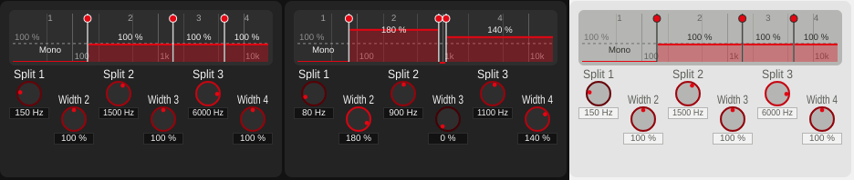

# Multiband Width: staggered knob rows (v0.1.29)

Review request: "put the width knob in a second row but shift the position in between
the frequency splits, since the width is defined between these two frequencies."

## Layout

Before, the six compact knobs sat in one row in two captioned groups (Frequency:
Split 1-3, Width: Band 2-4), so nothing showed which width belongs between which
splits. Now the knobs are ordered like the frequency axis:

- **Row 1**: Split 1, Split 2, Split 3 (the crossovers).
- **Row 2**, half a column step to the right: Width 2 between Split 1 and 2, Width 3
  between Split 2 and 3, Width 4 right of Split 3 -- each band's width sits between the
  two splits that bound the band, as in the display above. Band 1 has no knob (always
  mono).

The width knobs are labelled "Width 2-4" (before "Band 2-4"), so the group captions
are no longer needed and were removed. Because the columns alternate, the rows can
overlap by half a knob height (label + half a knob): the knob block grows by only
~28 px, taken from the band-split display, which stays readable (bar values and band
numbers unchanged). The column step adapts to the playground width (text box + 3 px
to text box + 13 px), so the layout also holds at other GUI scales.

Host parameter names are unchanged ("Crossover 1-3", "Band 2-4 Width"), as is the
DSP.

## Verification

- GUI: offline renders at defaults, with varied values, both themes (image above).
- pluginval --strictness-level 10: 3/3 SUCCESS, zero JUCE assertions, see
  [console](../../python/results/multiband_staggered/console.txt).

## Files

- `StereoWidener/playgrounds/MultibandPlayground.h/.cpp`: staggered layout, labels,
  captions removed.
- `StereoWidener/README.md`, `StereoWidener/CMakeLists.txt` (0.1.28 -> 0.1.29).
