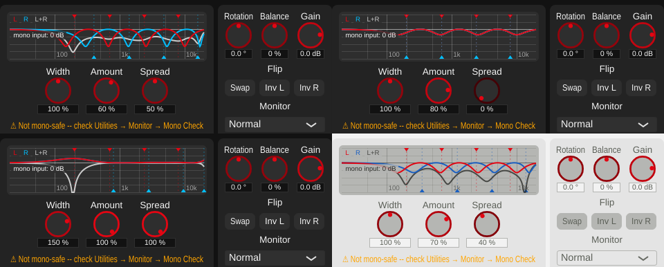

# Playground 7: Allpass Decorrelation (v0.1.27)

Step 7, the last one, of [plan_changeGUI.md](../../plan_changeGUI.md). No new
parameters (as planned).

## The playground

An allpass cascade leaves the magnitude spectrum unchanged and only shifts phase,
so a plot of the cascades' own responses would be flat and say nothing. What is
audible is the blend with the dry signal, so the graph shows what the algorithm does
to a centred (mono) input:

- **Curves**: the gain of L (red), R (blue) and the mono sum L+R (grey). With
  S = 0: L1 = M (1 + Amount (H1 - 1)), R1 likewise with the second cascade H2, then
  Width on the result. Spread 0 %: both cascades are identical, so L = R = mono sum,
  with dips from the blend (the mid itself is coloured -- why the algorithm isn't
  mono-safe). Spread > 0: L and R dip at different frequencies -- the decorrelation --
  and the mono sum dips too. Amount 0 %: all flat.
- **Frequency marks**: the four allpass stages' centre frequencies, L's (fixed:
  200, 700, 2400, 8000 Hz) with triangles at the top, R's (shifted up by Spread,
  up to 2 octaves) at the bottom, each with a faint vertical line.
- **Dragging**: left/right anywhere changes Spread (the width of the graph = 100 %),
  up/down changes Amount (the height = 100 %); hover shows both values, double-click
  resets.
- **Knobs** (below): Width, Amount, Spread.

## Building blocks extended

`FrequencyGraph` gains a third curve colour (text colour), `addFrequencyMarks()`
(vertical marks with a triangle at the top or bottom edge) and `setFreeDrag()` (drags
not on a point or marker change one parameter horizontally and one vertically,
relative to the drag start, as host gestures).

DSP: `AllpassDecorrelation::stageFrequencyHz()` and `monoInputGainDb()` (pure math,
same biquad designs as `process()`); the cascade coefficients are now assigned from
JUCE's allocation-free `ArrayCoefficients` (same values: renders byte-identical).

## README corrections

The README described the algorithm as decorrelating "without altering either
channel's own magnitude spectrum" -- only the allpass copies are magnitude-flat; the
blend with the dry signal colours each channel (as the new graph shows). It also said
it was the only non-mono-safe algorithm; Early Reflections and Chorus Doubler aren't
mono-safe either. Both corrected.

## Verification

- **Display = DSP.** Mono white noise rendered through `tools/widener_render`; the
  transfer functions M -> L, M -> R and M -> (L+R)/2 measured from the render match
  the drawn curves within 0.02 dB (points above -20 dB), for three settings:
  [response_check.txt](../../python/results/playground_allpass/response_check.txt).
- **Dragging** (synthetic mouse events): vertical = Amount, horizontal = Spread,
  clamping, double-click reset (1 % deviations are whole-pixel drag distances):
  [drag_test.txt](../../python/results/playground_allpass/drag_test.txt).
- **Sound unchanged**: render byte-identical to before.
- **GUI**: offline renders in several states, both themes.
- **pluginval --strictness-level 10**: 5/5 SUCCESS, zero JUCE assertions:
  [console.txt](../../python/results/playground_allpass/console.txt).

## Files

- `StereoWidener/playgrounds/AllpassPlayground.h/.cpp` (new).
- `StereoWidener/playgrounds/FrequencyGraph.h/.cpp`: third curve colour, frequency
  marks, free drag.
- `StereoWidener/algorithms/AllpassDecorrelation.h/.cpp`: display helpers,
  allocation-free coefficients, help text.
- `StereoWidener/AlgorithmPlayground.cpp`: factory creates `AllpassPlayground`.
- `StereoWidener/README.md` (Allpass, corrections), `StereoWidener/CMakeLists.txt`
  (new source; version 0.1.26 -> 0.1.27).
