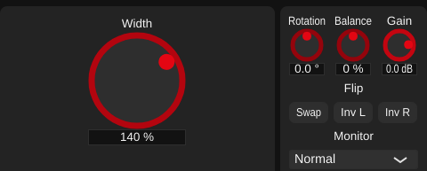

# Playground 1: M/S Width (Broadband) (v0.1.18, simplified in v0.1.20)

Step 1 of [plan_changeGUI.md](../../plan_changeGUI.md).

**Current state (v0.1.20):** the playground is just the Width knob, large and centred
(the plain `KnobsPlayground` layout for a single parameter). Per explicit request:
"only the width knob in the middle is enough. This should show how easy it is." The
simplest algorithm gets the simplest playground -- one knob.

**History:** v0.1.18 added a top-down stereo-image picture next to the knob (a wedge
showing where hard-panned sources are heard, from the stereophonic tangent law, plus
the side gain in dB). It was removed again in v0.1.20, together with its helper
functions in `MSWidthBroadband` and the matching paragraph in the help text.

The building blocks added in v0.1.18 stay, since the Filtered playground uses them:

- `AlgorithmPlayground::watchParameter()`: follows a parameter on the GUI thread
  (including host automation) via `juce::ParameterAttachment`, for live graphics.
- `playgrounds/PlaygroundStyle.h`: shared, theme-based colours for playground
  displays (on the Day theme's mid-light grey the text is darkened for about 6:1
  contrast).

## Verification (v0.1.20)

- Offline GUI render: the Width knob alone, centred in the card.
- `pluginval --strictness-level 10`, see the Multiband write-up
  ([phase6_playground_multiband.md](phase6_playground_multiband.md)), which was
  verified on the same build.
- DSP unchanged.

## Files (v0.1.20)

- `StereoWidener/playgrounds/BroadbandPlayground.h/.cpp`: removed.
- `StereoWidener/AlgorithmPlayground.cpp`: Broadband uses `KnobsPlayground` again.
- `StereoWidener/algorithms/MSWidthBroadband.h/.cpp`: picture helpers and their help
  text removed.
- `StereoWidener/README.md`, `StereoWidener/CMakeLists.txt` (version 0.1.19 -> 0.1.20).
