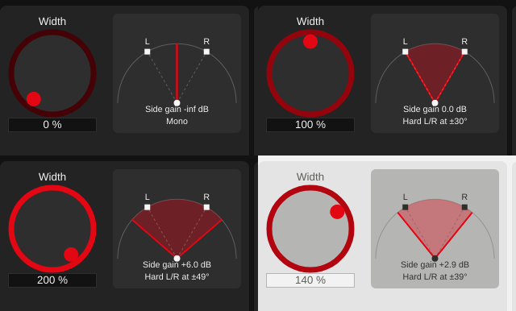

# Playground 1: M/S Width (Broadband) (v0.1.18)

Step 1 of [plan_changeGUI.md](../../plan_changeGUI.md). Broadband has one control,
Width, so its playground pairs the large Width knob with a picture of what Width does
to the stereo image.

## The picture

A top-down view: the listener at the bottom, loudspeakers L and R at +-30 degrees
(dashed lines). The red wedge spans the directions from which sources panned hard left
or right are heard at the current Width:

- 0 %: a single line in the centre -- everything is mono.
- 100 %: the wedge reaches the loudspeakers -- unchanged.
- above 100 %: the wedge reaches beyond the loudspeakers.

Below it, two readouts: the side signal's gain in dB, and the angle of hard-panned
sources.

The angle comes from the stereophonic tangent law, tan(phi)/tan(phi0) =
(L'-R')/(L'+R'). For an input panned hard left, M = S = L/2, so after widening
L' = L(1+w)/2 and R' = L(1-w)/2, and the law gives tan(phi) = w * tan(30 degrees).
Above w = 1, R' becomes negative (antiphase), which is what places the image beyond
the loudspeaker. Reference: V. Pulkki, "Virtual Sound Source Positioning Using Vector
Base Amplitude Panning", J. Audio Eng. Soc. 45(6), 1997. The same explanation was added
to the algorithm's "?" help text.

| Width | Side gain | Hard-panned source |
|---|---|---|
| 0 % | -inf dB | 0 degrees (mono) |
| 50 % | -6.0 dB | 16.1 degrees |
| 100 % | 0.0 dB | 30.0 degrees |
| 140 % | +2.9 dB | 38.9 degrees |
| 200 % | +6.0 dB | 49.1 degrees |

The formulas live in the DSP class as pure functions
(`MSWidthBroadband::sideGainDb()`, `hardPannedSourceAngleDeg()`), so the display and
the processing share one definition and the algorithm stays GUI-free.

## Building blocks added (reused by later playgrounds)

- `AlgorithmPlayground::watchParameter()`: follows a parameter on the GUI thread
  (including host automation) via `juce::ParameterAttachment`, for live graphics.
- `playgrounds/PlaygroundStyle.h`: shared colours for playground displays, taken from
  the current theme. Display panels use the knobs' fill colour (like the meter
  displays); on the Day theme's mid-light grey the text is darkened (about 6:1
  contrast instead of 3:1).

## Verification

- Offline GUI render (throwaway snapshot tool) at Width 0/100/200 % (Night) and 140 %
  (Day); the displayed angles and gains match the table, which was computed
  independently: [python/results/playground_broadband/console.txt](../../python/results/playground_broadband/console.txt).
- `pluginval --strictness-level 10`: 3/3 SUCCESS, zero JUCE assertions.
- DSP unchanged (only pure helper functions were added to the algorithm).

## Files

- `StereoWidener/playgrounds/BroadbandPlayground.h/.cpp` (new): `StereoImageView`,
  `BroadbandPlayground`.
- `StereoWidener/playgrounds/PlaygroundStyle.h` (new).
- `StereoWidener/AlgorithmPlayground.h/.cpp`: base class gets the APVTS,
  `getParameter()`, `watchParameter()`; factory creates `BroadbandPlayground`.
- `StereoWidener/algorithms/MSWidthBroadband.h/.cpp`: math helpers, help text.
- `StereoWidener/CMakeLists.txt`: new source; version 0.1.17 -> 0.1.18.
