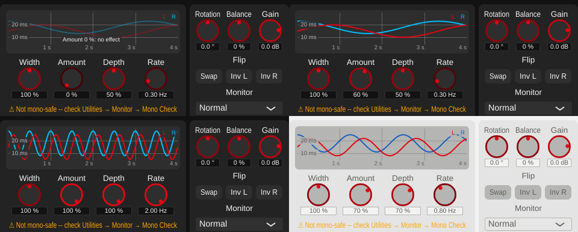

# Playground 6: Chorus Doubler (v0.1.25)

Step 6 of [plan_changeGUI.md](../../plan_changeGUI.md): a display of the two modulated
delay lines, draggable, plus Rate as a new parameter.

## The playground

- **Delay-time display** (`playgrounds/DelayModulationView.h/.cpp`): the delay of
  L's (red) and R's (blue) modulated delay line over a fixed 4 s window. Both swing
  sinusoidally a quarter cycle apart; R is 3 ms longer on average (the fixed L/R
  separation that keeps the channels different even at Depth 0). Depth sets how far
  they swing (up to +-10 ms), Rate how many cycles fit into the window. The delay axis
  covers 4-30 ms (the full range, 5-28 ms). When Width x Amount is 0 the curves fade
  and a note says the effect is off.
  - Drag up/down for **Depth** (the curves' peaks follow the mouse), left/right for
    **Rate** (multiplicative: across the full width x8, so slow and fast rates are
    equally easy to set). Hover shows both values, double-click resets both.
- **Knobs** (below): Width, Amount, Depth, Rate.

## New parameter: Rate

`chorusRate`, 0.05-2 Hz, default 0.3 Hz. Until now a fixed value from `settings.json`
(`chorusRateHz`), deliberately not a knob because fast rates turn the effect into an
obvious vibrato/warble. As a parameter it is capped at 2 Hz for the same reason. Rate
only sets the LFO's phase increment, so changing it live is click-free. Default
processing unchanged: a render at 0.3 Hz is byte-identical to before.

With this, `settings.json` holds no processing settings any more (shelf gain, comb
crossover, pre-delay and chorus rate all became parameters in steps 2-6); only the
GUI size, theme and meter ballistics remain.

The delay formula for the display is a pure function in the DSP class
(`ChorusDoubler::delayMs()`); `process()` keeps its own sample-domain version of the
same formula unchanged, so the render stays byte-identical.

## Verification

- **Display = DSP.** An impulse every 50 ms rendered through `tools/widener_render`:
  each delayed impulse's position in the output gives the delay at that moment; over
  all 156 delayed impulses in each of three settings, it matches the displayed curve
  within 0.05 ms (0.2 % of the 23 ms range; the residual is interpolation blur of a
  moving delay):
  [delay_check.txt](../../python/results/playground_chorus/delay_check.txt).
- **Dragging** (synthetic mouse events): vertical drag sets Depth (2 ms = 20 %),
  horizontal drag scales Rate (a third of the width = x2), clamping at 100 % / 2 Hz,
  double-click resets:
  [drag_test.txt](../../python/results/playground_chorus/drag_test.txt).
- **Sound unchanged at defaults**, see above.
- **GUI**: offline renders in several states, both themes. (A first render showed no
  curves at all: `juce::Path::isEmpty()` stays true until a line is added, so every
  point started a new sub-path -- fixed before this was committed.)
- **pluginval --strictness-level 10**: 5/5 SUCCESS, zero JUCE assertions:
  [console.txt](../../python/results/playground_chorus/console.txt).

## Files

- `StereoWidener/playgrounds/DelayModulationView.h/.cpp`, `ChorusPlayground.h/.cpp`
  (new).
- `StereoWidener/algorithms/ChorusDoubler.h/.cpp`: Rate parameter, `delayMs()`, help
  text.
- `StereoWidener/GlobalSettings.h/.cpp`, `StereoWidener.cpp`: settings-file rate
  removed.
- `StereoWidener/AlgorithmPlayground.cpp`: factory creates `ChorusPlayground`.
- `tools/widener_render/main.cpp`: rate passed as a parameter value.
- `StereoWidener/README.md` (Chorus, settings file), `StereoWidener/CMakeLists.txt`
  (new sources; version 0.1.24 -> 0.1.25).
