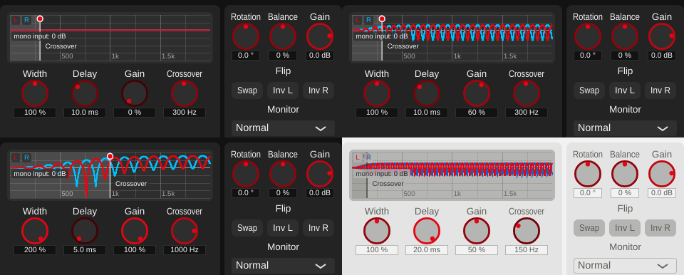

# Playground 4: Complementary Comb (v0.1.23)

Step 4 of [plan_changeGUI.md](../../plan_changeGUI.md): a display of the complementary
combs that give this algorithm its name, the crossover as a draggable line, and the
crossover as a new parameter.

## The playground

- **Graph** (top): what the algorithm does to a centred (mono) input -- the gain of L
  (red) and R (blue). With S = 0 the algorithm gives L' = M (1 + a), R' = M (1 - a),
  a = Width x Gain x HighPass(f) x e^(-j 2 pi f Delay): two complementary combs, L's
  peaks exactly where R has its notches, 1/Delay apart, summing back to 2M (mono
  compatible). Below the crossover, a -> 0 and both stay flat.
  - **Linear 0-2 kHz axis**, not the log axis the other displays use. The teeth are
    evenly spaced in Hz; on a log axis they crowded into a solid band above ~1 kHz
    (tried first), where L and R have the same envelope and the complementary pattern
    disappears. On the linear axis the pattern is visible for every Delay (10 teeth
    at 5 ms, 40 at 20 ms), and changing Delay visibly changes their spacing. The help
    text says the pattern continues up to 20 kHz.
  - **Crossover** as a vertical line with the region below it shaded: drag it
    sideways anywhere along the line (hover shows the value), double-click resets.
- **Knobs** (below): Width, Delay, Gain, Crossover.

## New parameter: Crossover

`combCrossover`, 50-2000 Hz (log), default 300 Hz (planing.md's "~300 Hz"). Until now
a fixed value read from `settings.json` (`combCrossoverHz`); removed from
`GlobalSettings`. The default equals the old settings default: a render at 300 Hz is
byte-identical to before. The crossover filter is recomputed per block only when the
value changes, from JUCE's allocation-free `ArrayCoefficients`.

## Building blocks extended (shared with the other playgrounds)

- `FrequencyGraph`: several curves (first in the accent colour, second in the new
  `PlaygroundStyle::secondary` blue); `addCurveRange()` for curves too detailed to
  sample once per pixel (each column reports its min/max, dense regions draw as a
  band); `addMarker()` for draggable vertical frequency lines; optional linear axis
  (`setLinearAxis()`); labels now drawn on top of curves, markers and points.
- `FrequencyAxis.h` (was `LogFrequencyAxis.h`): log or linear mapping and grid.
- `algorithms/BiquadResponse.h`: the biquad frequency response, now shared by
  `MSWidthFiltered::sideGainDb()` and `ComplementaryComb::monoInputGainDb()` (Filtered's
  output unchanged, byte-identical render).
- `AlgorithmPlayground::kDisplaySampleRate` (48 kHz) shared by all response displays.

## Verification

- **Display = DSP.** Mono white noise rendered through `tools/widener_render`; the
  transfer functions M -> L and M -> R measured from the render match the values the
  graph draws within 0.06 dB (points outside deep notches), for three settings:
  [response_check.txt](../../python/results/playground_comb/response_check.txt).
- **Dragging the crossover** (synthetic mouse events): grabbed along the line, set,
  clamped at 50 Hz / 2 kHz, reset by double-click:
  [drag_test.txt](../../python/results/playground_comb/drag_test.txt).
- **Sound unchanged at defaults**, see above.
- **GUI**: offline renders in several states, both themes; Filtered and Multiband
  re-checked after the axis refactor.
- **pluginval --strictness-level 10**: 5/5 SUCCESS, zero JUCE assertions:
  [console.txt](../../python/results/playground_comb/console.txt).

## Files

- `StereoWidener/playgrounds/CombPlayground.h/.cpp` (new).
- `StereoWidener/playgrounds/FrequencyGraph.h/.cpp`, `FrequencyAxis.h` (renamed),
  `PlaygroundStyle.h`, `BandSplitView.h/.cpp`, `FilteredPlayground.h/.cpp`.
- `StereoWidener/algorithms/ComplementaryComb.h/.cpp`: Crossover parameter,
  `monoInputGainDb()`, help text; `BiquadResponse.h` (new); `MSWidthFiltered.cpp`.
- `StereoWidener/GlobalSettings.h/.cpp`, `StereoWidener.cpp`: settings-file crossover
  removed.
- `StereoWidener/AlgorithmPlayground.h/.cpp`: display sample rate; factory creates
  `CombPlayground`.
- `tools/widener_render/main.cpp`: crossover passed as a parameter value.
- `StereoWidener/README.md`, `StereoWidener/CMakeLists.txt` (new source; version
  0.1.22 -> 0.1.23).
