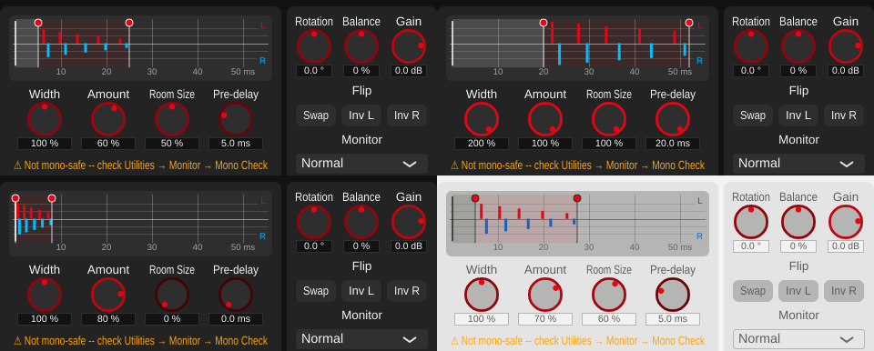

# Playground 5: Early Reflections (v0.1.24)

Step 5 of [plan_changeGUI.md](../../plan_changeGUI.md): an echogram of the reflection
pattern, draggable, plus Pre-delay as a new parameter.

## The playground

- **Echogram** (`playgrounds/EchogramView.h/.cpp`): what one impulse at the input
  produces. The direct sound at 0 ms (full height), the left channel's five
  reflections above the time axis (red), the right channel's below it (blue). The
  two patterns are different -- that difference is the width, and the reason the
  algorithm isn't mono-safe. Bar height is the level relative to the direct sound in
  dB (0 to -30 dB, faint lines at -10 and -20 dB); a linear scale made realistic
  reflections (e.g. -11 dB) tiny bars next to the direct sound (tried first). Small
  ticks on the axis mark every reflection's position even at Amount 0.
  - The pre-delay region is shaded; the room window (Pre-delay to Pre-delay + Room
    Size spread) is lightly tinted.
  - Drag the **Pre-delay line** or the **room-end line** sideways (the latter sets
    Room Size: the window spans 8-32 ms after the pre-delay). Drag up/down anywhere
    else for **Amount**. Hover shows the value, double-click resets.
- **Knobs** (below): Width, Amount, Room Size, Pre-delay.

## New parameter: Pre-delay

`earlyReflPreDelay`, 0-20 ms, default 5 ms (planing.md's reflection window starts
around 5 ms). Until now a fixed value from `settings.json`
(`earlyReflectionsPreDelayMs`); removed from `GlobalSettings`. The tap positions are
recomputed (and glide, as before) when Room Size *or* Pre-delay changes. Default
processing unchanged: a render at 5 ms is byte-identical to before.

The tap time and level formulas are now pure functions in the DSP class
(`EarlyReflections::tapTimeMs()`, `tapGain()`), used by both `process()` and the
display.

## Verification

- **Display = DSP.** An impulse rendered through `tools/widener_render`: every
  reflection's time (centroid over its samples) and level in the output match the
  echogram's values exactly, for three settings (including 0 ms pre-delay and a
  20 ms pre-delay with the largest room):
  [tap_check.txt](../../python/results/playground_early_reflections/tap_check.txt).
- **Dragging** (synthetic mouse events): pre-delay line, room-end line (Room Size
  follows (end - pre-delay - 8 ms) / 24 ms), vertical Amount drag, clamping, reset:
  [drag_test.txt](../../python/results/playground_early_reflections/drag_test.txt).
- **Sound unchanged at defaults**, see above.
- **GUI**: offline renders in several states, both themes.
- **pluginval --strictness-level 10**: 5/5 SUCCESS, zero JUCE assertions:
  [console.txt](../../python/results/playground_early_reflections/console.txt).

## Files

- `StereoWidener/playgrounds/EchogramView.h/.cpp`, `EarlyReflectionsPlayground.h/.cpp`
  (new).
- `StereoWidener/algorithms/EarlyReflections.h/.cpp`: Pre-delay parameter,
  `tapTimeMs()`/`tapGain()`, help text.
- `StereoWidener/GlobalSettings.h/.cpp`, `StereoWidener.cpp`: settings-file pre-delay
  removed.
- `StereoWidener/AlgorithmPlayground.cpp`: factory creates
  `EarlyReflectionsPlayground`.
- `tools/widener_render/main.cpp`: pre-delay passed as a parameter value.
- `StereoWidener/README.md`, `StereoWidener/CMakeLists.txt` (new sources; version
  0.1.23 -> 0.1.24).
