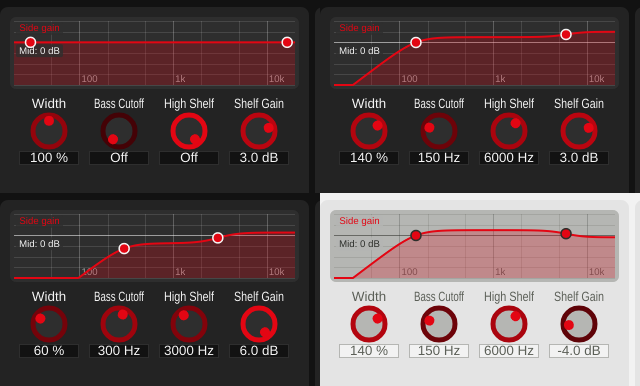

# Playground 2: M/S Width (Filtered / Bass Mono) (v0.1.19)

Step 2 of [plan_changeGUI.md](../../plan_changeGUI.md): a frequency-response display
of what the algorithm does to the side signal, with the filter frequencies draggable
on the curve, plus the shelf gain as a new parameter.

## The playground

- **Graph** (top): the gain the side signal gets at each frequency, Width and both
  filter stages combined ("Side gain"), against the mid signal, which always passes
  unchanged ("Mid: 0 dB" line). Log frequency axis 20 Hz-20 kHz, -24 to +12 dB.
  - Left point: Bass Cutoff. Drag sideways; past the left end it reaches "Off".
  - Right point: High Shelf. Drag sideways for the frequency (past 16 kHz: "Off"),
    up/down for Shelf Gain.
  - Hovering or dragging shows the point's values; double-click resets it.
- **Knobs** (below): Width, Bass Cutoff, High Shelf, Shelf Gain -- the same
  parameters, for exact values and fine steps.

The help text ("?") explains the graph.

## New parameter: Shelf Gain

`highShelfGain`, -6 to +6 dB, default +3 dB. Until now the shelf gain was a fixed value
read from `settings.json` (`highShelfGainDb`), not automatable and not saved with a
project. The setting is removed from `GlobalSettings` (an existing key in an old
settings file is ignored and dropped on the next write). The default equals the old
settings default, so default processing is unchanged. The shelf is recomputed when its
frequency *or* gain changes.

Also changed in the DSP: the filter coefficients are now assigned from JUCE's
allocation-free `ArrayCoefficients` instead of allocating a new `Coefficients` object on
the audio thread at every change. Same coefficient values.

## Building block added: FrequencyGraph

`playgrounds/FrequencyGraph.h/.cpp`, reusable by the later playgrounds (Comb, Allpass,
Multiband):

- A curve from a `std::function<float(float hz)>` returning dB. Here that's
  `MSWidthFiltered::sideGainDb()`, which evaluates the same biquad designs `process()`
  uses (pure math in the DSP class, no GUI dependency). The display is computed at
  48 kHz, since the GUI doesn't know the host's rate; differences only show near
  Nyquist.
- Draggable points bound to a frequency parameter and optionally a gain parameter,
  sent as host gestures (`juce::ParameterAttachment`), so automation recording and undo
  work as with a knob. Values are clamped to the parameter's range before they are
  set; a log-frequency range asserts on out-of-range values (see the v0.1.14 crash
  fix).
- Theme colours via `PlaygroundStyle`; labels on backing boxes so they stay readable
  over the curve.

## Verification

- **Display = DSP.** White noise rendered through `tools/widener_render` (new optional
  last argument: shelf gain); the side-signal transfer function measured from the
  render (Welch cross-spectrum) matches the values the graph draws within 0.06 dB at
  50 Hz-15 kHz, for three settings including a shelf cut:
  [response_check.txt](../../python/results/playground_filtered/response_check.txt).
- **Dragging.** Synthetic mouse events on the graph (throwaway tool): dragging sets the
  cutoff and shelf frequency, vertical dragging sets the gain and clamps at +6 dB,
  dragging past the left edge reaches "Off", double-click resets to the defaults:
  [drag_test.txt](../../python/results/playground_filtered/drag_test.txt).
- **Sound unchanged at defaults**: render at Shelf Gain +3 dB byte-identical to before.
- **GUI**: offline renders in four states, both themes.
- **pluginval --strictness-level 10**: 4/4 SUCCESS, zero JUCE assertions:
  [console.txt](../../python/results/playground_filtered/console.txt).

Limitation: the graph is about 64 px tall at 100 % zoom, so vertical dragging moves
the gain in steps of roughly 0.5 dB per pixel; the Shelf Gain knob gives 0.1 dB steps.

## Files

- `StereoWidener/playgrounds/FrequencyGraph.h/.cpp`, `FilteredPlayground.h/.cpp` (new).
- `StereoWidener/algorithms/MSWidthFiltered.h/.cpp`: Shelf Gain parameter,
  `sideGainDb()`, allocation-free coefficient updates, help text.
- `StereoWidener/GlobalSettings.h/.cpp`, `StereoWidener.cpp`: settings-file shelf gain
  removed.
- `StereoWidener/AlgorithmPlayground.cpp`: factory creates `FilteredPlayground`.
- `tools/widener_render/main.cpp`: optional shelf-gain argument.
- `StereoWidener/README.md`, `StereoWidener/CMakeLists.txt` (new sources; version
  0.1.18 -> 0.1.19).
