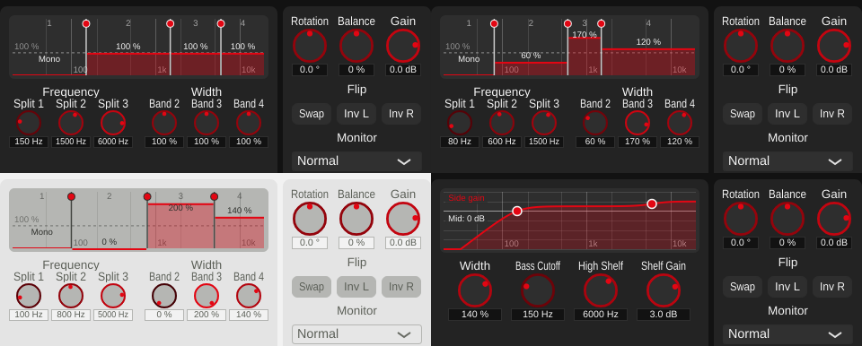

# Playground 3: Multiband Width, the band-split element (v0.1.21, review fixes v0.1.22)

Step 3 of [plan_changeGUI.md](../../plan_changeGUI.md), section 4.1: a display of the
four bands that is also their control, plus compact knobs for exact values. Multiband
Width loses its overall Width.

## The playground

**Band-split display** (`playgrounds/BandSplitView.h/.cpp`):

- The four bands on a log frequency axis (20 Hz-20 kHz), numbered 1-4 along the top,
  separated by the three crossover lines.
- Band 1 is always mono (the algorithm's built-in "bass mono", decided in
  plan_changeGUI.md 7.2): shown as "Mono" with a flat line at the bottom; it can't be
  changed.
- Bands 2-4: each is a bar whose height is its width, 0-200 %, with a dashed line at
  100 % (unchanged) and the value above the bar. Drag a band up or down to change its
  width.
- Crossover lines with a grip at the top: drag sideways. A crossover stops at its
  neighbours (at least 5 % apart, `MultibandWidth::kMinCrossoverRatio`, the same rule
  the DSP applies to automated values) and at 40 Hz / 18 kHz; hovering or dragging
  shows its frequency. Next to a narrow band a line's grab zone shrinks (at most 30 %
  of the band), so even a very narrow band's width stays draggable.
- Double-click resets what's under the mouse. Drags are host gestures
  (`juce::ParameterAttachment`), so automation recording and undo work.

**Knobs** below, in two captioned groups: *Frequency* -- Split 1-3 (the crossovers;
split k separates band k and k+1) -- and *Width* -- Band 2-4, for exact values. The
crossover knobs also stop at their neighbours when dragged or typed into.

## No overall Width any more

Until now a master Width scaled bands 2-4 on top of their own widths, so how wide a
band ended up depended on two knobs -- "counterintuitive" per the plan review. It is
removed (parameter `multibandMasterWidth`); each band's own width is the only control.
At its default (100 %) it multiplied by exactly 1, so default processing is unchanged:
a render with the old master at 100 % is byte-identical before and after. Presets
that set it to anything else lose that setting.

The host-visible parameter names are now unambiguous ("Crossover 1-3", "Band 2-4
Width" instead of "Low-Mid"/"Mid-High" appearing twice); the parameter IDs are
unchanged. The Python reference (`python/algorithms/multiband_width.py`) keeps its
`width` argument; its default of 1.0 matches the plugin.

## Other changes

- **Value boxes size their text to the box** (`StereoWidenerLookAndFeel::
  createSliderTextBox()`): JUCE always used a 15 px font, so "1500 Hz" was cut off in
  the compact knobs' 44 px boxes. Now 0.85 x the box height, at most 15 px. This
  affects every knob: the large Width knob's value is as before; smaller boxes get a
  smaller, no longer squashed font.
- **Shared pieces**: `LogFrequencyAxis.h` (pixel-frequency mapping and grid) is now
  used by both `FrequencyGraph` and `BandSplitView`; `ParameterValues.h` holds the
  clamp-before-set helpers both need.
- **Removed**: `KnobsPlayground`'s grid layout and the interim Multiband knob grid --
  no algorithm with more than three parameters uses `KnobsPlayground` any more. The
  grid constants became `g_smallKnob*` (used by Filtered); `g_compactKnob*` is new.

## Review fixes (v0.1.22)

Four comments on v0.1.21:

1. **Knob handle not scaled.** `StereoWidenerLookAndFeel::drawRotarySlider()` had
   fixed minimums (10 px pointer, 5 px ring) and measured the slider's full width,
   which for small knobs is the wider value box -- so small knobs were mostly handle.
   Ring and pointer now scale with the knob's own size, in the proportions the 110 px
   Width knob always had (it looks as before); all smaller knobs (Multiband, Filtered,
   Utilities) get proportionally smaller handles.
2. **Band 4's lower edge was restricted to 1000 Hz**, and 3. **the same was true
   elsewhere**: each crossover had its own fixed range (40-400, 200-4000,
   1000-18000 Hz), so band 1's top couldn't pass 400 Hz, band 2's top couldn't go
   below 200 Hz, band 3's bottom couldn't pass 4 kHz and band 4's bottom couldn't go
   below 1 kHz. All three now share one range, 40 Hz-18 kHz
   (`kMinCrossoverHz`/`kMaxCrossoverHz`), and are limited only by their neighbours.
   The DSP's safety net for automated values now also keeps them inside that range
   and below 0.45 x the sample rate (checked at 32 kHz with crossovers set above
   Nyquist: valid output, no assertion -- previously an 18 kHz crossover at 32 kHz
   would have been above Nyquist).
4. **Captions** "Frequency" and "Width" above the two knob groups.

Found while verifying: with the shared range, pluginval's parameter fuzzing could set
two crossovers closer than allowed; the crossover knobs' limit (which wrote the
clamped value back) then bounced between the lower and upper limit until the stack
overflowed -- 3 of 4 pluginval runs crashed. The knob limit now applies only to the
user's own changes (mouse drag, typed values), uses a single clamp that can't
oscillate (shared with the display: `BandSplitView::limitCrossover()`), and never
writes back during host automation, which the DSP sorts on its own anyway.

## Verification

- **Dragging** (synthetic mouse events on the display, throwaway tool): splits move,
  a split stops at its neighbours (315 Hz = 300 Hz x 1.05; 17143 Hz = 18 kHz / 1.05)
  and at 40 Hz / 18 kHz, split 3 goes below 1 kHz and split 2 above 4 kHz now, band
  widths follow vertical drags and clamp at 0 % (also for a ~5 px wide band), band 1
  can't be changed, double-click resets:
  [drag_test.txt](../../python/results/playground_multiband/drag_test.txt).
- **Typed values** on the crossover knobs are limited by the neighbours:
  [knob_text_test.txt](../../python/results/playground_multiband/knob_text_test.txt).
  (The knob *drag* limit depends on a real mouse button and wasn't simulated.)
- **Sound unchanged at defaults**, see above.
- **GUI**: offline renders in several states, both themes; Filtered re-checked after
  the axis refactor.
- **pluginval --strictness-level 10**: v0.1.21 4/4 SUCCESS (this build also covers the
  simplified Broadband playground, v0.1.20):
  [console.txt](../../python/results/playground_multiband/console.txt); v0.1.22 6/6
  SUCCESS after the recursion fix, zero JUCE assertions:
  [console_review.txt](../../python/results/playground_multiband/console_review.txt).

## Files

- `StereoWidener/playgrounds/BandSplitView.h/.cpp`, `MultibandPlayground.h/.cpp`,
  `LogFrequencyAxis.h`, `ParameterValues.h` (new).
- `StereoWidener/playgrounds/FrequencyGraph.h/.cpp`, `FilteredPlayground.cpp`: use the
  shared axis/helpers.
- `StereoWidener/algorithms/MultibandWidth.h/.cpp`: no master Width, clearer names,
  `kMinCrossoverRatio`, help text explains the display.
- `StereoWidener/AlgorithmPlayground.h/.cpp`: knob label override; grid layout removed;
  factory creates `MultibandPlayground`.
- `StereoWidener/PluginLookAndFeel.h/.cpp`: value-box font.
- `StereoWidener/PluginSettings.h`: knob size constants.
- `tools/widener_render/main.cpp`: width argument ignored for multiband.
- `StereoWidener/README.md`, `StereoWidener/CMakeLists.txt` (new sources; version
  0.1.20 -> 0.1.21 -> 0.1.22).
- v0.1.22 also: `PluginLookAndFeel.cpp` (knob proportions), `MultibandWidth.h/.cpp`
  (shared crossover range, safety net), `BandSplitView.h/.cpp` (grab zone, public
  `limitCrossover()`), `MultibandPlayground.h/.cpp` (captions, user-only knob limit).
