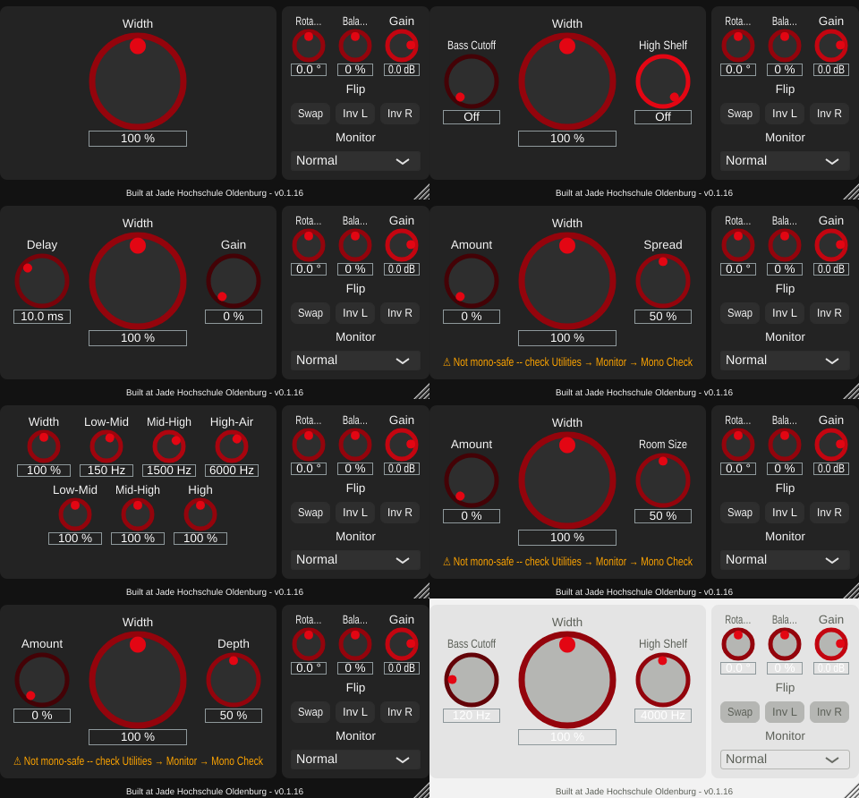
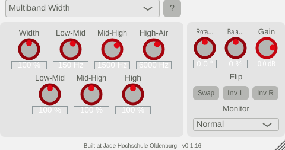

# GUI playground, step 0: infrastructure (v0.1.16)

First implementation step of [plan_changeGUI.md](../../plan_changeGUI.md): the shared
structure every per-algorithm playground builds on. No algorithm gets its dedicated
playground yet -- each gets a plain "one knob per parameter" playground -- but the
window no longer changes size when switching algorithms.

## What changed

**Each algorithm declares its own parameters** (`algorithms/StereoAlgorithm.h`).
`getParamSpecs()` returns a list of `AlgorithmParamSpec` (ID, name, unit, range,
default, display precision, linear or log-frequency mapping, optional "Off" zone), and
`process()` receives the current values as `AlgorithmParamValues` (a fixed-size array,
no allocation on the audio thread), indexed by the algorithm's own `ParamIndex` enum,
in the declared units ("%" arrives as 0-100). This replaces
`StereoAlgorithmParams { width, auxLeft, auxRight, multi[6] }`, the `AuxKnobInfo`
methods, and the hand-maintained per-index tables in `StereoWidener.cpp`
(`paramsFor()`, `auxLeftParamIdFor()`, `auxRightParamIdFor()`, `auxMultiParamIdFor()`).
`StereoWidenerAudio::addParameter()` now just loops over every algorithm's specs. The
DSP layer is still GUI-free (`tools/widener_render` builds as before).

**One Width parameter per algorithm** (decided in plan_changeGUI.md, section 7.1):
`broadbandWidth`, `filteredWidth`, `combWidth`, `allpassWidth`, `multibandMasterWidth`,
`earlyReflWidth`, `chorusWidth`. The old shared `width` parameter is gone, so presets
saved before v0.1.16 load without their Width setting (compatibility was explicitly
not required). All other parameter IDs are unchanged.

**Parameter text includes the unit** ("150 Hz", "10.0 ms", "100 %", or "Off"), set
once in `makeAlgorithmParameter()`. Host views and the GUI show the same text, and no
GUI code adds unit suffixes any more.

**Playgrounds** (`StereoWidener/AlgorithmPlayground.h/.cpp`). `StereoWidenerGUI`
creates one playground per algorithm at construction, bound permanently to that
algorithm's parameters, and only toggles visibility on a switch. No slider is ever
rebound to a different parameter any more, which removes `bindAuxKnob()`,
`bindMultiKnob()` and the stale-slider-value handling behind the v0.1.14 crash fix.
Every playground gets the same fixed bounds (`g_playgroundHeight`), with the "not
mono-safe" badge as a shared strip below it. `KnobsPlayground` shows up to three
parameters as today (Width large in the middle, the others flanking it) and more than
three as a grid of small knobs; Multiband Width's version keeps the crossover knobs
from passing each other.

**Fixed window size.** `StereoWidenerGUI::getRequiredContentHeight()` no longer
depends on the algorithm; `PluginEditor::applyWindowSize()` sizes the window once. The
default window is 480 x 553 px for every algorithm (same as every algorithm except
Multiband before; Multiband no longer grows it).

Visible differences from v0.1.15: Broadband shows Width alone (no greyed-out empty
knobs beside it), and Multiband shows its 7 controls (master Width, 3 crossovers, 3
band widths) as a 4 + 3 grid inside the normal card instead of a taller window.

## Verification

Console output: [python/results/playground_step0/console.txt](../../python/results/playground_step0/console.txt).

- **Sound unchanged**: all seven algorithms rendered through `tools/widener_render`
  before and after the refactor with non-default settings (so every parameter path is
  exercised) are **byte-identical**.
- **GUI**: offline render of all seven algorithms (throwaway snapshot tool, removed
  afterwards) in both themes: every algorithm renders at 480 x 553 px, all controls
  show correct values/units/"Off", mono-safe badge still shown for the three
  non-mono-safe algorithms.
- **pluginval --strictness-level 10**: 6/6 runs SUCCESS, zero JUCE assertions.
- Builds without warnings in the changed files.

Noticed during the GUI check, not caused by this change and left for separate fixes:
at scale 1.0 the Utilities knob labels truncate ("Rota...", "Bala...") since the
knobs shrank to 40 px in v0.1.15; in the Day theme the knobs' value boxes have low
text contrast.

## Files

- `StereoWidener/algorithms/StereoAlgorithm.h`: `AlgorithmParamSpec`,
  `AlgorithmParamValues`, `getParamSpecs()`; removed `StereoAlgorithmParams`,
  `AuxKnobInfo` and the aux/multi methods.
- `StereoWidener/algorithms/*.h/.cpp`: each algorithm declares its specs and reads its
  values (unit conversion moved from `paramsFor()` into the algorithm).
- `StereoWidener/AlgorithmPlayground.h/.cpp` (new): `PlaygroundKnob`,
  `AlgorithmPlayground`, `KnobsPlayground`, `createPlayground()`.
- `StereoWidener/StereoWidener.h/.cpp`: parameter structs for algorithm parameters
  removed; spec-driven parameter creation; playground hosting; fixed layout.
- `StereoWidener/PluginEditor.h/.cpp`: window sized once (`applyWindowSize()`).
- `StereoWidener/PluginSettings.h`: `g_playgroundHeight`, grid constants; removed the
  multiband-grid and unused window-ratio constants.
- `tools/widener_render/main.cpp`: ported to `AlgorithmParamValues`.
- `StereoWidener/CMakeLists.txt`: new source file; version 0.1.15 -> 0.1.16.
